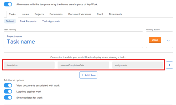
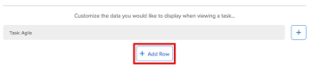
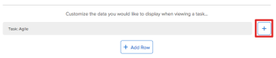

# Create and manage layout templates

>[!IMPORTANT]
>
>You're currently viewing the Adobe Workfront Classic version of this document. Adobe Workfront Classic is no longer supported. All Adobe Workfront Classic functionality, along with this documentation, will be removed in July 2022. Please transition to the the new Adobe Workfront experienceas soon as possible, and switch to the new Adobe Workfront experience version of this document.

<!--

**DON'T DELETE, DRAFT OR HIDE THIS ARTICLE. IT IS LINKED TO THE PRODUCT, THROUGH THE CONTEXT SENSITIVE HELP LINKS.

-->

<!--

NWE version of this content at the bottom

-->

The Adobe Workfront layout refers to the arrangement of Global Navigation bar areas and the tabs associated with them, as well as to the views, filters, and groupings that are visible in lists and reports.

Every user's default layout depends on their access level. For example, some users might not see some areas in the Global Navigation bar or tabs associated with them. For more information, see [About the default Adobe Workfront layout](../../../administration-and-setup/customize-workfront/use-layout-templates/about-the-default-wf-layout.md).

As a Workfront administrator or a group administrator, you can create and modify layout templates to create a well-defined and consistent interface for your users, based on the needs of their teams, groups, or job roles. This decreases training time and improves workflow and efficiency. It's important to put the right information in front of the right people. For information about group administrators, see [Group administrators](../../../administration-and-setup/manage-groups/group-roles/group-administrators.md).

You can migrate layout templates that you already have in Classic Workfront to the new Workfront experience. For instructions, see [Migrate your layout templates to the new Adobe Workfront experience](../../../administration-and-setup/customize-workfront/use-layout-templates/migrate-layout-templates-to-nwe.md).

## Create or modify a layout template {#create-or-modify-a-layout-template}

When you create or modify a layout template, you can do the following things:

* Change the default landing tab
* Change what areas display in the Global Navigation Bar
* Add custom tabs
* Set up list controls
* Change the information on the My Work lists
* Change the names of objects

After you modify a layout template, you can assign it to teams, job roles, groups, or individual users.

To create or modify an existing layout template:

1. Click **Setup** near the upper-right corner of Adobe Workfront on the Global Navigation Bar.
1. Expand **Interface**, then click **Layout Templates**.

   >[!NOTE]
   >
   >group administrators can see only the layout templates that are managed by the groups that they administer.

1. Click **New Layout Template**.

   Or

   Click the name of the layout template you want to modify.

1. Change any of the options in the layout template, as described in the following sections:

   * [Set Details](#set-details) 
   * [Customize Tabs](#customize-tabs) 
   * [Customize Lists](#customize-lists) 
   * [Customize My Work](#customize-my-work) 
   * [Customize Home](#customize-home) 
   * [Assign people](#assign-people) 
   * [Customize Terminology](#customize-terminology)

1. Click **Save Layout Template**.

### Set Details {#set-details}

1. Begin creating your layout template, as described above, in [Create or modify a layout template](#create-or-modify-a-layout-template).
1. On the **Set Details** tab, supply the following information:

   <table cellspacing="0"> 
    <col> 
    <col> 
    <tbody> 
     <tr> 
      <td role="rowheader">Name</td> 
      <td>Type descriptive name for the template. For example, if the template is intended for the Marketing organization, you could type "Marketing Layout." </td> 
     </tr> 
     <tr> 
      <td role="rowheader">Description</td> 
      <td>(Optional) Type a brief description of the purpose of the template.</td> 
     </tr> 
     <tr> 
      <td role="rowheader">Group with Administration Access</td> 
      <td> Indicate the single group whose group administrators you want to have the permission to edit this layout template.
This does not assign the template to the users in the group. 

For more information about assigning layout templates to users, groups, teams, and job roles, see <a href="#assign-people" class="MCXref xref">Assign people</a>.
 
Important:   
When a group administrator creates a layout template, this field is mandatory. A group administrator can create a layout template designated only for a specific administrative group. The layout templates created for a specific administrative group is not visible to users that do not belong to the Group specified here when they attach a layout template to a user when editing the user. For more information about editing users, <a href="../../../administration-and-setup/add-users/create-and-manage-users/edit-a-users-profile.md" class="MCXref xref">Edit a user's profile</a>.
 
Workfront admins can create a system-level layout template when they do not associate it with a specific administrative group. The system-level layout templates are visible to select to all users who can edit user accounts. For more information about group administrators, see <a href="../../../administration-and-setup/manage-groups/group-roles/group-administrators.md" class="MCXref xref">Group administrators</a>.
 
</td> 
     </tr> 
     <tr> 
      <td role="rowheader">On login, show</td> 
      <td>Determines the default login area for the user. 
For example, My Work takes users to the My Work area each time they log in. This is their home screen. 
</td> 
     </tr> 
     <tr> 
      <td role="rowheader">In the Global Navigation bar, show</td> 
      <td>Show or hide areas for users using the template. 
By default, <strong>My Work</strong> and <strong>Projects</strong> cannot be removed. 

Adding the <strong>Reporting</strong> area provides access to reports for users with a Worker license.
</td> 
     </tr> 
    </tbody> 
   </table>

1. Continue with any of the remaining sections in this article, depending on the area of the interface that you want to customize.

### Customize Tabs {#customize-tabs}

You can customize the tabs that are available to users who are assigned the layout template.

For example, you can customize landing pages for the following objects:

* Projects
* Tasks
* Issues
* Programs
* Portfolios

You can also customize the following Global Navigation areas:

* Projects
* Requests
* Reporting

To customize tabs:

1. Begin creating your layout template, as described above, in [Create or modify a layout template](#create-or-modify-a-layout-template) and [Set Details](#set-details).

1. Click the **Customize Tabs** tab.
1. Click the **When a person with this Template looks at** drop-down list, then select one of the following areas of Workfront to customize:

   * A Task
   * A Project
   * An Issue
   * A Program
   * A Portfolio
   * Projects 
   * Requests 
   * Reporting

1. Remove items from the main tabs on the layout template by clicking the 'X' on the tab you want to remove from a specific object.

   This moves the items to the **More** tab.

   The following tabs are available for each object:

   * Updates
   * Documents
   * <Object Name> Details
   * Subtasks (for Tasks only)
   * Issues (for Tasks and Projects only)
   * Hours (for Projects, Tasks, and Issues)
   * Approvals (for Projects, Tasks, and Issues)
   * Expenses (for Tasks and Projects only)
   * Predecessors (for Tasks only)
   * Tasks (for Projects only)
   * Risks (for Projects only)
   * Approvals (for Projects, Tasks, and Issues)
   * Baselines (for Projects only)
   * Billing Rates (for Projects only)
   * Billing Records (for Projects only)

     <!--   
     <li data-mc-conditions="QuicksilverOrClassic.Draft mode">Legacy Gantt (for Projects only)</li>   
     -->   
   
   * Queue Setup (for Projects only)
   * Staffing (for Projects only) 
   * Utilization (for Projects only)

     This tab refers to the utilization report that enables users to track the progress of a project by quickly viewing how the actual hours are tracking against the budgeted hours or planned hours. For more information, see [Overview of the Resource Utilization report](../../../reports-and-dashboards/reports/using-built-in-reports/resource-utilization-report.md).
   
   * Projects (for Programs and Portfolios only) 
   * Programs (for Portfolios only)
   * Portfolio Optimization (for Portfolios only)
   * My Projects (for the Projects area only)
   * All Projects (for the Projects area only)
   * Templates (for the Projects area only)
   * New Request (for the Requests area only)
   * Requests I've Submitted (for the Requests area only)
   * All Requests (for the Requests area only)
   * Drafts (for the Requests area only)
   * Reports (for the Reporting area only)
   * Dashboards (for the Reporting area only)
   * Calendars (for the Reporting area only)

1. Hide items from the template by clicking **Hide** next to the item after it is moved to the **More** tab.

   Some tabs can be hidden, and others cannot. If **Hide** is not displayed on the tab, it cannot be hidden.

1. Drag items from one location to any empty tab in the template.
1. Click **Add Custom Tab** to add a dashboard to the template.
1. Click the **Assign People** tab and assign users, teams, groups, or job roles to the layout template as described in [Assign people](#assign-people).

1. Click **Save Layout Template**.

### Customize Lists {#customize-lists}

You can customize the Filters, Views, and Groupings (also known as list controls) that are available to users who are assigned the layout template.

>[!NOTE]
>
>You cannot remove all the filters, views, and groupings from the lists. You must have at least one option for filters, one for views, and one for groupings. If you remove all the filters, views, or groupings from a layout template, the default ones are added back in when you save the layout template.

1. Begin creating your layout template, as described above, in [Create or modify a layout template](#create-or-modify-a-layout-template) and [Set Details](#set-details).

1. Click the **Customize Lists** tab.
1. Click the **When a person with this Template looks at** drop-down list to select an area of Workfront to customize.
1. Hide items by mousing over the item, then clicking **Hide**.

   Hiding unused options or options that are not relevant to a user can streamline the workspace of that user.

1. Add items by clicking **Add Filter**, **Add View**, or **Add Grouping**.

   You can search for and add existing custom list controls that you previously created, or you can create new custom list controls.

   The views, filters and groupings you see listed on this tab will be visible to all users assigned to this layout template. 

1. Click the **Assign People** tab and assign users, teams, groups, or job roles to the layout template as described in [Assign people](#assign-people).

1. Click **Save Layout Template**.

### Customize My Work {#customize-my-work}

You can create custom views to display on tasks and issues in the Working On and Work Requests tabs in the My Work area.

1. Begin creating your layout template, as described above, in [Create or modify a layout template](#create-or-modify-a-layout-template) and [Set Details](#set-details).

1. Click the **Customize My Work** tab.  

1. (Optional) If you want users with this layout template to see the new calendar in the My Work area, select **Show new calendar**.

   By default, the option **Show legacy calendar** is selected. For information about the new My Work calendar, see [View assigned work on the My Work calendar](../../../workfront-basics/using-home/my-work/view-assigned-work-on-calendar-my-work.md).

1. Click the **When a person with this Template looks at** drop-down list to select an area of My Work to customize and a type of work item. 
1. Select whether you want the layout template to be associated with tasks on the Working On tab, issues on the Working On tab, tasks on the Work Requests tab, or issues on the Work Requests tab.  
1. Click one of the **Add Field** buttons on the layout template, depending on where you want the field to be displayed.
1. Begin typing the name of the field that you want to add to the layout template. 
1. Click the field name when it appears in the list.
1. Repeat Step 5 and Step 6 to add multiple fields to the layout template.

   For the columns on the right side of the layout template, you can add only one field per column.

   When adding fields to the left side of the layout template, you can add as many fields as you want, provided that the fields originate from no more than four object types. (After reaching the four object limit, a message is displayed, notifying you of the limitation).

   After you add fields from four object types, only fields from those object types are available when adding additional fields. 

1. (Optional) If you selected **Working On: Tasks** or **Working On: Issues** in Step 3, you can choose which date is displayed next to Tasks or Issues on the Working On tab:

   * **Commit Date:** (Default) Displays the Commit Date next to items on the Working On tab. When the Commit Date is displayed, the users who are working on the task or issue can suggest a new date directly from the Working On tab. This new date is the Commit Date. Project managers can then modify the Planned Completion Date to match the suggested Commit Date, or they can leave the Planned Completion Date unchanged. For more information about the Commit Date, see [Commit Date overview](../../../manage-work/projects/updating-work-in-a-project/overview-of-commit-dates.md).

     >[!NOTE]
     >
     >When this option is selected for either **Working On: Tasks** or **Working On: Issues**, the legacy calendar is displayed in the My Work area.

   * **Planned Completion Date:** Displays the Planned Completion Date next to items on the Working On tab. Users who are working on the task or issue see the Planned Completion Date, which is the date when the project manager expects the item to be completed. Users are not able to suggest a new date from the Working On tab. For more information, see [Overview of the task Planned Completion Date](../../../manage-work/tasks/task-information/task-planned-completion-date.md).

     >[!NOTE]
     >
     >When this option is selected for both Working On: Tasks and Working On: Issues, the new calendar in the My Work area is displayed. For more information about using the new calendar in the My Work area, see [View assigned work on the My Work calendar](../../../workfront-basics/using-home/my-work/view-assigned-work-on-calendar-my-work.md).

1. Click the **Assign People** tab and assign users, teams, groups, or job roles to the layout template, as described in [Assign people](#assign-people).

1. Click **Save Layout Template**.

### Customize Home {#customize-home}

The Home area allows you to manage all your work from a single location.

Complete the following sections to determine user visibility to the Home area and to customize it to best fit user needs:

* [Configure user visibility to the Home Area](#configure-user-visibility-to-the-home-area) 
* [Customize the Home Area](#customize-the-home-area)

#### Configure user visibility to the Home Area {#configure-user-visibility-to-the-home-area}

You can customize the layout template to determine the visibility users in your organization have to the Home area. Users who are not assigned a layout template see the Home area by default.

You can configure user visibility to the Home area for one of the following scenarios:

* [When users see the Home area by default and can switch to the My Work area](#when-users-see-the-home-area-by-default-and-can-switch-to-the-my-work-area) 
* [When users see the My Work area by default and cannot switch to the Home area](#when-users-see-the-my-work-area-by-default-and-cannot-switch-to-the-home-area) 
* [When users see the Home area by default and cannot switch to the My Work area](#when-users-see-the-home-area-by-default-and-cannot-switch-to-the-my-work-area)

##### When users see the Home area by default and can switch to the My Work area {#when-users-see-the-home-area-by-default-and-can-switch-to-the-my-work-area}

1. Click **Setup** > **Interface** >**Layout Templates**.

1. Select an existing layout template.

   Or

   Click **New layout template**. 

1. Click the **Customize Home** tab.
1. Ensure that **Revert users with this template to legacy My Work in place of Home** is disabled.
1. Ensure users are assigned to the layout template.

   For more information see the section [Assign people](#assign-people) in this article.

1. (Conditional) If you had to disable the Revert users setting, click **Save layout template**.

##### When users see the My Work area by default and cannot switch to the Home area {#when-users-see-the-my-work-area-by-default-and-cannot-switch-to-the-home-area}

1. Go to **Setup** > **Interface** >**layout templates**.

1. Select an existing layout template.

   Or

   Click**New Layout Template**. 

1. Click the **Customize Home** tab.
1. Enable the **Revert users with this template to legacy My Work in place of Home** option.
1. Ensure users are assigned to the layout template.

   For more information see the section [Assign people](#assign-people) in this article.

1. Click **Save layout template**.

##### When users see the Home area by default and cannot switch to the My Work area {#when-users-see-the-home-area-by-default-and-cannot-switch-to-the-my-work-area}

1. Go to **Setup** > **Interface** >**Layout Templates**.

1. Select an existing layout template.

   Or

   Click**New Layout Template**. 

1. Click the **Set Details** tab.
1. In the **On login, show** drop-down menu, select **Home**.

1. In the **In the Global Nav bar, show** drop-down menu, select **Home**.

1. Ensure users are assigned to the layout template.

   For more information see the section [Assign people](#assign-people) in this article.

1. Click **Save Layout Template**.

#### Customize the Home Area {#customize-the-home-area}

You can customize the information displayed to users when they view information within the Home area.

To customize the layout template for the Home area:

1. Begin creating your layout template, as described in [Create or modify a layout template](#create-or-modify-a-layout-template) and [Set Details](#set-details).

1. Click **Customize Home**.  

1. Make sure the option **Revert users with this template to legacy My Work in place of Home** is not enabled.

   For more information, see [Configure user visibility to the Home Area](#configure-user-visibility-to-the-home-area).

1. (Optional) Make sure the option **Show timestamps for date fields** is enabled if you want users to see timestamps for the following date fields in the Work List and Calendar:

   * Planned Completion Date
   * Commit Date
   * Submitted Date

     >[!NOTE]
     >
     >When this option is enabled, work items that become past due are moved to the Late grouping in the Home Work List based on date only, not time.

1. Select the tab for the object type you want to customize.

   You can customize how the following objects are displayed in the Home area:

   * Tasks  
   * Issues  
   * Projects
   * Documents
   * Document Versions
   * Timesheets

1. (Optional) For each object type, determine the naming of the object from the available drop-down menu.

   The name of this menu differs depending on the object type you are viewing. For example, when viewing a task, use the **Task naming** drop-down menu to update the name.

1. (Optional) For each object type, on the far-right of the screen, click the **Primary action** that you want available to users when viewing objects of this type.

   Some object types have only one primary action; other object types, such as default tasks and issues, have multiple options you can choose from.

1. (Optional) Customize the data that is displayed when viewing a specific object type in the Home area.

   The default fields for each object type display.

   

   1. Click **Customize**.
   1. Click **Add Row**, then begin typing the name of the field you want to include on the object and select it when it appears in the drop-down list.

      You can choose from any fields, including custom fields.
   
   1. (Optional) Include additional fields on the object in either of the following ways:

      * Add another row to include additional fields on the object. An object can contain up to 4 rows.

        

      * Add another column to include additional fields on the object. An object can contain up to 4 columns.

        

   1. In the Additional options section, enable any of the following options:

      | View documents associated with work |A Documents area is displayed when the task or issue is selected, showing any documents attached to the task or issue. Users can click any documents to view them in a preview window within the Home area. |
      |---|---|
      | Log time against work |The Log Time option is displayed when the task or issue is selected, allowing users to log time on work items directly from the Home area. |
      | Show updates for work |Any updates made on the task or issue are displayed when the task or issue is selected. This includes both system updates and updates made by a user. When this option is enabled, users can still filter out system updates, as described in [Update work](../../../workfront-basics/updating-work-items-and-viewing-updates/update-work.md). |

<!--WRITER - Please redo these steps
   <li>Click the <strong>Assign People</strong> tab and assign users, teams, groups, or job roles to the layout template, as described in <a href="#assign-people" class="MCXref xref">Assign people</a>.</li><li>Click <strong>Save Layout Template</strong>.</li>
-->

## Test your layout template

It is a good idea to test the newly created layout template before distributing it to users.

You can test the layout template in either of the following ways:

* Assign the template to your own user account and verify that it meets all requirements.
* Log in as a user who is assigned to the layout template. For information about how to log in as another user, see [Log in as another user](../../../administration-and-setup/add-users/create-and-manage-users/log-in-as-another-user.md).

## Assign people {#assign-people}

After you create a layout template, you can assign users to it.

When the template is assigned, users see only the assigned template when accessing Workfront.

If you do not assign a layout template, the default layout is used.

For more information about what the default layout is, according to the users' access level, see [About the default Adobe Workfront layout](../../../administration-and-setup/customize-workfront/use-layout-templates/about-the-default-wf-layout.md)

Users can also assign a layout template to themselves, as described in [Change the My Work and Work Requests areas with Layout Templates](../../../workfront-basics/manage-your-account-and-profile/configuring-your-user-profile/change-my-work-layout-templates.md).

* [Layout template assignment priority](#layout-template-assignment-priority) 
* [Assign users to a layout template](#assign-users-to-a-layout-template) 
* [Limitations and best practices in assigning people to a layout template](#limitations-and-best-practices-in-assigning-people-to-a-layout-template) 
* [Customize Terminology](#customize-terminology)

### Layout template assignment priority {#layout-template-assignment-priority}

You can assign a layout template to individual users, job roles, teams, and groups.

A user can be assigned to all four layout templates at the same time. However, only one layout template is visible to a single user at any given time.

The order in which layout templates take priority when assigned simultaneously to the same user is:

* Their user layout template (overrides all others)
* Their Primary Job Role layout template
* Their Home Team layout template
* Their Home Group layout template.

When a user does not have a layout template assigned to their profile, the system first checks for a layout template assigned to their Primary Job Role and uses that one. If they do not have a layout template assigned to their Job Role, the system then checks for the template assigned to their Home Team, and lastly to their Home Group.

Where the layout template is assigned determines which layout template is used for the user:

* **Individual Users:** Supersedes layout templates assigned to teams, job roles, or groups. The user is assigned to a layout template that is individually assigned, regardless of what layout templates have been assigned to their primary job role, their Home Team, or their Home Group.
* **Job Roles:** When you assign a layout template to a job role, all users that have the job role assigned to them as their primary job role can see the settings specified in the layout template. layout templates assigned to job roles always supersede layout templates assigned to the Home Team or the Home Group of a user. Only the layout template assigned to the primary job role of a user is visible to the user. layout templates assigned to secondary job roles of a user are not visible to that user. 
* **Teams**: When you assign a layout template to a team, all users that have the team assigned to them as their Home Team can see the settings specified in the layout template. layout templates assigned to the Home Team of a user supersedes the layout template assigned to the Home Group of that user. Only the layout template assigned to the Home Team of a user is visible to the user. layout templates assigned to the Other Teams of a user are not visible to that user. If the user has a layout template assigned to themselves or their primary job role, they do not see the layout template assigned to their Home Team. 
* **Groups**: When you assign a layout template to a group, all users that have the group assigned to them as their Home Group can see the settings specified in the layout template. Only the layout template assigned to the Home Group of a user is visible to the user. layout templates assigned to their Other Groups are not visible to that user. The layout template assigned to a group has the lowest assignment priority. If the user has a layout template assigned to themselves, their primary job role, or their Home Team, they do not see the layout template assigned to their Home Group.

### Assign users to a layout template {#assign-users-to-a-layout-template}

A user with a Plan license and administrative rights to users can modify their own settings and assign themselves an individual layout template.

For information about how to assign administrative rights to users, refer to [Grant access to users](../../../administration-and-setup/add-users/configure-and-grant-access/grant-access-other-users.md).

If the user assigns a layout template to themselves, they also override the layout template that you, as the Workfront administrator or group administrator, assigned to their primary job role, Home Team, or Home Group.

Any user can furthermore make modifications to their layout. These modifications override predefined layout preferences.

The same is true if a layout template is applied after a user has adjusted his or her settings. In this case, the layout template overrides user settings and serves as the new default for the user.

To assign users to the layout template:

1. Begin creating your layout template, as described above, in [Create or modify a layout template](#create-or-modify-a-layout-template) and [Set Details](#set-details).

1. Click the **Assign People** tab.
1. Begin typing the name of a user, team, group, or job role into the **Add People, Roles, Teams & Groups** field, then click it when it appears in the drop-down list.
1. Click **Save Layout Template**.

   >[!NOTE]
   >
   >Users that could not see specific areas in the Global Navigation Bar or the respective tabs within those areas might have to log in and out of the Workfront application, as well as modify their layout preferences to enable the areas that are now shared with them through the layout template. For more information about how to edit your preferences, see the [Preferences](../../../workfront-basics/manage-your-account-and-profile/configuring-your-user-profile/configure-my-settings.md#preferences) section in [Configure My Settings](../../../workfront-basics/manage-your-account-and-profile/configuring-your-user-profile/configure-my-settings.md).

### Limitations and best practices in assigning people to a layout template {#limitations-and-best-practices-in-assigning-people-to-a-layout-template}

You can assign a layout template to users in Workfront, by applying it to their profiles, while editing them. For more information about editing users, see [Edit a user's profile](../../../administration-and-setup/add-users/create-and-manage-users/edit-a-users-profile.md).

If you edit a layout template which is assigned to more than 2000 users and make changes to it, only the first 2000 users will be retained on the layout template and will see the changes you made. The layout template is removed from all others.

As a best practice, we recommend that if you have more than 2000 users to assign to a layout template, to organize them in groups or teams, or assign job roles to them and apply the layout template to their Home Group, Home Team or their primary job role.

## Customize Terminology {#customize-terminology}

* [Customize object names](#customize-object-names) 
* [Communicate terminology changes to users](#communicate-terminology-changes-to-users)

### **Customize object names** {#customize-object-names}

As a system or group administrator, you can customize the names of objects on the Workfront interface using a layout template. Users assigned to the layout template see the customized names instead of the default names.

As a group administrator, you can customize the terminology of only the layout templates associated with the group you manage.

You can customize the names of the following objects:

* Portfolio
* Program
* Project
* Task
* Issue

>[!NOTE]
>
>When you change terminology in an existing layout template, the users who use the template must log out and log back in to Workfront, after you save the layout template, in order to see the changes.

For example, to customize the name for **Projects** using the layout template:

1. Begin creating your layout template, as described above, in [Create or modify a layout template](#create-or-modify-a-layout-template) and [Set Details](#set-details).

1. On the **Terminology** tab, select the **Projects** drop-down menu.

1. Do one of the following:

   * Select one of the **Standard Names** provided by Workfront.
   * Select one of the **Custom names** that has been used before. When the name for an object is customized in any layout template, it is saved under the **Custom names** section.
   
   * Click **Add Custom Name** to add a new custom name.

     When you customize the name of an object, the new name for that object appears in most areas of the Workfront interface where that object name would appear.

   * The following areas show the updated name of the objects:

      * Global Navigation Bar
      * All areas accessed from the Global Navigation Bar
      * All tabs
      * All menus 
      * Report Builder and reporting elements (views, filters and groupings)
      * Save buttons
      * Exported files
      * Emails
      * Mobile Apps

     The following areas of Workfront do not show the updated name of the object:

      * Outlook Add-in

   For information about the implications of customizing object names, see the [Understand objects in Adobe Workfront](../../../workfront-basics/navigate-workfront/workfront-navigation/understand-objects.md). 

1. (Conditional) If you clicked **Add Custom Name**, specify the **Singular** and the **Plural** forms of the new name in the fields provided.

   >[!NOTE]
   >
   >Only lower case labels are supported in the **Singular** and **Plural** fields. Workfront capitalizes the first letter of the custom name everywhere in the application where it appears.

1. Click **Add**.
1. Click the **Assign People** tab and assign users, teams, groups, or job roles to the layout template, as described in [Assign people](#assign-people).

1. Click **Save Layout Template**.

### Communicate terminology changes to users {#communicate-terminology-changes-to-users}

The Workfront documentation always refers to the default names of the objects. As a Workfront administrator or group administrator, ensure that you notify users of the changes in object names, so they can understand how to use the Workfront documentation, as well as the areas of the application which do not reflect the changes in the names of the objects.

We recommend that you assign your layout templates around your business units (Teams or Groups) when you change the names of your objects. We recommend that you use names that are clearly understood by the users of these business units, to avoid confusion.

>[!NOTE]
>
>Email notifications and delivered reports always contain object names as defined by the layout template of the user who generates the email. Your users should be prepared to see object names in their emails that are not related to their group or team, if they receive email notifications from users in other teams and groups.

For common tasks in your organization, consider creating custom documentation to reflect your terminology.

For more information about the implications of customizing the names of objects in Workfront, see [Customize object names](../../../workfront-basics/navigate-workfront/workfront-navigation/understand-objects.md#customizing-object-names) section in [Understand objects in Adobe Workfront](../../../workfront-basics/navigate-workfront/workfront-navigation/understand-objects.md).
