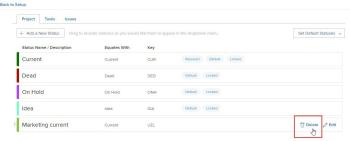

# Delete a group status

>[!IMPORTANT]
>
>You're currently viewing the Adobe Workfront Classic version of this document. Adobe Workfront Classic is no longer supported. All Adobe Workfront Classic functionality, along with this documentation, will be removed in July 2022. Please transition to the the new Adobe Workfront experienceas soon as possible, and switch to the new Adobe Workfront experience version of this document.

As a group administrator, you can delete a status for a group that you manage if it is not configured as a required or locked status on the system level, or for a higher group in the hierarchy.

If there are any groups above the group you manage, their administrators can also do this for your group. The same is true for Workfront administrators (for any group).

## Access requirements

You must have the following to perform the steps in this article:

<table cellspacing="0"> 
 <col> 
 <col> 
 <tbody> 
  <tr> 
   <td role="rowheader">Workfront plan*</td> 
   <td> 
Any
 </td> 
  </tr> 
  <tr> 
   <td role="rowheader">Adobe Workfront license*</td> 
   <td> 
Plan 
 
You must be a group administrator of the group or a Workfront administrator. For more information, see <a href="../../../administration-and-setup/manage-groups/group-roles/group-administrators.md" class="MCXref xref">Group administrators</a> and <a href="../../../administration-and-setup/add-users/configure-and-grant-access/grant-a-user-full-administrative-access.md" class="MCXref xref">Grant a user full administrative access</a>.
 </td> 
  </tr> 
 </tbody> 
</table>

&#42;If you need to find out what plan or license type you have, contact your Workfront administrator.

## Delete a group status

1. Click **Setup** near the upper-right corner of Adobe Workfront on the Global Navigation Bar.
1. In the left panel, click **Groups**.
1. Select the top-level group, then click **More** > **Settings**.

1. In the list of statuses that displays, hover over the status you want to delete, then click **Delete** when it appears to the far right.

   

1. In the box that displays, select a status to designate a replacement status for objects (projects, tasks, issues, and approval processes) that were using the status that you are deleting.

   Only statuses that equate with the status you are deleting are available. For example, if you are deleting a status that equates with Current, you can see only statuses that equate with Current.

   Also, the statuses that display depend on whether the status you are deleting is unlocked or locked:

   * **If it's unlocked**: Non-hidden locked and unlocked statuses are available.

     Along with the statuses that were created for the subgroup, statuses inherited from system-level and upper level groups are included.
   
   * **If it's locked**: One of the following is true:

      * If there are other locked, non-hidden statuses, only those are available.
      * If there is no locked non-hidden status, the default Workfront status is available, even if it’s hidden or unlocked.

        For information about the default Workfront statuses, see [Access the list of system project statuses](../../../administration-and-setup/customize-workfront/creating-custom-status-and-priority-labels/project-statuses.md), [Access the list of system task statuses](../../../administration-and-setup/customize-workfront/creating-custom-status-and-priority-labels/task-statuses.md), and the information about the 4 required issue statuses in [Access the list of system issue statuses](../../../administration-and-setup/customize-workfront/creating-custom-status-and-priority-labels/issue-statuses.md).

1. Click **Delete Status**.

   If the deleted status was the default status for that type in the group, the replacement status takes its place.

   If the deleted status was set as the default project status in project preferences, the preference is now set to the replacement status.

## When a group is deleted

When a group is deleted and replaced by another group, any unique statuses that the deleted group had are added to the statuses of the replacement group. For more information, see [Custom statuses in a group that is moved or deleted](../../../administration-and-setup/manage-groups/manage-group-statuses/custom-statuses-in-group-moved-or-deleted.md).
