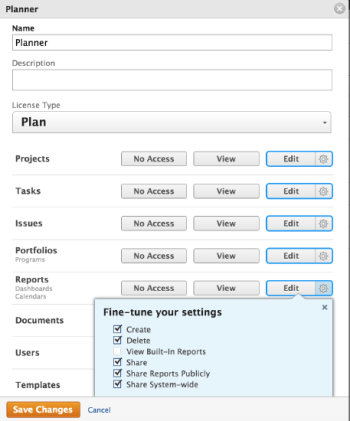

# Hide built-in reports

>[!IMPORTANT]
>
>You're currently viewing the Adobe Workfront Classic version of this document. Adobe Workfront Classic is no longer supported. All Adobe Workfront Classic functionality, along with this documentation, will be removed in July 2022. Please transition to the the new Adobe Workfront experienceas soon as possible, and switch to the new Adobe Workfront experience version of this document.

Adobe Workfront has an extensive list of default built-in reports that users can access and view. As a Workfront administrator, you can modify the access level of a user to hide built-in reports so users do not have access to them.

## Access requirements

You must have the following access to perform the steps in this article: 

<table cellspacing="0"> 
 <col> 
 <col> 
 <tbody> 
  <tr> 
   <td role="rowheader">Adobe Workfront plan</td> 
   <td> 
Any
 </td> 
  </tr> 
  <tr> 
   <td role="rowheader">Adobe Workfront license</td> 
   <td> 
Plan 
 </td> 
  </tr> 
  <tr> 
   <td role="rowheader">Access level configurations</td> 
   <td> 
You must be a Workfront administrator. For more information, see <a href="../../../administration-and-setup/add-users/configure-and-grant-access/grant-a-user-full-administrative-access.md" class="MCXref xref">Grant a user full administrative access</a>.
 
Note: If you still don't have access, ask your Workfront administrator if they set additional restrictions in your access level. For information on how a Workfront administrator can modify your access level, see <a href="../../../administration-and-setup/add-users/configure-and-grant-access/create-modify-access-levels.md" class="MCXref xref">Create or modify custom access levels</a>.
 </td> 
  </tr> 
 </tbody> 
</table>

## Hide built-in reports

1. Click **Setup** in the Global Navigation Bar. 
1. Click **Access Levels**.
1. Select the access level for which you want to hide built-in reports, then click **Edit**.
1. For the **Reports** object, click the **Settings** icon next to the highest level of access available, then deselect **View Built-In Reports**.

   

1. Click **Save****Changes**.

