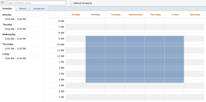
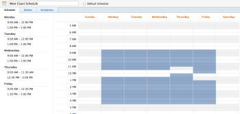
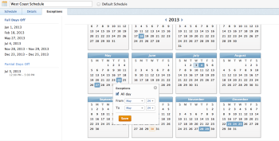
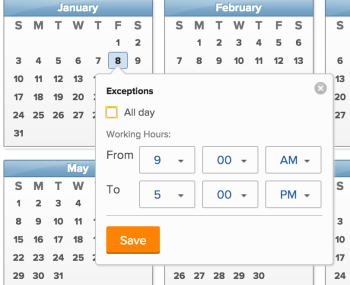

# Create a schedule

>[!IMPORTANT]
>
>You're currently viewing the Adobe Workfront Classic version of this document. Adobe Workfront Classic is no longer supported. All Adobe Workfront Classic functionality, along with this documentation, will be removed in July 2022. Please transition to the the new Adobe Workfront experienceas soon as possible, and switch to the new Adobe Workfront experience version of this document.

<!--

Alina: **DON'T DELETE, DRAFT OR HIDE THIS ARTICLE. IT IS LINKED TO THE PRODUCT, THROUGH THE CONTEXT SENSITIVE HELP LINKS. ***** Linked to Editing Users, Editing Projects, Creating and managing groups

-->

As an Adobe Workfront administrator, you can define your work week by using schedules. You can associate a schedule with a user or a project. This allows Workfront to calculate timelines and user availability.

When you have users that work in different timezones, creating a schedule in each of the timezones and associating it with those users ensures that their work is recorded in Workfront in real time and that their availability is always accurate according to when they work.

For information about associating schedules with users and projects, see the following articles:

* [Edit a user's profile](../../../administration-and-setup/add-users/create-and-manage-users/edit-a-users-profile.md) 
* [Edit projects](../../../manage-work/projects/manage-projects/edit-projects.md)

Group administrators can also create schedules that are associated with the groups they manage. For more information, see Create and modify a group’s schedules.

For information about using schedules to help users collaborate in Workfront across time zones, see [Working across time zones](../../../workfront-basics/tips-tricks-and-troubleshooting/working-across-timezones.md).

## Access requirements

You must have the following access to perform the steps in this article: 

<table cellspacing="0"> 
 <col> 
 <col> 
 <tbody> 
  <tr> 
   <td role="rowheader">Adobe Workfront plan</td> 
   <td> 
Any
 </td> 
  </tr> 
  <tr> 
   <td role="rowheader">Adobe Workfront license</td> 
   <td> 
Plan 
 </td> 
  </tr> 
  <tr> 
   <td role="rowheader">Access level configurations</td> 
   <td> 
You must be a Workfront administrator. For more information, see <a href="../../../administration-and-setup/add-users/configure-and-grant-access/grant-a-user-full-administrative-access.md" class="MCXref xref">Grant a user full administrative access</a>.
 
Note: If you still don't have access, ask your Workfront administrator if they set additional restrictions in your access level. For information on how a Workfront administrator can modify your access level, see <a href="../../../administration-and-setup/add-users/configure-and-grant-access/create-modify-access-levels.md" class="MCXref xref">Create or modify custom access levels</a>.
 </td> 
  </tr> 
 </tbody> 
</table>

## Create a schedule

1. Click **Setup** near the upper-right corner of Adobe Workfront on the Global Navigation Bar.
1. Click**Schedules**.
1. Click**New Schedule**.
1. Specify a name for the schedule.
1. (Optional) Select **Default Schedule** to identify this schedule as your default.

   You can have more than one schedule in Workfront, but you can only have one default schedule.

   You must have at least one schedule in Workfront. If you only have one, that is designated as the default schedule.

   >[!NOTE]
   >
   >You cannot designate a schedule as the default schedule if you are a group administrator. Only a Workfront administrator can designate a schedule as the default for the system.

   

1. In the **Schedule** tab, select a daily schedule by dragging the blue outline across hour blocks to highlight them.

   We recommend that you select 8 one-hour blocks over a 9 hour period of time. This accommodates for lunch or other breaks.

   

1. On the **Details** tab, specify the following information:

   * **Group with Administration Access**: Indicate the group whose Group Administrators have the permission to edit this schedule.

     >[!IMPORTANT]
     >
     >
     >   
     >   
     >   * If you are a group administrator creating a schedule, this field is mandatory.
     >   
     >   
     >     A group administrator can create a schedule only if it is designated for a group or subgroup for which they are designated as the administrator.
     >   
     >   
     >     If you manage only one group, that group is selected in this field, by default. 
     >   
     >   
     >     If you manage several groups, you must select a group in this field before you can save the schedule.  

     >   
     >   * If you are a Workfront administrator creating a schedule, this field is optional. When you create a schedule without associating it with a group, it is saved as a system-level schedule and cannot be managed by a group administrator of any group.
     >   
     >   
     >     Schedules assigned to accounts or projects are visible to all users who can edit these objects. This is true for both system-level and group-level schedules.  

     >   
     >   
     >

     Specifying a **Group with Administration Access** for a schedule does not assign the schedule to the users in the group. Specifying a **Group with Administration Access** only allows the Group Administrators in the group to edit, delete, and copy the schedule.  
     Group Administrators cannot edit, delete, or copy system-level schedules. For more information, see [Group administrators](../../../administration-and-setup/manage-groups/group-roles/group-administrators.md).
   
   * Select the **Groups with View Access** to which this schedule is visible to.

     Only the users in the groups specified here can find the schedule in the drop-down menu when they are assigning it to users or projects. 
   
   * Select the **Time Zone** for your schedule.

     >[!NOTE]
     >
     >If you associate the schedule with a user, we recommend that the Time Zone of the schedule matches that of the user.&nbsp;For information about user's time zones, see [Edit a user's profile](../../../administration-and-setup/add-users/create-and-manage-users/edit-a-users-profile.md).

1. On the **Exceptions** tab, specify the exceptions to the schedule.

   Exceptions are full or half days which need to be excluded from the schedule, such as holidays or company events.

   >[!NOTE]
   >
   >If you already know what your recurring schedule exceptions are, you can define your schedule exceptions for many years in the future.

   Full or partial days can be excluded from the work schedule. Click the date to select it as an exception, then select the **All day** field to indicate whether the exception is a full day or not.

   

1. Specify the start and end time for the partial day exceptions.

   

1. Click **Save**, then click **Save Changes**.

1. (Optional) Associate the schedule with a user.

   For information, see [Edit a user's profile](../../../administration-and-setup/add-users/create-and-manage-users/edit-a-users-profile.md).

1. (Optional)&nbsp;Associate the schedule with a project.

   For information, see [Edit projects](../../../manage-work/projects/manage-projects/edit-projects.md).

##  

