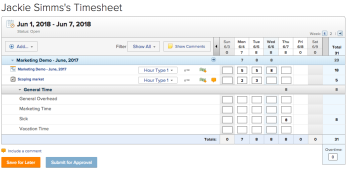

# Manage timesheets for all users

You can manage users' timesheets.

## Access requirements

You must have the following to perform the steps in this article:

<table cellspacing="0"> 
 <col> 
 <col> 
 <tbody> 
  <tr> 
   <td role="rowheader">Adobe Workfront plan*</td> 
   <td> 
Any
 </td> 
  </tr> 
  <tr> 
   <td role="rowheader">Adobe Workfront license*</td> 
   <td> 
Plan 
 </td> 
  </tr> 
 </tbody> 
</table>

&#42;To find out what plan or license type you have, contact your Workfront administrator.

## Filter timesheets

1. Timesheet
1. All Timesheets
1. Configure the filter options.

   These include **Belonging To**, **Approver**, **Status**, and **Time Period**.

   The filters in the **Time Period** drop-down list are based on the timesheet's start and end dates. Timesheets with any date in the selected time frame are filtered, not just by the start or end date.

   For example, if you have a timesheet from February 26 to March 12, you see this timesheet under the filters This Month and Next Month because the timesheet covers dates in February and in March.

   | This Week |A timesheet with dates that fall between 12:00 am Sunday to 11:59 Saturday in the current week. |
   |---|---|
   | Next Week | &nbsp;A timesheet with dates that fall between 12:00 am Sunday to 11:59 Saturday in the next week.  |
   | Last Week | &nbsp;A timesheet with dates that fall between 12:00 am Sunday to 11:59 Saturday in the previous week.  |
   | This Month |&nbsp;A timesheet with dates that fall between the first and last day of the month. |
   | Next Month | &nbsp;A timesheet with dates that fall between the first and last day of the next month.  |
   | Last Month | &nbsp;A timesheet with dates that fall between the first and last day of the previous month.  |
   | This Year |&nbsp;A timesheet with dates that fall between January 1 and the current day. |
   | Past Year |&nbsp;A timesheet with dates that fall between 365 days from the current date. |
   | Last Year | &nbsp;A timesheet with dates that fall between January 1 and December 31st of the previous year.  |
   | Containing the date |A timesheet containing the specified date. |
   | Specific Dates |A timesheet with dates that fall between the specified date range. |

1. Click **Filter**.

## Update user timesheets

1. Timesheet
1. All Timesheets
1. Set the filter options.

   For more information, see the [Filter timesheets](#filtering-timesheets) section in this article.

1. Click **Date Range** to select a timesheet.
1. Update the information as needed.

   For more information, see [Log time](../../../timesheets/create-and-manage-timesheets/log-time.md).

1. (Optional) Click **Include a Comment**.
1. If you are not finished updating the timesheet, click **Save for Later**.

   Or

   If you are finished updating the timesheet, click **Submit for Approval**.

   

