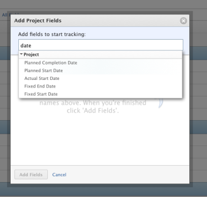

# Configure system updates

Adobe Workfront generates automatic system updates in an object's Updates area to record the following events:

* Changes users make in an object field
* Actions users perform on an object

These system updates include the change that was made, the name of the user who made the change, and the time and date of the change.

As a Workfront administrator, you can configure which object fields and actions Workfront tracks to record system updates.

For example, you could have Workfront track all changes users make to the names of issues throughout the system. Any issue name change then appears as a system update on the issue's Updates area.

## Access requirements

You must have the following to perform the steps in this article:

<table cellspacing="0"> 
 <col> 
 <col> 
 <tbody> 
  <tr> 
   <td role="rowheader">Adobe Workfront plan</td> 
   <td> 
Any
 </td> 
  </tr> 
  <tr> 
   <td role="rowheader">Adobe Workfront license</td> 
   <td> 
Plan 
 </td> 
  </tr> 
  <tr> 
   <td role="rowheader">Access level configurations</td> 
   <td> 
You must be a Workfront administrator. For more information, see <a href="../../../administration-and-setup/add-users/configure-and-grant-access/grant-a-user-full-administrative-access.md" class="MCXref xref">Grant a user full administrative access</a>.
 
Note: If you still don't have access, ask your Workfront administrator if they set additional restrictions in your access level. For information on how a Workfront administrator can modify your access level, see <a href="../../../administration-and-setup/add-users/configure-and-grant-access/create-modify-access-levels.md" class="MCXref xref">Create or modify custom access levels</a>.
 </td> 
  </tr> 
 </tbody> 
</table>

## Determine which fields Workfront tracks for an object type

You can determine what information Workfront tracks when users change information associated with a certain object type throughout the entire Workfront interface. You do this by adding or removing the fields you want Workfront to track for that object type.

>[!NOTE]
>
>* Workfront cannot track and record updates about calculated custom fields.
>* You can customize the system update for projects, tasks, issues, portfolios, programs, and users. You cannot customize the system update for templates, documents or timesheets, but Workfront does record system updates for these objects.
>

* [Add fields you want Workfront to track](#adding-fields-to-the-update-feeds) 
* [Remove fields that you don't want tracked](#removing-fields-from-the-update-feeds)

### Add fields you want Workfront to track

You can add fields you want Workfront to track for a particular type of object throughout the Workfront interface. When users change information in that field, Workfront records information about the change as a system update in the Updates area for the object.

>[!NOTE]
>
>You can track up to 300 built-in and custom fields in the update feeds. If you are tracking the maximum number of fields and want to track additional fields that are not displayed in the All Fields Sub-tab, you must first remove some of the tracked fields in order to track new fields. For more information about removing fields from the update fields, see see [Remove fields that you don't want tracked](#removing-fields-from-the-update-feeds).

1. Setup
1. In the panel on the left, click **Interface** > **Update Feeds**.  

1. ​Click **Add Fields**, then click the object that you want to be tracked.  

1. In the**Add Fields** box that appears, start typing either a built-in (standard) field or a custom field for the object, then click to select it when it appears in the list.

   If Workfront is already tracking the field, you cannot add it a second time from the list.

   

1. After adding all the fields you want Workfront to track, click **Add Fields**.

   The built-in fields that you added show under the **Built-in Fields** sub-tab.

   The custom fields you added show under the **Custom Fields** sub-tab.

   The **All Fields** sub-tab shows both the built-in and the custom fields that are being tracked.

### Remove fields that you don't want tracked

You can remove fields you do not want the system to track for a particular type of object throughout the Workfront interface.

1. Setup
1. Click **Interface** > **Update Feeds**.  

1. On the **Tracked Fields** tab, select the **All Fields** sub-tab.

   This shows both the built-in and the custom fields that are currently being tracked.

1. Select the field you want to stop tracking, then click **Remove**.  

1. In the **Remove Field** box that appears, click **Yes, Remove It** to confirm.

Any updates about the previously-tracked fields are preserved in the Updates area where they were recorded.

## Determine which actions Workfront tracks for an object type

You can have Workfront track the following actions that users can perform on objects throughout the Workfront interface.

For example, you can have Workfront record an update every time a user changes an assignment to a task or issue. The change then appears as a system update in the Updates area for the task or issue.

<table cellspacing="15"> 
 <col> 
 <col> 
 <col> 
 <thead> 
  <tr> 
   <th><strong>Action</strong> </th> 
   <th><strong>Objects</strong> </th> 
   <th><strong>Default Status</strong> </th> 
  </tr> 
 </thead> 
 <tbody> 
  <tr> 
   <td>Assignment is changed</td> 
   <td>Tasks, Issues</td> 
   <td> 
Enabled
 </td> 
  </tr> 
  <tr> 
   <td>Baseline is deleted</td> 
   <td>Projects</td> 
   <td> 
Disabled
 </td> 
  </tr> 
  <tr> 
   <td>Billing record is created or deleted</td> 
   <td>Projects</td> 
   <td> 
Enabled
 </td> 
  </tr> 
  <tr> 
   <td>Document is created or deleted</td> 
   <td>Projects, Tasks, Issues, Portfolios, Programs</td> 
   <td> 
Enabled
 </td> 
  </tr> 
  <tr> 
   <td>Expense is created or deleted</td> 
   <td>Projects, Tasks</td> 
   <td> 
Enabled
 </td> 
  </tr> 
  <tr> 
   <td>Hour is logged or deleted</td> 
   <td>Projects, Tasks, Issues</td> 
   <td> 
Enabled
 </td> 
  </tr> 
  <tr> 
   <td>Issue is deleted</td> 
   <td>Projects</td> 
   <td> 
Enabled
 </td> 
  </tr> 
  <tr> 
   <td>Task is deleted</td> 
   <td>Projects</td> 
   <td> 
Enabled
 </td> 
  </tr> 
  <tr> 
   <td>Someone's Access is changed</td> 
   <td>Projects, Tasks, Issues, Documents, Portfolios, Programs</td> 
   <td> 
Enabled
 </td> 
  </tr> 
  <tr> 
   <td>Subscribe comment object</td> 
   <td>Projects, Tasks, Issues</td> 
   <td> 
Enabled
 </td> 
  </tr> 
 </tbody> 
</table>

To configure which actions you want Workfront to track:

1. Setup
1. Click **Interface** > **Update Feeds**.  

1. Click the **Actions** tab.  

1. Select an action to enable it, or deselect an action to disable it.
1. Click **Save**.

When you disable an action, any previously-recorded update about that action is preserved in the Updates area where it was recorded.
