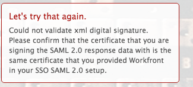

# Error message: Couldn't validate XML digital signature

>[!IMPORTANT]
>
>You're currently viewing the Adobe Workfront Classic version of this document. Adobe Workfront Classic is no longer supported. All Adobe Workfront Classic functionality, along with this documentation, will be removed in July 2022. Please transition to the the new Adobe Workfront experienceas soon as possible, and switch to the new Adobe Workfront experience version of this document.

## Problem

You are unable to establish a successful connection to ADFS.

>[!NOTE]
>
>If you establish a successful test connection and you are still experiencing issues, you might have incorrect attribute mappings or issues with the federation IDs. Contact customer support with questions.

## Access requirements

You must have the following access to perform the steps in this article: 

<table cellspacing="0"> 
 <col> 
 <col> 
 <tbody> 
  <tr> 
   <td role="rowheader">Adobe Workfront plan</td> 
   <td> 
Any
 </td> 
  </tr> 
  <tr> 
   <td role="rowheader">Adobe Workfront license</td> 
   <td> 
Plan 
 </td> 
  </tr> 
  <tr> 
   <td role="rowheader">Access level configurations</td> 
   <td> 
You must be a Workfront administrator. For more information, see <a href="../../administration-and-setup/add-users/configure-and-grant-access/grant-a-user-full-administrative-access.md" class="MCXref xref">Grant a user full administrative access</a>.
 
Note: If you still don't have access, ask your Workfront administrator if they set additional restrictions in your access level. For information on how a Workfront administrator can modify your access level, see <a href="../../administration-and-setup/add-users/configure-and-grant-access/create-modify-access-levels.md" class="MCXref xref">Create or modify custom access levels</a>.
 </td> 
  </tr> 
 </tbody> 
</table>

## Cause 1: The certificate is incorrect

### Solution

Manually retrieve the Signing Certificate from the ADFS Server:

1. In Windows, click **Start** > **Administration** > **ADFS 2.0 Management**.  
   The ADFS 2.0 Management dialog box is displayed.

1. Select **Trust Relationship** > **Relying Party Trusts** in the left-hand pane.

1. Right-click on **Relying Party Trust**, and select **Properties**.

1. Click on the **Signature** tab.
1. Click on the name of the Signing Certificate, and click **View**.
1. Click Copy to **File**..., and select **Next**.

1. Select **Base-64 encoded x.509 (CER)**, and click **Next**.

1. Specify the file name, and click **Next**.
1. Click **Finish**.
1. In Adobe Workfront, navigate to **Setup** > **System** > **Single Sign-On (SSO)** and manually upload the Signing Certificate.

## Cause 2: The certificate is signed using DSA when Workfront is expecting an RSA signature

### Solution

Recreate the certificate and use the RSA signature instead of the DSA.

## Cause 3: XML Data is incorrect

### Solution

Re-export and re-import the XML metadata from the ADFS management system.

## Cause 4: The request could not be performed due to an error on the SAML side

### Solution

Contact your SAML provider.
