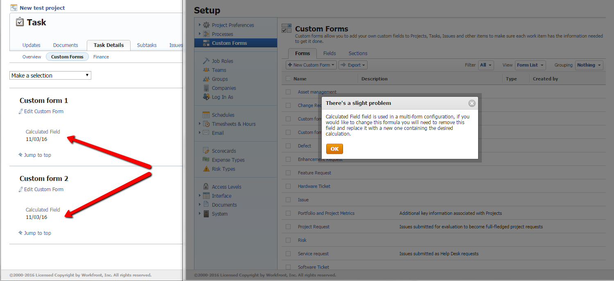

# Error saving custom field: "There is a slight problem. [That field] is used in a multi-form configuration ..."

##  Problem

When you change a calculation on a calculated custom field on a custom form, Adobe Workfront might display the following warning:

There's a slight problem

[The field] is used in a multi-form configuration, if you would like to change this formula you will need to remove this field and replace it with a new one containing the desired calculation.

## Cause

This means that somewhere in your Workfront environment you have an object that has at least two different custom forms attached to it and both forms contain the field you are trying to change

In this case, you cannot change the calculation for the custom field in&nbsp;Form 1 because it would conflict with the formula in the same field on Form 2.

##  Solution

To resolve this conflict you must find the object that has the two forms in it and remove one of the forms from the object.

1. Go to **Setup**, then **Custom Forms** >&nbsp;**Fields**> apply the **Field List** view to find the Calculated Field you are trying to modify and make note of every Custom Form on which it is used (e.g. Form 1, Form 2, Form 3) .  
1. Click&nbsp;**Forms**, then apply the **Form List** view. 
1. Click the **Filter** drop-down list, then **New Filter**. 

1. Click&nbsp;**Add a Filter Rule**, then start typing "Custom&nbsp;Form Name" and select this value when it displays in the list. 
1. Select **Equal** for your filter modifier, then start typing the name of each form you made a note of in Step 1, then select it when it displays in the list. For example, Custom Form Name Equals Form 1,&nbsp;Form 2,&nbsp;Form 3. 
1. Click&nbsp;**Save Filter**, then name the new filter, and click&nbsp;**Save Filter**. 

1. In the list of forms, make note of the object type of the filter which displays in the **Type** column. For example, "Issue."
1. On each Custom Form you found in Step 1, create a new Checkbox custom field with a single default value of Yes. For example, Field 1 on Form 1 = Yes, Field 2 on Form 2 = Yes, Field 3 on Form 3 = Yes. This means "The Calculated Custom&nbsp;Field exists on Form 1," or "The Calculated Custom Field exists on Form 2," etc. 
1. Go to the **Search box** in the upper-right corner of the screen and click the **drop-down menu**, then click&nbsp;**Advanced Search**.  

1. Click the object of your custom form (for example, Issue), then click&nbsp;**Filter your results**, then click **Add a filter**. 
1. Start typing the name of a Checkbox field in the **Start typing field name ...** and click it when it displays in the list, then select **Equal** and type "Yes" (without quotation marks) in the following box. For example: Field 1 Equal (Case Sensitive)&nbsp;Yes. 
1. Click **Add a Filter** and add all Checkbox fields to your Advanced&nbsp;Search.

   Look for every possible combination. For example, build several filters with these combinations, as listed below. Only in one situation you should actually find objects with multiple forms containing the same calculated fields attached.&nbsp;For example, you may find the following scenarios:

   Field 1= Yes + Field 2 = Yes + Field 3 = Yes (no objects, for example)

   Field 1= Yes + Field 2 = Yes (no objects, for example)

   Field 1= Yes + Field 3 = Yes (two objects, for example)

   This means that the calculated field exists on both Form 1 and Form 3, because the corresponding Checkbox fields (Field 1 and Field 3) exist on these objects.

   Field 2 = Yes + Field 3 = Yes (no objects, for example)

1. Open each of the objects found in Step 12 and remove one of the two forms, then save the object.

   >[!NOTE]
   >
   >You might need to edit the custom form that remains attached to the object to add the fields from the form you are removing from the object. This way, you can preserve the custom data information on the object.

1. Now, go back to your custom form and edit the calculation for the custom field you were originally trying to update. This time, Workfront should not encounter any more conflicts when saving the new calculation. 
1. (Optional) Remove the Checkbox fields from the forms

   Or

   Delete the Checkbox fields from Workfront.

<!--
<blockquote data-mc-conditions="QuicksilverOrClassic.Draft mode">
<h2>Problem</h2>

You get the following error&nbsp;while editing a calculated Custom Field on a Custom Form:&nbsp;

<em>"<Name of custom field> field is used in a multi-form configuration, if you would like to change this formula you will need to remove this field and replace it with a new one containing the desired calculation."</em> 

<h2>Cause</h2>

The error occurs because the following setup exists: currently you have at least one object in your system that has multiple Custom Forms attached. The calculated field you are editing exists on multiple forms attached to these objects.

You cannot have the same calculated field with different calculations on the same object. For this reason, the system does not allow you to make a change which will result in calculations being different.

 

For example, you have a task&nbsp;with Custom Forms A and B attached to it. Both forms contain the same calculated field, Field 1. You encounter this error when you try to edit the calculation for Field 1 on Custom Form A.&nbsp;

<h2>Solution</h2>

Remove the field from the Custom Form and replace it with a new one containing the desired calculation.&nbsp;&nbsp;

To understand what Custom Forms are attached to objects, you can build a report for those objects and reference the Category Name field in the view of the report. For more information about referencing Custom Forms in reports, see the "Referencing Custom Forms in a Report View (Column)" section in <a href="../../reports-and-dashboards/reports/creating-and-managing-reports/reference-custom-form-report.md" class="MCXref xref" xrefformat="{para}">Reference a custom form in a report</a>.

To understand what Custom Form contains a Custom Field, see the "Accessing Custom Forms and Fields" section in <a href="../../administration-and-setup/customize-workfront/create-manage-custom-forms/custom-forms-overview.md" class="MCXref xref" xrefformat="{para}">Custom forms overview</a>.

For more information about creating a Custom Form and adding or removing fields from it, see <a href="../../administration-and-setup/customize-workfront/create-manage-custom-forms/create-or-edit-a-custom-form.md" class="MCXref xref" xrefformat="{para}">Create or edit a custom form</a>.

</blockquote>
-->

