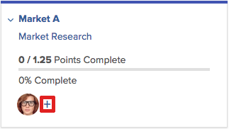
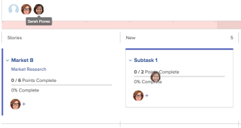

# Assign users to a story on the Kanban board

>[!IMPORTANT]
>
>You're currently viewing the Adobe Workfront Classic version of this document. Adobe Workfront Classic is no longer supported. All Adobe Workfront Classic functionality, along with this documentation, will be removed in July 2022. Please transition to the the new Adobe Workfront experienceas soon as possible, and switch to the new Adobe Workfront experience version of this document.

## Access requirements

You must have the following access to perform the steps in this article:

<table> 
 <col> 
 <col> 
 <tbody> 
  <tr> 
   <td role="rowheader">Adobe Workfront plan*</td> 
   <td> <p>Any</p> </td> 
  </tr> 
  <tr> 
   <td role="rowheader">Adobe Workfront license*</td> 
   <td> <p>Work or higher</p> </td> 
  </tr> 
  <tr> 
   <td role="rowheader">Access level configurations*</td> 
   <td> <p>Worker or higher</p> <p>Note: If you still don't have access, ask your Workfront administrator if they set additional restrictions in your access level. For information on how a Workfront administrator can change your access level, see <a href="../../administration-and-setup/add-users/configure-and-grant-access/create-modify-access-levels.md" class="MCXref xref">Create or modify custom access levels</a>.</p> </td> 
  </tr> 
 </tbody> 
</table>

&#42;To find out what plan, license type, or access you have, contact your Workfront administrator.

## Assign users to a story on the Kanban board

1. Go to the agile Kanban board where&nbsp;you want to assign users.
1. Go to the story tile on the Kanban board where you want to add a user.
1. Click the **Plus** icon on the story tile,&nbsp;begin typing the name of the user you want to assign to the story, then click the name when it appears. You can also click the&nbsp;drop-down arrow and select a user from the list. Users who are members of the agile team are displayed.

   >[!TIP]
   >
   >You can also assign a job role to a story. You can only assign active users and ```active roles```.

   This option is available only when the story tile is expanded.  
     
   Or  
   Drag the user avatar from the list at the top of the page&nbsp;to the story tile where you want to assign the user.  
   The user avatar list remains at the top of the page even while you scroll down the Kanban board.  
   

