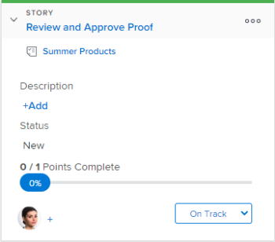

# Use flags on stories on the Kanban board

>[!IMPORTANT]
>
>You're currently viewing the Adobe Workfront Classic version of this document. Adobe Workfront Classic is no longer supported. All Adobe Workfront Classic functionality, along with this documentation, will be removed in July 2022. Please transition to the the new Adobe Workfront experienceas soon as possible, and switch to the new Adobe Workfront experience version of this document.

On the Kanban board, flags provide a visual indication of when a story is ready to move to the next status. This enables Kanban teams to use a "pull" approach rather than a "push" approach when moving stories across statuses.

``` ```**Example: **``````Consider the following example of a team using a "pull" approach: Olivia, the graphic designer on the team, finishes her work and then sets the story flag as "Ready to Pull." This flag provides a visual indication to Tony, the copywriter on the team, that the story is ready for him to move to the next status. Tony then moves the story to the next status when he is ready to begin working on it.&nbsp; Consider the following when using flags on stories:

* Flags are not a status, but rather a visual indication that the story is ready to be moved to the next status by another member of the team.&nbsp;
* Flags do not appear on any story cards that are in the Backlog column or in the Complete column (or in any column where the status of the column equates with Complete).

  For more information about story statuses, see [Use flags on stories on the Kanban board](#updating-the-status-of-stories-and-subtasks)

## Access requirements

You must have the following access to perform the steps in this article:

<table cellspacing="0"> 
 <col> 
 <col> 
 <tbody> 
  <tr> 
   <td role="rowheader">Adobe Workfront plan*</td> 
   <td> <p>Any</p> </td> 
  </tr> 
  <tr> 
   <td role="rowheader">Adobe Workfront license*</td> 
   <td> <p>Work or higher</p> </td> 
  </tr> 
  <tr> 
   <td role="rowheader">Access level configurations*</td> 
   <td> <p>Worker or higher</p> <p>Note: If you still don't have access, ask your Workfront administrator if they set additional restrictions in your access level. For information on how a Workfront administrator can change your access level, see <a href="../../administration-and-setup/add-users/configure-and-grant-access/create-modify-access-levels.md" class="MCXref xref">Create or modify custom access levels</a>.</p> </td> 
  </tr> 
 </tbody> 
</table>

&#42;To find out what plan, license type, or access you have, contact your Workfront administrator.

## Use flags on stories on the Kanban board

To change a flag on a story:

1. Go to the Kanban board where you want to change a flag on a story.
1. Expand the story tile to view the&nbsp;flag.  
   The flag is set to **On Track** for each story by default.  
   

1. Click the current flag, then select from the&nbsp;following flag options:

   * **On Track:**&nbsp;The story is in the appropriate status and no action needs to be taken at this time.  
     This is the default flag for each story on the Kanban board.  
     

   * **Is Blocked:**&nbsp;The story cannot proceed to the next status. When this flag is set on a story, the story does not count toward the WIP limit. (For more information about WIP limits, see&nbsp;the article [Configure Kanban](../../agile/get-started-with-agile-in-workfront/configure-kanban.md).  
     

   * **Ready to Pull:**&nbsp;The story is ready to be moved to the next status by another member of the team.  
     

