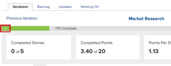

# Resize and collapse the burndown chart

>[!IMPORTANT]
>
>You're currently viewing the Adobe Workfront Classic version of this document. Adobe Workfront Classic is no longer supported. All Adobe Workfront Classic functionality, along with this documentation, will be removed in July 2022. Please transition to the the new Adobe Workfront experienceas soon as possible, and switch to the new Adobe Workfront experience version of this document.

You can resize or collapse the burndown chart to adjust how much room it occupies on the story board.

Any changes you make to the size or visibility of the burndown chart are visible only to you, and are reset when you clear your browser cache.

## Access requirements

You must have the following access to perform the steps in this article:

<table> 
 <col> 
 </col> 
 <col> 
 </col> 
 <tbody> 
  <tr> 
   <td role="rowheader">Adobe Workfront plan*</td> 
   <td> 
Any
 </td> 
  </tr> 
  <tr> 
   <td role="rowheader">Adobe Workfront license*</td> 
   <td> 
Review or higher
 </td> 
  </tr> 
 </tbody> 
</table>

&#42;To find out what plan or license type you have, contact your Workfront administrator.

## Resize the burndown chart

1. Go to the iteration 

   <!--
   <MadCap:conditionalText data-mc-conditions="QuicksilverOrClassic.Draft mode">
   or project
   </MadCap:conditionalText>
   -->

   that contains the burndown chart you want to resize.
1. Hover over the bottom line of the burndown chart, then drag the chart to the desired size.  
   

## Collapse the burndown chart

1. Go to the iteration 

   <!--
   <MadCap:conditionalText data-mc-conditions="QuicksilverOrClassic.Draft mode">
   or project
   </MadCap:conditionalText>
   -->

   that contains the burndown chart you want to collapse.
1. Click the arrow icon in the left of the Percent Complete status bar.  
   

