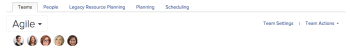

# Use an alternate team schedule for burndown charts

>[!IMPORTANT]
>
>You're currently viewing the Adobe Workfront Classic version of this document. Adobe Workfront Classic is no longer supported. All Adobe Workfront Classic functionality, along with this documentation, will be removed in July 2022. Please transition to the the new Adobe Workfront experienceas soon as possible, and switch to the new Adobe Workfront experience version of this document.

Schedules that are defined in Adobe Workfront affect the burndown&nbsp;chart&nbsp;by excluding days off (weekends and holidays) from the burndown.

By default, the burndown chart&nbsp;uses the default schedule.&nbsp;In addition to the default schedule, agile teams can choose to also use an alternate schedule in order to incorporate team-specific non-working days. This alternate schedule is then&nbsp;reflected in the burndown&nbsp;chart of any iteration that is assigned to the team. The alternate schedule affects only the burndown&nbsp;chart.&nbsp;(For more information about the default schedule, as well as how the Workfront administrator can create a team-specific schedule, see&nbsp; [Create a schedule](../../../administration-and-setup/set-up-workfront/configure-timesheets-schedules/create-schedules.md).)

The burndown chart does not take partial days into consideration. For example, if your team works&nbsp;4 hours each Friday, it’s represented as a full day in the burndown chart.

For more information about using the burndown chart, see the [Agile burndown chart overview](../../../agile/use-scrum-in-an-agile-team/burndown/burndown-chart-overview.md).

## Access requirements

You must have the following access to perform the steps in this article:

<table> 
 <col> 
 </col> 
 <col> 
 </col> 
 <tbody> 
  <tr> 
   <td role="rowheader">Adobe Workfront plan*</td> 
   <td> 
Any
 </td> 
  </tr> 
  <tr> 
   <td role="rowheader">Adobe Workfront license*</td> 
   <td> 
Work or higher
 </td> 
  </tr> 
 </tbody> 
</table>

&#42;To find out what plan or license type you have, contact your Workfront administrator.

## Use an alternate team schedule for burndown charts

1. Ensure that the Workfront administrator has already created the alternate schedule, as described in&nbsp; [Create a schedule](../../../administration-and-setup/set-up-workfront/configure-timesheets-schedules/create-schedules.md).
1. Go to the&nbsp;**People**&nbsp;area, then click the&nbsp;**Teams**&nbsp;tab.

1. Select the agile&nbsp;team that you want to manage.
1. Click on the&nbsp;**Team Settings**&nbsp;link in the top-right corner.

   

1. In the&nbsp;**Agile**&nbsp;section, in the&nbsp;**Schedule**&nbsp;area, select the new schedule from the drop-down menu.

1. Click&nbsp;**Save Changes**.

