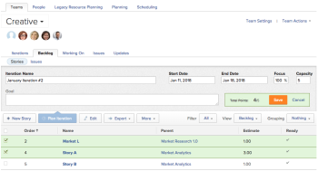
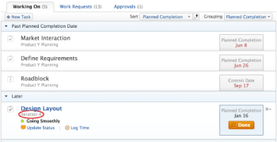

# Create an iteration

>[!IMPORTANT]
>
>You're currently viewing the Adobe Workfront Classic version of this document. Adobe Workfront Classic is no longer supported. All Adobe Workfront Classic functionality, along with this documentation, will be removed in July 2022. Please transition to the the new Adobe Workfront experienceas soon as possible, and switch to the new Adobe Workfront experience version of this document.

Iterations are a key component for Scrum agile teams in planning out work capacity. Adobe Workfront allows Scrum agile teams to manage their work by creating multiple&nbsp;iterations to accommodate team needs.

## Access requirements

You must have the following access to perform the steps in this article:

<table cellspacing="0"> 
 <col> 
 </col> 
 <col> 
 </col> 
 <tbody> 
  <tr> 
   <td role="rowheader">Adobe Workfront plan*</td> 
   <td> 
Any
 </td> 
  </tr> 
  <tr> 
   <td role="rowheader">Adobe Workfront license*</td> 
   <td> 
Review or higher
 </td> 
  </tr> 
 </tbody> 
</table>

&#42;To find out what plan or license type you have, contact your Workfront administrator.

## Plan an iteration on the Backlog tab

Use the Plan Iteration feature to create an iteration using tasks on your backlog.

1. Go to the **People** area in the Global Navigation Bar.
1. Ensure that the **Teams** tab is selected, then select the agile team from the drop-down menu.  
   If you do not have an agile team, you can create one, as described in [Create an agile team](../../../agile/get-started-with-agile-in-workfront/create-an-agile-team.md).

1. Click the **Backlog**&nbsp;tab,&nbsp;then click **Plan Iteration**.  
   

1. Specify the following information:  

   <table cellspacing="0"> 
    <col> 
    <col> 
    <tbody> 
     <tr> 
      <td role="rowheader"><strong>Iteration Name:</strong></td> 
      <td>Specify a name for the iteration.</td> 
     </tr> 
     <tr> 
      <td role="rowheader"><strong>Start Date:</strong></td> 
      <td> Specify the date the iteration should start.</td> 
     </tr> 
     <tr> 
      <td role="rowheader"><strong>End Date:</strong>&nbsp;</td> 
      <td>
Specify the date the iteration should end. Workfront recommends setting an end date no longer than 4 weeks from the start date.

Tip: Make sure to choose a working day as the end date. The burndown chart uses only working days in its calculations. By default, the burndown chart uses the&nbsp;default schedule to define working days (as described in&nbsp;<a href="../../../administration-and-setup/set-up-workfront/configure-timesheets-schedules/create-schedules.md" class="MCXref xref">Create a schedule</a>). Or, to incorporate team-specific non-working days,&nbsp;agile teams can choose to use an alternate schedule (as described in <a href="../../../agile/use-scrum-in-an-agile-team/burndown/use-alt--team-schedule-burndown-charts.md" class="MCXref xref">Use an alternate team schedule for burndown charts</a>).
</td> 
     </tr> 
     <tr> 
      <td role="rowheader"><strong>Focus:</strong></td> 
      <td>Specify the focus percentage of the team. If all members of the team will be focused completely on this iteration, the focus would be 100%. Workfront pre-populates this field with the average value from your team's past iterations. If this is your team's first iteration, this field value is 0 by default.</td> 
     </tr> 
     <tr> 
      <td role="rowheader"> <strong>Capacity:</strong></td> 
      <td> Specify the capacity for the iteration. This is the number of points or hours your team is able to accomplish in the iteration. The number you enter must be equal to or greater than the number of points or hours from the sum of all the stories in the iteration. Workfront pre-populates this field with the average value from your team's past iterations. If this is your team's first iteration, this field value is 0 by default.</td> 
     </tr> 
     <tr> 
      <td role="rowheader"> <strong>Goal:</strong></td> 
      <td> Specify a goal for the iteration.&nbsp;This field is not required.</td> 
     </tr> 
    </tbody> 
   </table>

1. (Optional) Select stories to add them to&nbsp;the iteration now, or you can skip this step and add stories to an iteration at a later time. The stories at the top of the backlog are higher priority. Stories&nbsp;are highlighted in green when they fit in the capacity; they are highlighted in red if they do not.  
   You can add both tasks and issues to a single iteration:

   * **To add tasks to the iteration:** On the **Backlog** tab, ensure that the **Stories** tab is selected (this tab is selected by default when viewing the backlog). Select the stories you want to add to the iteration.  
     When you add tasks to an iteration, the start date of the task is calculated as described in&nbsp; [Understand how task start dates are calculated when added to an iteration](#understand-how-task-start-dates-are-calculated-when-added-to-an-iteration).
   
   * **To add issues to the iteration:** On the **Backlog** tab, click the **Issues** tab. Select the issues you want to add to the iteration.

1. Click **Save.** 
   The iteration is created.

1. (Optional) To add stories to an existing iteration, see [Add stories to an existing iteration](../../../agile/use-scrum-in-an-agile-team/iterations/add-stories-to-existing-iteration.md).

## Understand how task start dates are calculated when added to an iteration {#understand-how-task-start-dates-are-calculated-when-added-to-an-iteration}

When you add a task as a story to an iteration, the Must Finish On task constraint is used for&nbsp;each story. In most cases, the planned start date of the task is calculated based on the following formula:

Iteration End Date minus (-) Task Duration equals (=) Task Planned Start Date

The Project End Date is used instead of the Iteration End Date if&nbsp;the&nbsp;project start date is after the iteration start date, and the project end date is after the iteration end date.

## Understand how iterations are referenced in the My Work area

If a work item in the My Work area is a story on an iteration, the iteration name is displayed on the list instead&nbsp;of the project name.

For more information about using the My Work area, see [My Work](../../../workfront-basics/using-home/my-work/my-work.md)

