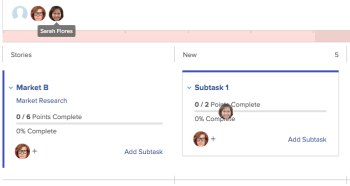

# Assign users to a story on the Scrum board

## Access requirements

You must have the following access to perform the steps in this article:

<table cellspacing="0"> 
 <col> 
 </col> 
 <col> 
 </col> 
 <tbody> 
  <tr> 
   <td role="rowheader">Adobe Workfront plan*</td> 
   <td> <p>Any</p> </td> 
  </tr> 
  <tr> 
   <td role="rowheader">Adobe Workfront license*</td> 
   <td> <p>Work or higher</p> </td> 
  </tr> 
  <tr> 
   <td role="rowheader">Access level configurations*</td> 
   <td> <p>Worker or higher</p> <p>Note: If you still don't have access, ask your Workfront administrator if they set additional restrictions in your access level. For information on how a Workfront administrator can change your access level, see <a href="../../../administration-and-setup/add-users/configure-and-grant-access/create-modify-access-levels.md" class="MCXref xref">Create or modify custom access levels</a>.</p> </td> 
  </tr> 
 </tbody> 
</table>

&#42;To find out what plan, license type, or access you have, contact your Workfront administrator.

## Assign users to a story on the Scrum board

1. Go to the agile iteration or project that contains the story board where&nbsp;you want to assign users. For information about how to navigate to an iteration, see [View an iteration](../../../agile/use-scrum-in-an-agile-team/iterations/view-iteration.md).
1. Go to the story tile on the story board where you want to add a user.
1. Click the **Plus** icon on the story tile,&nbsp;begin typing the name of the user you want to assign to the story, then click the name when it appears. You can also click the&nbsp;drop-down arrow and select a user from the list. Users who are members of the agile team are displayed.

   >[!TIP]
   >
   >You can also assign a job role to a story. You can only assign active users and ```active roles```.

   This option is available only when the story card is expanded.

   

   Or

   On an iteration, drag the user avatar from the list at the top of the page&nbsp;to the story card where you want to assign the user.

   The user avatar list remains at the top of the page even while you scroll down the story board.

   

