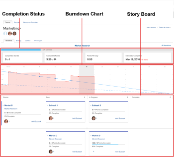
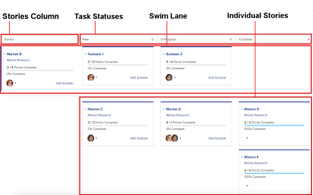
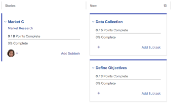

# Scrum board overview

The Scrum agile story board displays together&nbsp;with the completion status and the burndown chart. These agile components are available in the following situations in Adobe Workfront:

* On agile iterations. For more details about using the agile story board, burndown chart, and completion status in a pure agile environment (with backlogs and an iteration), see [Work in an agile environment](../../../agile/work-in-an-agile-environment/work-in-an-agile-environment.md).
* When viewing a project in an agile view. For information about how you can leverage the agile story board, burndown chart, and completion status&nbsp;within an existing project, see [Manage a project in the Agile View](../../../manage-work/projects/manage-projects/manage-projects-in-agile-view.md).

## Story Board Layout and Functions

The story board consists of the following elements:

* **Stories Column:**&nbsp;Unlike the other columns on the story board, the  Stories  column is not a task status, but rather exists to house&nbsp;any stories that contain&nbsp;subtasks in the iteration or project. Only parent stories that have at least one subtask on the story board can reside in this column. The parent stories themselves do not move from status to status across the story board.

  In an iteration, this column appears on the story board only when one or more stories on the story board contains at least one&nbsp;subtask&nbsp;that meets the following requirements:

   * Assigned to the same agile team as the parent task
   * Belongs to the iteration

     In a project, this column appears any time a task has at least one subtask.

     

* **Task Statuses:** Indicate how a story is progressing through the iteration or project based on which status column the story is in.

  For more information, see [Scrum board overview](#).

  Task statuses can be customized for the project by modifying the agile view, as described in [Create or customize an Agile view](../../../reports-and-dashboards/reports/reporting-elements/views-overview.md#customizing-an-agile-view) in [Views overview in Adobe Workfront](../../../reports-and-dashboards/reports/reporting-elements/views-overview.md).

* **Swim Lane:**&nbsp;When a parent story and its subtasks appear on the story board, a swim lane is created specifically for the story and its subtasks. This provides a visual distinction to better view how a story's&nbsp;subtasks are progressing across the story board.&nbsp;

  In an iteration, swim lanes appear on the story board only when a story&nbsp;on the story board contains at least one&nbsp;subtask&nbsp;that meets the following requirements:

   * Assigned to the same agile team as the parent task
   * Belongs to the iteration

  In a project, swim lanes&nbsp;appear any time a task has at least one subtask or one parent task.

* **Individual Stories:**&nbsp;Individual stories and issues are displayed below any swim lanes on the story board.&nbsp;This provides a visual distinction from the stories that are part of a swim lane.

## Relationship between Subtasks&nbsp;and Stories

If a story contains subtasks, you cannot update any information on the parent story itself&nbsp;(such as points/hours&nbsp;or percent complete). Furthermore, you cannot move the story across the story board to update its status.&nbsp;Rather, any changes you make to the story's subtasks are reflected on the story.&nbsp;The combined&nbsp;story points or hours&nbsp;for all subtasks determines the points or hours of&nbsp;the parent story.&nbsp;

For example, if a story has&nbsp;only one subtask valued at&nbsp;4 points, the story itself also has 4 points. If you change the subtask point value to 3, the point value of the parent story is changed to 3. If you create another&nbsp;subtask on the same story and set the point value for that&nbsp;subtask&nbsp;to 4, the point value for the story is changed to 7 in order to reflect the combined&nbsp;point value for both subtasks.

This same logic applies to second-level subtasks (subtasks&nbsp;of subtasks). If a&nbsp;subtask&nbsp;has one or more second-level subtasks, the subtask&nbsp;is calculated based on the second-level subtasks.

## Relationship between the Story Board and the Backlog

>[!NOTE]
>
>The information in this section applies only to agile views&nbsp;on an iteration; agile views&nbsp;on a project do not use a backlog. (For more information about the differences between agile views on an iteration and a project, see "Differences When Using the Agile View on a Project verses on an Iteration" in [Manage a project in the Agile View](../../../manage-work/projects/manage-projects/manage-projects-in-agile-view.md).)

The iteration backlog shows only stories or subtasks where you can set an estimate.&nbsp;If a parent&nbsp;story&nbsp;has subtasks&nbsp;that are displayed on the story board (because they are assigned to the same agile team and belong to the iteration), the parent task is not displayed&nbsp;on the backlog. In this situation, only the subtasks are displayed on the backlog, while the subtasks and the parent story are displayed on the story board.

For example, suppose that&nbsp;Story A contains Subtask 1 and Subtask 2&nbsp;(and both subtasks are assigned to the same agile team). In this situation,&nbsp;Story A is displayed on the story board in a swim lane with&nbsp;Subtask 1 and Subtask 2. However, only Subtask 1 and Subtask 2&nbsp;are displayed in the backlog.&nbsp;

This same logic applies to second-level subtasks (subtasks&nbsp;of subtasks). If a&nbsp;subtask&nbsp;has one or more second-level subtasks assigned to the same agile team and belong to the iteration, only the second-level subtask is displayed in the backlog.

For more information about the backlog, see [Manage the agile backlog](../../../agile/work-in-an-agile-environment/manage-the-agile-backlog.md).
