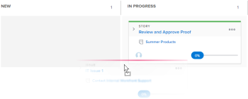

# Update the status of stories and subtasks on the Scrum board

>[!IMPORTANT]
>
>You're currently viewing the Adobe Workfront Classic version of this document. Adobe Workfront Classic is no longer supported. All Adobe Workfront Classic functionality, along with this documentation, will be removed in July 2022. Please transition to the the new Adobe Workfront experienceas soon as possible, and switch to the new Adobe Workfront experience version of this document.

You can change the status of a story directly from the agile story board to reflect how the stories are progressing through the iteration or project.

>[!NOTE]
>
>Only statuses selected in the Story Board section in the team settings area are available on the Scrum board and in the status drop-down menu. For more information, see [Configure Scrum](../../../agile/get-started-with-agile-in-workfront/configure-scrum.md).

## Access requirements

You must have the following access to perform the steps in this article:

<table> 
 <col> 
 </col> 
 <col> 
 </col> 
 <tbody> 
  <tr> 
   <td role="rowheader">Adobe Workfront plan*</td> 
   <td> 
Any
 </td> 
  </tr> 
  <tr> 
   <td role="rowheader">Adobe Workfront license*</td> 
   <td> 
Work or higher
 </td> 
  </tr> 
  <tr> 
   <td role="rowheader">Access level configurations*</td> 
   <td> 
Worker or higher
 
Note: If you still don't have access, ask your Workfront administrator if they set additional restrictions in your access level. For information on how a Workfront administrator can change your access level, see <a href="../../../administration-and-setup/add-users/configure-and-grant-access/create-modify-access-levels.md" class="MCXref xref">Create or modify custom access levels</a>.
 </td> 
  </tr> 
 </tbody> 
</table>

&#42;To find out what plan, license type, or access you have, contact your Workfront administrator.

## Update the status of a story or subtask

1. Navigate to an active iteration.
1. Drag a story from one status column on the story board into another column.  
   

