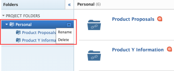
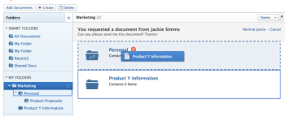
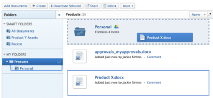

# Link documents between Quip and Adobe Workfront

<!--

***** Keep this article drafted but don't delete it. It's for Salesforce customers only (delivered as a PDF). *****

-->

You can link documents and folders from Quip to Adobe Workfront and from Workfront to Quip.

Before you do this, your Workfront administrator must enable this functionality, as described in [Configure document integrations](../../administration-and-setup/configure-integrations/configure-document-integrations.md) and in the Quip help documentation about getting an API key.

You can proof and approve documents linked to Quip the same way you do so with documents uploaded directly to Workfront.

* [Link a Quip document to Workfront](#link-a-quip-document-to-workfront) 
* [Add a new version of a linked Quip document](#add-a-new-version-of-a-linked-quip-document) 
* [Download a linked Quip document to your hard drive](#download-a-linked-quip-document-to-your-hard-drive) 
* [Upload and link a document from Workfront to Quip](#upload-and-link-a-document-from-workfront-to-quip) 
* [Link folders](#link-folders) 
* [Add a Quip document to a linked folder](#add-a-quip-document-to-a-linked-folder)

  <!--
  <li data-mc-conditions="QuicksilverOrClassic.Draft mode"> </li>
  -->

* [Delete a linked document or folder](#delete-a-linked-document-or-folder) 
* [About renaming linked documents and folders](#about-renaming-linked-documents-and-folders)

## Link a Quip document to Workfront {#link-a-quip-document-to-workfront}

You can link existing Quip documents to Workfront. This includes any shared documents. Quip documents that are linked to Workfront are stored in Quip, not within Workfront.

Before you link Quip documents or folders, your Workfront administrator must enable this functionality, as described in [Configure document integrations](../../administration-and-setup/configure-integrations/configure-document-integrations.md).

1. Go to the **Documents** area in Workfront where you want the document.
1. Click **Add New**, then click 

   <!--
   <MadCap:conditionalText data-mc-conditions="QuicksilverOrClassic.Draft mode">
   <strong>From</strong>
   </MadCap:conditionalText>
   -->

   **Quip**.

1. (Conditional) If you are prompted to log into Quip, type your login credentials in the box that appears, then click **Sign in**.
1. (Conditional) If you are prompted to authorize Quip, click the **Authorize** button.

   You need to do this only once.

1. In the search box of the **Link External Files and Folders** box that appears, type the name of the item you want to search for, then press **Enter** to see all results from Quip, regardless of which folder they are storied in.

   Or

   Browse to and select the documents you want to link.

   Though you can select multiple documents, only documents that are selected in&nbsp;the current view are linked. For example, if you select a document, then go into a folder, the document you originally selected is not linked.

1. Click **Link**.

   In Workfront, the Quip icon appears next to the documents.

## Add a new version of a linked Quip document {#add-a-new-version-of-a-linked-quip-document}

You can add a new version of a Quip document linked to Workfront.

1. Go to the **Documents** area where the document is linked, then select the linked document.
1. Click **More** > **New Version** > **New Version**..

1. (Conditional) If you are prompted to log into Quip, type your login credentials in the box that appears, then click **Sign in**.
1. (Conditional) If you are prompted to authorize Quip, click **Authorize**.

   You need to do this only once.

1. In the search box of the **Link External Files and Folders** box that appears, type the name of the item you want to search for, then press **Enter** to see all results&nbsp;from Quip, regardless of which folder they are storied in.

   Or

   Browse to and select the documents you want to link.

   You can select multiple documents; however, only documents that are selected in the current&nbsp;view are linked. For example, if you select a document, then go into a folder, the document&nbsp;you originally selected is not linked.

1. Click **Link**.

   In Workfront, the Quip icon appears next to the documents.

For information about adding new version of a document you have uploaded to Workfront from your file system, see [Add documents to Adobe Workfront from your file system](../../documents/adding-documents-to-workfront/add-documents-from-file-system.md#adding-new-versions-of-documents) in [Add documents to Adobe Workfront from your file system](../../documents/adding-documents-to-workfront/add-documents-from-file-system.md).

## Download a linked Quip document to your hard drive {#download-a-linked-quip-document-to-your-hard-drive}

From Workfront, you can download a Quip document already linked to Workfront to your hard drive. For instructions, see [Download Documents](../../documents/managing-documents/download-documents.md).

When you download a Quip document linked in Workfront, it might be converted as follows:

* A text document is converted to a Microsoft Word file
* A spreadsheet is converted to a Microsoft Excel file
* A slide presentation is converted to a PDF file

## Upload and link a document from Workfront to Quip {#upload-and-link-a-document-from-workfront-to-quip}

You can upload and link a file of any of the following file types from Workfront to Quip: DOC, DOCX, RTF, ODT, XLSX, XLS, CSV, ODS, HTML, HTM, PDF, MD, MKDN, MDOWN, MARKDOWN, PPTX.

When you do this, the storage of the document moves from Workfront to Quip. When the document is changed in Quip, it updates automatically in Workfront.

Quip users without Workfront access can see the document in Quip.

1. Select a document that is uploaded in Workfront.
1. Click **More** >**Send to** > **Quip**.
1. Select the Quip folder where you want to store the document.

   This can be any folder in Quip, including a shared folder. 

1. Click **Save**.

   Quip's logo appears next to the document name to indicate the link.

## Link folders {#link-folders}

You can link any Quip folders to Workfront, including shared folders.

When you link a folder between Workfront and Quip, the folder and all of its contents are linked. This is useful when you and other users add documents to a linked folder (either via Workfront or via Quip) because they are automatically linked.

Also, when users without access to Workfront add, remove, and modify Quip files in a linked folder, their changes are synchronized to Workfront.

* [Link one or more Quip folders](#link-one-or-more-quip-folders) 
* [Add subfolders to a linked folder](#add-subfolders-to-a-linked-folder) 
* [Folder access rights](#folder-access-rights)

### Link one or more Quip folders {#link-one-or-more-quip-folders}

1. Go to the area in Workfront where you want the folder, then click  the **Documents** tab .
1. Click **Add New**, then click **Quip**.
1. (Conditional) If you have not yet authorized Quip to integrate with Workfront, specify your Quip credentials, then click **Sign in**.
1. In the **Link External Files and Folders** box that appears, browse to and select the folders you want to link.

   Or

   Type the name of the folder you want to search for, then press **Enter**.

   You can select multiple folders; however, only folders that are selected in the current view are linked. For example, if you select a folder, then go into a folder, the folder you originally selected is not linked.

1. Click **Link**.

   In Workfront, Quip's logo displays next to the folder.

1. (Optional) To rename the folder so that the folder name in Workfront is different from the folder name in Quip, select the folder in the **Folders** section, click the  drop-down arrow  that displays next to the folder name, then click **Rename**.

   

   This does not rename the folder in Quip.

### Add subfolders to a linked&nbsp;folder  {#add-subfolders-to-a-linked-folder}

You can create a new folder inside an existing linked folder. You can also drag another folder into an existing linked folder.

1. To create a new folder within an existing linked folder, go to the existing folder, then create the new folder as described in [Create document folders](../../documents/organizing-documents/create-documents-folder.md).

   Or

   To drag an existing folder into an existing linked folder, go to the Documents&nbsp;area where you want the subfolder, then drag it into the linked folder.

   

   >[!NOTE]
   >
   >The following limitations apply when dragging an existing Workfront folder into a linked&nbsp;folder:
   >
   >   
   >   
   >   * The folder that you are dragging can't already be linked&nbsp;and can't contain any content that is already linked.
   >   * The folder (including its contents) that you are dragging can't exceed 50 MB.
   >   
   >

### Folder access rights {#folder-access-rights}

When synchronizing folder content from Quip, Workfront uses the credentials of the user who originally linked the folder. This results in the following user experience:

* If users do not have access to view files and folders in Quip, but do have access to view the linked folder via Workfront, they can view only the names of the files and folders in Workfront, not their contents. 
* When someone accesses content in a linked folder in Workfront that was linked to Workfront by another user (such as a subfolder in a linked folder), the content synchronizes to Workfront using the Workfront login credentials of the user who originally linked the folder, not the credentials of the user accessing the content.  
* If the user who originally linked the folder is removed from the Workfront system, users are no longer able to access&nbsp;content on the linked folder via Workfront. In this case, the folder must be relinked by an active Workfront user who has rights to the folder in Quip.

## Add a Quip document to a linked folder  {#add-a-quip-document-to-a-linked-folder}

When you add a document to a linked folder via Workfront, it is automatically added as a linked document.

1. In the **Documents** area where you want the document, drag the document into a linked&nbsp;folder.

   

   Or

   Select the linked folder where you want the document, click **Add New > Document**, then browse to the document and add it to the folder.

   A new version of your document is automatically created in Quip and linked into Workfront.

<!--
<h2 data-mc-conditions="QuicksilverOrClassic.Draft mode" id=""> </h2>
-->

## Delete a linked document or folder {#delete-a-linked-document-or-folder}

When you delete a linked Quip document or folder, it remains in the Workfront system until you also delete it from Workfront.

1. Select the linked document or folder, then click **Delete**.
1. In the confirmation box that appears, click **Yes, Unlink it**.

   The document is unlinked from the Workfront site. It is not affected in Quip.

## About renaming linked documents and folders {#about-renaming-linked-documents-and-folders}

When you rename a linked document or folder, the change is visible only in the application where you make it. For example, if you rename a linked document in Workfront, the new name is visible only in Workfront.

If you want the name to match in Workfront and in Quip, you must rename it in both places.
