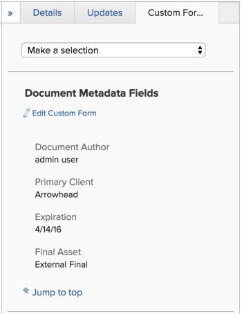

# Add or edit a custom form to a document

You can add a custom form to a document or to a document version to capture additional information or metadata specific to your assets.

## Access requirements

You must have the following:

<table cellspacing="0"> 
 <col> 
 <col> 
 <tbody> 
  <tr> 
   <td role="rowheader">Adobe Workfront plan*</td> 
   <td> 
 Any
 </td> 
  </tr> 
  <tr> 
   <td role="rowheader">Adobe Workfront licenses*</td> 
   <td> 
Request or higher
 </td> 
  </tr> 
  <tr> 
   <td role="rowheader">Access level configurations*</td> 
   <td> 
Edit access to Documents
 
Note: If you still don't have access, ask your Workfront administrator if they set additional restrictions in your access level. For information on how a Workfront administrator can modify your access level, see <a href="../../administration-and-setup/add-users/configure-and-grant-access/create-modify-access-levels.md" class="MCXref xref">Create or modify custom access levels</a>.
 </td> 
  </tr> 
  <tr> 
   <td role="rowheader">Object permissions</td> 
   <td> 
Manage access to the Document
 
For information on requesting additional access, see <a href="../../workfront-basics/grant-and-request-access-to-objects/request-access.md" class="MCXref xref">Request access to objects in Adobe Workfront</a>.
 </td> 
  </tr> 
 </tbody> 
</table>

&#42;To find out what plan, license type, or access you have, contact your Workfront administrator.

## Prerequisites

* The custom form must be shared with you

## Add a custom form

To add a custom form to a document:

1. Go to the project, task, or issue that contains the document, then select **Documents**.
1. Find the document you need.

1. Click the **Custom Form** tab in the right panel.
1. Select the custom form you want to attach from the **Make a Selection** drop-down menu.

   Only active custom forms display in the drop-down menu. You can add up to 10 custom forms per document. If you need to create a custom form, see [Create or edit a custom form](../../administration-and-setup/customize-workfront/create-manage-custom-forms/create-or-edit-a-custom-form.md).

   

1. Click **Edit Custom Form** to enter information into the fields.

   

1. Click **Save** to keep the information entered. Click **Cancel** to remove the information entered.

   Or

   Click **Remove this form** to remove the form from the document.

1. Go to the project, task, or issue that contains the document, then select **Documents**.
1. Find the document you need.

1. Go to the project, task, or issue that contains the document, then select **Documents**.
1. Find the document you need.

