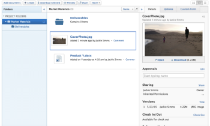
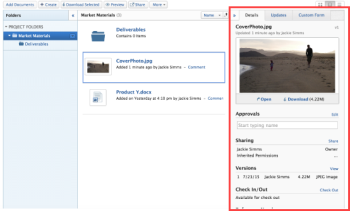

# The Documents area

In the Documents area, you can organize, manage, and view metadata for documents uploaded to Adobe Workfront. 

There are two types of Documents areas. Features and functionality are the same for both:

* **Documents area in a project, task, or issue:** Lists all documents that you have access to for a particular project, task, or issue. To access this area, click the **Documents**&nbsp;tab for a project, task, and issue.

* **Global Documents area:** Lists all documents that you have access to&nbsp;in Workfront. To access this area, click **Documents** in the Global Navigation Bar near the top of Workfront.

For information about uploading documents to Workfront, see [Add documents to Adobe Workfront from your file system](../../documents/adding-documents-to-workfront/add-documents-from-file-system.md).

##  Right panel

While you select a document in the documents area, you can use the right panel to view document **Details**, manage document **Updates** and approvals, and add and edit **Custom Forms**. You can click the double arrow  at the top left of this panel to collapse it when you don't need it.    

## Folders

On a project, task, or issue where documents are uploaded, you can set up folders to organize the documents. For more information, see [Create document folders](../../documents/organizing-documents/create-documents-folder.md).

In the global Documents area, you can set up two types of folders to organize the documents you have access to:

* **Smart Folders:** Show only the documents that you want to see. For more information, see [Create and Manage Smart Folders](../../documents/organizing-documents/create-manage-smart-folders.md).

* **My Folders:**&nbsp;Organize documents the way you want them. For more information, see [Create document folders](../../documents/organizing-documents/create-documents-folder.md).

## Expanded Document Details

The Document Details page provides a more full-scale version of the Document Details in the right panel. To learn more, see [View Document Details](../../documents/managing-documents/view-document-details.md).
