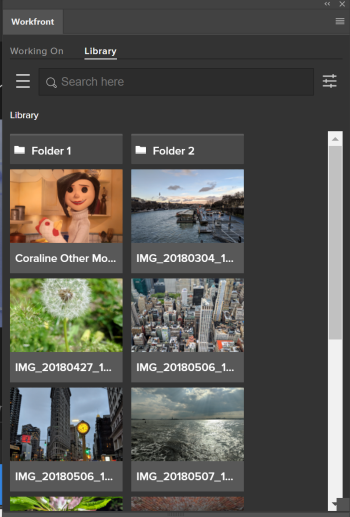
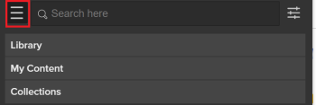

# Use Adobe Workfront for Adobe Creative Cloud with Workfront Library {#use-adobe-workfront-for-adobe-creative-cloud-with-workfront-library}

>[!IMPORTANT]
>
>You're currently viewing the Adobe Workfront Classic version of this document. Adobe Workfront Classic is no longer supported. All Adobe Workfront Classic functionality, along with this documentation, will be removed in July 2022. Please transition to the the new Adobe Workfront experienceas soon as possible, and switch to the new Adobe Workfront experience version of this document.

You must purchase a Workfront Library license to be able to access Workfront Library from the Workfront for Adobe Creative Cloud extension.

For information about Workfront Library, see our [Workfront Library](../../workfront-library/workfront-library.md) section.

For information about installing the Workfront for Adobe Creative Cloud extension, see [Installing Workfront for Adobe Creative Cloud](../../documents/workfront-for-adobe-creative-cloud/installl-wf-adobe-cc.md).

After you have purchased a license for Workfront Library, you can access and edit the content stored in the Workfront Library from the following supported Adobe applications:

* InDesign
* Illustrator

You can do the following in&nbsp;Workfront Libraryusing the Workfront for Adobe Creative Cloud extension:

* [Access Workfront Library Content from Adobe Creative Cloud applications](#use-adobe-workfront-for-adobe-creative-cloud-with-workfront-library)

## Access Workfront Library content from Adobe Creative Cloud applications

Consider the following when accessing Workfront Library content from the Workfront for Adobe Creative Cloud extension:

* You can view only assets that you have created, or that have been shared with you.
* 100 folders and single items display at one time, starting with folders.  
  If there are no folders, and the thumbnails of items display, only 25 items with their thumbnails display at a time by default.

To accessWorkfront Library folders and single items from the Workfront extension for Adobe Creative Cloud:

1. Open a supported Adobe Creative Cloud application.
1. On the **Window** menu, click **Extensions**, then select Workfront.
1. The Workfront panel that opens.   
   Log in to Workfront.

   For information about logging in to Workfront, see the [Logging in to Workfront from Adobe Creative Cloud Applications](../../documents/workfront-for-adobe-creative-cloud/use-wf-adobe-cc.md#logging-in) section in the [Using Workfront for Adobe Creative Cloud](../../documents/workfront-for-adobe-creative-cloud/use-wf-adobe-cc.md) article.

1. Select the **Library** tab.

   

1. Do one of the following:

   1. Using the **Search here** box:

      1. Type in the name of an item or folder that you want to navigate to, then press enter.

         The item displays in the **Search results** area.

   1. Click the **More** icon.

      

      1. Select from the following options:

      * Click **Library** to access the content you have access to view in the Workfront Library.
      * Click **My Content** to access the content that you have uploaded in the Workfront Library.
      * Click **Collections** to access a Workfront Library Collection.

1. (Optional) To decrease the amount of items that you display in the Workfront extension, click the **Options** icon.

   

   When at least one criteria is selected, the Options icon displays a blue dot in the top right.

1. Select from the following types of information about the content stored in Workfront Library to display only items meeting that criteria:

   <table cellspacing="0"> 
    <col> 
    <col> 
    <tbody> 
     <tr> 
      <td role="rowheader">Branding </td> 
      <td> Select from one of the custom Branding categories displayed. Branding information must be configured in Workfront Library and associated with items before it is available in Workfront for Adobe Creative Cloud.</td> 
     </tr> 
     <tr> 
      <td role="rowheader">Created Date</td> 
      <td> 
Select the specific date when the content is created. 
 
Select from the following options:
 
       <ul> 
        <li>Any</li> 
        <li>Today</li> 
        <li>Last Seven Days</li> 
        <li>Last Thirty Days</li> 
        <li>Custom: Select a specific date range</li> 
       </ul> </td> 
     </tr> 
     <tr> 
      <td role="rowheader">Product</td> 
      <td> 
Select from one of the custom Product categories displayed. Products must be configured in Workfront Library and associated with content before they are available in Workfront for Adobe Creative Cloud.
 </td> 
     </tr> 
     <tr> 
      <td role="rowheader">Modified Date</td> 
      <td> 
Select the specific date when the content was modified. Select from the following options:
 
       <ul> 
        <li>Any</li> 
        <li>Today</li> 
        <li>Last Seven Days</li> 
        <li>Last Thirty Days</li> 
        <li>Custom: Select a specific date range</li> 
       </ul> </td> 
     </tr> 
     <tr> 
      <td role="rowheader">Size</td> 
      <td> 
Select a size range for items you want to display. 
 </td> 
     </tr> 
     <tr> 
      <td role="rowheader">File Extension</td> 
      <td> 
Select a specific type of file that you want to display. Select from the following:
 
       <ul> 
        <li>Image</li> 
        <li>Audio</li> 
        <li>Video</li> 
        <li>Document</li> 
        <li>Other</li> 
       </ul> </td> 
     </tr> 
     <tr> 
      <td role="rowheader">Region</td> 
      <td>Select from one of the custom Regions displayed. Regions must be configured in Workfront Library and associated with content before they are available in the Workfront extension.</td> 
     </tr> 
     <tr> 
      <td role="rowheader">Date Time</td> 
      <td> 
Select the specific date when the content was uploaded. 
 
Select from the following options: 
 
       <ul> 
        <li>Any</li> 
        <li>Today</li> 
        <li>Last Seven Days</li> 
        <li>Last Thirty Days</li> 
        <li>Custom: Select a specific date range</li> 
       </ul> </td> 
     </tr> 
     <tr> 
      <td role="rowheader">Date Time Original</td> 
      <td> 
Select the specific date when the content was originally uploaded. 
 
Select from the following options: 
 
       <ul> 
        <li>Any</li> 
        <li>Today</li> 
        <li>Last Seven Days</li> 
        <li>Last Thirty Days</li> 
        <li>Custom: Select a specific date range</li> 
       </ul> </td> 
     </tr> 
     <tr> 
      <td role="rowheader"><strong>Keywords</strong> </td> 
      <td>Start typing a keyword of an item in the <strong>Select</strong> box, then press Enter, to only display items that contain that word in their name.</td> 
     </tr> 
    </tbody> 
   </table>

1. (Optional) Click **Show More** to continue to display more items or folders.
1. Double-click a folder to open its contents.

   Folders may contain subfolders.

   Up to three folders and subfolders that you open during your search are saved in the breadcrumb at the top of the list of items.

1. Double-click the item when it appears in the **Search results** area to open it in the Adobe application.

