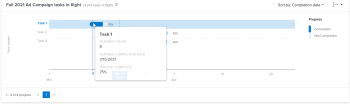
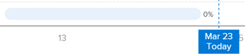

# View the Tasks in flight visualization in Enhanced analytics

>[!IMPORTANT]
>
>You're currently viewing the Adobe Workfront Classic version of this document. Adobe Workfront Classic is no longer supported. All Adobe Workfront Classic functionality, along with this documentation, will be removed in July 2022. Please transition to the the new Adobe Workfront experienceas soon as possible, and switch to the new Adobe Workfront experience version of this document.

The Tasks in flight visualization shows how many tasks (within the applied filter criteria) are in progress for a project, the percentage of work completed for each task, and how on schedule the tasks are.

The Tasks in flight plan visualization shows the following task details:

* **Planned task duration**: The length of a task bar indicates the planned duration, which is based on the task's start date and completion date.

  

* **Work effort completed**: The dark blue color within a task bar indicates the amount of work completed for a task. This completion percentage displays to the right of the task bar.

  

* **Work effort remaining**: The light blue color within a task bar indicates the amount of work that needs to be completed for a task.

  

This information can help you determine:

* Where work effort has been focused.
* Which tasks could be putting a project at risk.
* How close a task is to completion.
* Who you need to talk to about a specific task.

To learn how to get the best data for this visualization, see [Enhanced analytics overview](../enhanced-analytics/enhanced-analytics-overview.md).

## Access requirements

You must have the following:

<table cellspacing="0"> 
 <col> 
 <col> 
 <tbody> 
  <tr> 
   <td role="rowheader"><a href="https://www.workfront.com/plans" target="_blank">Adobe Workfront plan</a>*</td> 
   <td> 
Business or higher
 </td> 
  </tr> 
  <tr> 
   <td role="rowheader"><a href="../administration-and-setup/add-users/access-levels-and-object-permissions/wf-licenses.md" class="MCXref xref">Adobe Workfront licenses overview</a>*</td> 
   <td> 
Review or higher
 </td> 
  </tr> 
  <tr> 
   <td role="rowheader">Access level configurations*</td> 
   <td> 
View access to Projects
 
View access to Tasks (To update tasks, you need Edit access to Tasks.)
 
Note: If you still don't have access, ask your Workfront administrator if they set additional restrictions in your access level. For information on how a Workfront administrator can modify your access level, see <a href="../administration-and-setup/add-users/configure-and-grant-access/create-modify-access-levels.md" class="MCXref xref">Create or modify custom access levels</a>.
 </td> 
  </tr> 
  <tr> 
   <td role="rowheader">Object permissions</td> 
   <td> 
View permission to both project and task objects
 
For information on requesting additional access, see <a href="../workfront-basics/grant-and-request-access-to-objects/request-access.md" class="MCXref xref">Request access to objects </a>.
 </td> 
  </tr> 
 </tbody> 
</table>

&#42;To find out what plan, license type, or access you have, contact your Workfront administrator.

## Prerequisites

For prerequisites to using Enhanced Analytics, see [Prerequisites](../enhanced-analytics/enhanced-analytics-overview.md#prerequi) in [Enhanced analytics overview](../enhanced-analytics/enhanced-analytics-overview.md).

## View the Tasks in flight visualization

1. In the Global Navigation Bar, select **Analytics**.
1. (Optional) To use a different date range, select new start and end dates from the date range filter.

   

   For information on using the date range filter, see [Apply filters in Enhanced analytics](../enhanced-analytics/use-enhanced-analytics-filters.md).

1. (Conditional) If you need to limit the project data set, select and apply the filters that you want to use.

   For more information on adding filters in Enhanced analytics, see [Apply filters in Enhanced analytics](../enhanced-analytics/use-enhanced-analytics-filters.md).

   After you add filters, data for up to 50 projects displays and the filters remain active even after you leave the page or log out of Workfront.

1. On the Flight plan or Project treemap visualization, click a project to view more information.

   The Burndown and Tasks in flight visualizations display.

   >[!NOTE]
   >
   >To learn more about these other visualizations, see:
   >
   >   
   >   
   >   * [View the Flight plan visualization in Enhanced analytics](../enhanced-analytics/flight-plan-overview.md) 
   >   * [View the Project treemap visualization in Enhanced analytics](../enhanced-analytics/project-treemap-overview.md) 
   >   * [View the Burndown visualization in Enhanced analytics](../enhanced-analytics/burndown-overview.md) 
   >   
   >

1. (Optional) To zoom in on a date range, select a point on the visualization for the start of your date range and drag to the end of your date range.

   All other visualizations update to the same date range and a timeframe filter is created.

   

1. (Optional) To change how the tasks are sorted, click the **Sort by** menu, then select a new sorting option:

   * **Completion date** 
   * **Alphabetically A-Z** 
   * **Work breakdown structure** (This option matches the order that the tasks appear in the project.)

   All other visualizations on the page update to match your sorting selection.

1. Review the progress of tasks in the selected project, then hover over a specific task to see the number of planned hours, the planned due date, and the completion percentage.

   

1. Click a task to open the task Details in a new browser tab, where you can see more information about the task, view or enter updates, or make changes to the task.
1. (Optional) To export the visualization data, click the **Export icon**  in the top-right corner of the visualization, then select the export format:

   * **Chart (PNG)** 
   * **Data Table (XSLX)**

## Video walk-through

View the following video to learn more about the Tasks in flight visualization. This video was recorded in the new Workfront experience. However, the content also applies to Workfront Classic.

 
