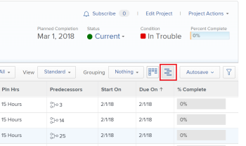

# Get started with the Gantt Chart

>[!IMPORTANT]
>
>You're currently viewing the Adobe Workfront Classic version of this document. Adobe Workfront Classic is no longer supported. All Adobe Workfront Classic functionality, along with this documentation, will be removed in July 2022. Please transition to the the new Adobe Workfront experienceas soon as possible, and switch to the new Adobe Workfront experience version of this document.

In Adobe Workfront, there are two Gantt charts with similar functionality:

* The task list Gantt Chart: displays information about tasks at the project level and is editable.
* The project list Gantt Chart: displays information about projects and is not editable.

Although they look and feel similar, the functionality of each one is different.

## Access the Gantt Chart

The Gantt charts in Workfrontprovide a visual representation of a list of tasks or projects. You can view the task list Gantt Chart directly from the task list on a project or from a task report. You can view the project list Gantt Chart in a project list or a project report.

* [Task list Gantt Chart](#task-list-gantt-chart) 
* [Project list Gantt Chart](#project-list-gantt-chart)

### Task list Gantt Chart {#task-list-gantt-chart}

The task list Gantt Chart is accessible in the following areas:

* Within a Project

   * Tasks tab 
   * Subtasks tab

* Within a Template

To access the task list Gantt Chart, navigate to any of the areas mentioned above and click the Gantt Chart icon.

### Project list Gantt Chart {#project-list-gantt-chart}

The project list Gantt Chart is accessible in the following areas:

* Within the Projects tab

   * Projects I Own
   * Projects I'm On
   * All Projects

* Within a Portfolio

   * Projects tab 
   * Active Projects
   * Requested Projects
   * All Projects

* Within a Project Report

   * Any Project or Task Report

* Within a Program

   * Active Projects
   * All Projects

To access the project list Gantt Chart, navigate to any of the areas mentioned above and click the Gantt Chart icon.

## Configure how information displays on the Gantt Chart

You can configure what information displays on both the task list Gantt Chart and the project list Gantt Chart.  
You cannot configure the colors or the fonts in which the Gantt chart information is displayed.

* [Task list Gantt Chart](#task-list-gantt-chart) 
* [Project list Gantt Chart](#project-list-gantt-chart)

### Task list Gantt Chart {#task-list-gantt-chart-1}

The following display options are available in the task list Gantt Chart:

* Actual Dates
* Assignments
* Baseline
* Commit Date
* % Complete
* Critical Path
* Milestone Diamonds
* Milestone Lines
* Predecessors
* Progress Status
* Projected dates

For detailed information about the display options listed above, see [Configure how information displays on the Gantt Chart](../../../manage-work/gantt-chart/use-the-gantt-chart/configure-info-on-gantt-chart.md).

### Project list Gantt Chart {#project-list-gantt-chart-1}

The following display options are available in the project list Gantt Chart:

* Actual Dates
* % Complete
* Milestone Diamonds
* Milestone Lines
* Predecessors
* Progress Status
* Projected Dates

For information about the display options listed above, see [Configure how information displays on the Gantt Chart](../../../manage-work/gantt-chart/use-the-gantt-chart/configure-info-on-gantt-chart.md).

## Update the Gantt Chart

When information is updated from the task list, it is automatically reflected in both the task list Gantt Chart and the project list Gantt Chart.

* [Task list Gantt Chart](#task-list-gantt-chart) 
* [Project list Gantt Chart](#project-list-gantt-chart)

### Task list Gantt Chart {#task-list-gantt-chart-2}

In a project, you can update the task list Gantt Chart directly from the Gantt chart or from the task list. For more information, see [Update information in the task list Gantt Chart](../../../manage-work/gantt-chart/use-the-gantt-chart/update-info-task-list-gantt.md).

In a template, the task list Gantt Chart reflects updates made in the template's task list. This Gantt chart is not editable.

### Project list Gantt Chart {#project-list-gantt-chart-2}

The project list Gantt Chart reflects updates made in each project's task list. This Gantt chart is not editable.

## View information on the Gantt Chart

The task list Gantt Chart and project list Gantt Chart display information about tasks and projects. For more information, see [View information in the Gantt Chart](../../../manage-work/gantt-chart/use-the-gantt-chart/view-info-in-gantt.md).
