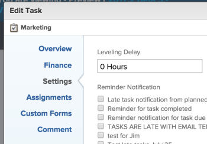

# Level Resources in the Gantt Chart

>[!IMPORTANT]
>
>You're currently viewing the Adobe Workfront Classic version of this document. Adobe Workfront Classic is no longer supported. All Adobe Workfront Classic functionality, along with this documentation, will be removed in July 2022. Please transition to the the new Adobe Workfront experienceas soon as possible, and switch to the new Adobe Workfront experience version of this document.

Leveling your resources&nbsp;on a project&nbsp;has two purposes:

* To automatically adjust&nbsp;over-allocation of time for assignees.
* To automatically create a realistic task schedule for a&nbsp;project.&nbsp;

## Access requirements

You must have the following access to perform the steps in this article:

<table cellspacing="0"> 
 <col> 
 <col> 
 <tbody> 
  <tr> 
   <td role="rowheader">Adobe Workfront plan*</td> 
   <td> 
Any 
 </td> 
  </tr> 
  <tr> 
   <td role="rowheader">Workfront license*</td> 
   <td> 
Plan 
 </td> 
  </tr> 
  <tr> 
   <td role="rowheader">Access level configurations*</td> 
   <td> 
Edit access to Projects
 
Note: If you still don't have access, ask your Workfront administrator if they set additional restrictions in your access level. For information on how a Workfront administrator can modify your access level, see <a href="../../../administration-and-setup/add-users/configure-and-grant-access/create-modify-access-levels.md" class="MCXref xref">Create or modify custom access levels</a>.
 </td> 
  </tr> 
  <tr> 
   <td role="rowheader">Object permissions</td> 
   <td> 
Manage access to the project
 
For information on requesting additional access, see <a href="../../../workfront-basics/grant-and-request-access-to-objects/request-access.md" class="MCXref xref">Request access to objects </a>.
 </td> 
  </tr> 
 </tbody> 
</table>

&#42;To find out what plan, license type, or access you have, contact your Workfront administrator.

## Overview of Resource Leveling

If the same resource is assigned to two different tasks, you can use resource leveling to adjust the timeline of the tasks so they will not occur at the same time.&nbsp;

Consider the following when leveling resources on a project:

* Resource leveling only applies to one project, so Adobe Workfront does not level resources across more than one project at a time.
* If **Effort Driven** is selected as a **Duration Type**, Workfront will not level the resources.
* When multiple users are assigned to the same task, leveling will be canceled.
* Conditions for the type of **Task Constraint**&nbsp;will take precedence over the leveling of resources. For example,&nbsp;if **Fixed Dates** is selected as the Task Constraint, resource leveling will not change the task dates.
* Predecessor relationships will take precedence over resource leveling.
* **Resource Leveling** needs to be set to **Manual** for the project in order to adjust leveling in the Gantt chart. If you have Manage permissions to the project, you can can have the system automatically level resources by adjusting this setting on the project and selecting **Automatic** instead of **Manual**in the Edit Project box**.**

  

* As the project owner, or the task assignee, you can introduce a leveling delay for a task to indicate that there is a great chance that the task might need extra time. For information about adding a leveling delay to a task, see [Update task Leveling Delay](../../../manage-work/tasks/task-information/task-leveling-delay.md).

## Apply Resource Leveling in the Gantt Chart

You can use the Task List Gantt Chart to level your resources.

1. Go to the project you want to level.
1. On the **Tasks** tab, click the **Gantt chart** icon.

   All changes are saved automatically when the **Autosave** option is enabled. It is enabled by default. 

1. (Optional) In the **Autosave** drop-down menu select **Manual save** or **Timeline Planning** to save your changes manually.

   >[!TIP]
   >
   >You cannot level resources in the Gantt chart when the Autosave option is enabled.

1. Click the **Level Resources** drop-down menu.

   

1. Select one of following options:

   * **Level Now**: Applies resource leveling to the selected task.
   * **Clear Leveling**: Removes all resource leveling from the selected task.

   >[!NOTE]
   >
   >Your resources might be overallocated if they are assigned to multiple tasks which occur during the same time frame.

1. (Optional and conditional) If you have disabled the Autosave option, click the **Undo** or**Redo** icons if you want to cancel or duplicate any of the changes.

   >[!TIP]
   >
   >You can use the following keyboard shortcuts to undo or redo changes on the Gantt chart:
   >
   >   
   >   
   >   * Mac: Use Command + Z to undo and Command + Shift + Z to redo.
   >   * Windows: Use Ctrl + Z to undo and Ctrl + Y to redo.
   >   
   >

1. Click **Save** in the upper-right corner of the Gantt chart.

<!--

<h2 data-mc-conditions="QuicksilverOrClassic.Classic">Apply Resource Leveling in the Legacy Gantt Chart</h2> 

(NOTE:&nbsp;drafted, because it's removed from the system)

<ol>
<li value="1" data-mc-conditions="QuicksilverOrClassic.Classic">Navigate to a project.</li>
<li value="2" data-mc-conditions="QuicksilverOrClassic.Classic">Click <strong>More</strong>, then click <strong>Legacy Gantt</strong>. 

</li>
<li value="3" data-mc-conditions="QuicksilverOrClassic.Classic">Click&nbsp;the <strong>Resource Leveling</strong> drop-down menu. 

</li>
<li value="4" data-mc-conditions="QuicksilverOrClassic.Classic">Select <strong>Level Now</strong>. Workfront automatically finds the next available time from the schedule of the over-allocated users, and moves over-allocated tasks to another time. By default, Workfront will look at the task ID number to prioritize this adjustment. In general, tasks with lower ID numbers take precedence over tasks with higher ID numbers.</li>
<li value="5" data-mc-conditions="QuicksilverOrClassic.Classic">(Optional) Select <strong>Clear Leveling</strong>, to remove all resource leveling from the project. 
NOTE: Your resources might be overallocated if they are assigned to multiple tasks which occur during the same time frame.
</note></li>
<li value="6" data-mc-conditions="QuicksilverOrClassic.Classic">Click <strong>Save</strong>.&nbsp;</li>
</ol>

-->

<!--

<h2>Overview of Leveling Delay</h2> 

(NOTE:&nbsp;moved to its own article: /Content/Manage work/Tasks/Task information/task-leveling-delay.htm) 

-->

At times, there might be conflicts between task schedules on a project. You can level resources or address resource conflicts by rescheduling resources and tasks so that all tasks can be completed within a realistic&nbsp;schedule. 

As the project manager, or the task assignee, you can also add a Leveling Delay on individual tasks to account for any resource or scheduling conflicts. In other words, a task might be scheduled with a delay to ensure that when Adobe Workfront levels&nbsp;the tasks a more realistic schedule overcomes resource conflicts.

To manually add a Leveling Delay to a task:

<ol>
<li value="1">Navigate to a task for which you want to add a Leveling Delay.</li>
<li value="2"> 
Click <strong>Edit Task</strong>. 
 </li>
<li value="3">Click <strong>Settings</strong>. </li>
<li value="4">Specify the <strong>Leveling Delay</strong>, in hours. This is the time that the resource will be delayed starting the task due to resource conflicts.</li>
<li value="5">Click <strong>Save Changes</strong>.&nbsp;</li>
</ol>

-->

