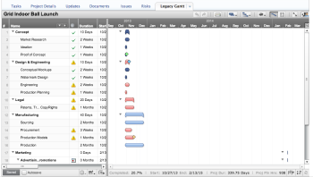
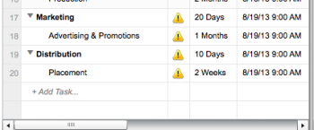
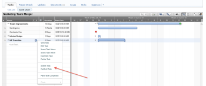

# Create tasks in the Legacy Gantt Chart

>[!NOTE]
>
>The information in this article refers to functionality that is currently deprecated and will be removed in the future.

The Legacy Gantt Chart is an interactive Flash-based version of the Gantt view that allows users &nbsp;to create, edit, and update tasks in a worksheet format, similar to Microsoft® Excel™.&nbsp;&nbsp;One of the ways a task can be created on a project is through a Gantt Chart.&nbsp;

One limitation to creating tasks in the Legacy Gantt Chart is that you cannot update and review all task attributes. You need to do this in a task list at the project level or by editing individual tasks. Consider using other methods when creating multiple tasks, like using a template when you create your project.&nbsp;

## Create tasks

1. Go to the Legacy Gantt Chart located on the **More** tab.

   

1. Select **+Add Task**&nbsp;in the 'Name Column,' under the last task.

   

1. Use&nbsp;enter or return to save the task. Continue to add tasks as needed. Duration and the start and finish fields are automatically populated with default values. Use in-line editing to update or modify as needed.&nbsp;
1. If 'Auto Save' is on, changes will save periodically. Make sure changes are saved prior to navigating away from the Gantt Chart.&nbsp;

## Create subtasks

1. Tasks can have parent-child relationships. Child tasks are called subtasks. Users can easily convert a task into a subtask in the Gantt chart.  
   

1. Open a project.&nbsp;Select the Legacy Gantt Chart.&nbsp;
1. The Legacy Gantt Chart is located in the 'More' tab. If needed, click the toggle full-screen icon&nbsp; &nbsp;to make the chart full screen.&nbsp;Note that each task listed in the chart has a number associated with it (see the # column).
1. Select a task or tasks by clicking the selection icon&nbsp; &nbsp;next to the name of the task. There needs to be a task above the task you are editing in order to establish a subtask. Use the Control (Windows or Linux), Command (Mac), or Shift keys to select multiple tasks.
1. Right-click and select indent task. Notice the tasks change: The selected task or tasks become subtasks for task above it. Right-click and select outdent to reverse the subtask operation.
1. Click the **Save** button to save your changes, or 'Cancel' to discard them.

