# Navigate the Legacy Gantt Chart

>[!NOTE]
>
>The information in this article refers to functionality that is currently deprecated and will be removed in the future.

You can manage the time line of a project using the tab with the Legacy Gantt chart on the project.&nbsp;

In addition to giving you a visual representation of the time line of the project, you can also perform the following actions using the Legacy Gantt Chart:

* Add tasks to a project.
* Update task information (assignments, Planned Start and Completion Dates, percent complete, predecessors).
* Change the structure of your project by reordering, outdenting, or indenting tasks.
* Associate tasks with milestones.&nbsp;
* Understand the daily Planned Hour distribution of the Planned Hours of the tasks.&nbsp;

Most of these editing options&nbsp;are accessible by using&nbsp;the icons in the Legacy Gantt chart. Others are accessible by performing&nbsp;several actions in the grid of the chart or in the chart itself.&nbsp;

## Use the Legacy Gantt Chart to update the project

You can access the Legacy Gantt Chart in various places in the Workfront application.  
For more information about where you can access the Gantt Chart in Workfront, see [View information in the Gantt Chart](../../../manage-work/gantt-chart/use-the-gantt-chart/view-info-in-gantt.md).

To access the Legacy Gantt in a project and to make update to the project using the Gantt Chart:&nbsp;

1. Navigate to a project for which you want to manage the timeline. 
1. Click **More**, then select the **Legacy Gantt** tab.  
   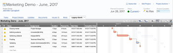  

1. (Optional) To rearrange the tasks in the project, select a task, drag and drop it in the correct spot. 
1. (Optional) To indent a task, right-click on the task, and click&nbsp;**Indent Task**. 
1. (Optional) To outdent a task, right-click on the task, and click **Outdent Task**. 
1. (Optional) Select multiple tasks by clicking and pressing Shift on your keyboard then clicking several tasks; then, right click and click **Chain**. This creates predecessor relationships between the tasks.&nbsp; 
1. (Optional) By default, you can update the following fields in the grid section&nbsp;of the Legacy Gantt Chart:

   * Name of the task 
   * Duration 
   * Start Date 
   * Completion Date 
   * Assignments 
   * Percent Complete 
   * Predecessors

     >[!NOTE]
     >
     >The ability to edit the Duration, Start Date, and Completion Date of the tasks depends on the Task Constraint and Duration Type. Not all Task Constraints and Duration Types allow for these fields to be edited.  
     >For more information about Task Constraint and Duration Type, see the following articles:
     >
     >   
     >   
     >   * [Task Constraint overview](../../../manage-work/tasks/task-constraints/task-constraint-overview.md)
     >   * * [Overview of Task Duration and Duration Type](../../../manage-work/tasks/taskdurtn/task-duration-and-duration-type.md)*
     >   
     >

     * 
     *

1. Click Save to save your changes  
   Or  
   Select the **Autosave** field to save your changes automatically.

## Overview of the Legacy Gantt Chart upper toolbar

Notice the following toolbar at the upper-right of the Legacy Gantt Chart:

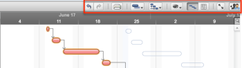

The following icons allow you to navigate the Legacy Gantt chart using&nbsp;the upper toolbar:

<table cellspacing="15"> 
 <col> 
 <col> 
 <thead> 
  <tr> 
   <th><strong>Icon</strong> </th> 
   <th><strong>Description</strong> </th> 
  </tr> 
 </thead> 
 <tbody> 
  <tr> 
   <td> 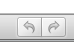 </td> 
   <td>The <strong>Undo</strong>&nbsp;and <strong>Redo</strong> icons can be used to revert or restore changes made in the Gantt chart. </td> 
  </tr> 
  <tr> 
   <td> 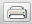 </td> 
   <td>The <strong>Print</strong>&nbsp;icon opens a dialog&nbsp;box used to export the Gantt Chart to a pdf. &nbsp;</td> 
  </tr> 
  <tr> 
   <td>  </td> 
   <td>The <strong>Baseline</strong>&nbsp;icon allows you&nbsp;to create manual baselines for a project.&nbsp;</td> 
  </tr> 
  <tr> 
   <td> 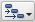 </td> 
   <td>The <strong>Resource Leveling</strong>&nbsp;icon provides the ability to level resources instantly or to clear resource leveling. &nbsp;</td> 
  </tr> 
  <tr> 
   <td> ,&nbsp;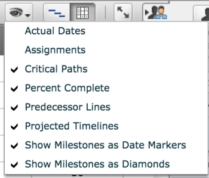</td> 
   <td>The <strong>Chart Options</strong>&nbsp;icon allows you&nbsp;to select several markers that add visibility&nbsp;to the Gantt Chart.</td> 
  </tr> 
  <tr> 
   <td> 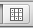 </td> 
   <td> By default, when you access the Legacy Gantt chart, the Gantt chart displays. By clicking the <strong>Resource Grid</strong> icon, you can display the daily Planned Hour allocation for each task. 
Note:  If a task has multiple assignments, the grid does not display the daily allocation per assignment. The Legacy Gantt Resource Grid displays only the distribution of the Planned Hours at the task level, across the duration of the task.
</td> 
  </tr> 
  <tr> 
   <td> 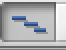 </td> 
   <td>From the Resource Grid view, click the <strong>Gantt Chart</strong> icon to return to the display of the Gantt chart.&nbsp;</td> 
  </tr> 
  <tr> 
   <td>  </td> 
   <td>Use the <strong>Full-screen</strong>&nbsp;icon to toggle between full-screen and normal Gantt view. When enabled, the Gantt View occupies the height and width of the browser window.</td> 
  </tr> 
  <tr> 
   <td> ,&nbsp;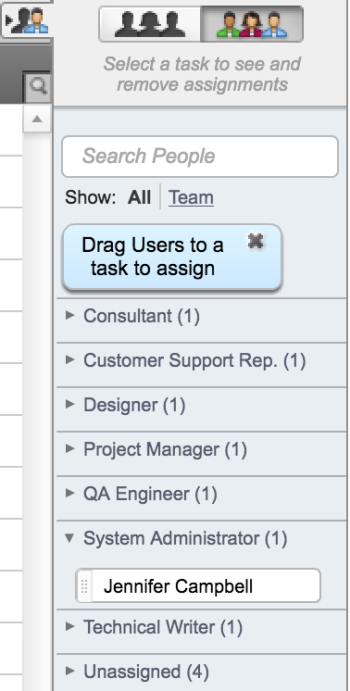</td> 
   <td>The <strong>Resource Sidebar</strong>&nbsp;icon displays available user and role resources to work on the project. You can drag and drop a resource onto a task to assign it to the task. You can search for a resource to be assigned to a task within the Project Team, or you can search the entire Workfront instance by selecting to <strong>Show All</strong> users.&nbsp;</td> 
  </tr> 
 </tbody> 
</table>

## Overview of the Legacy Gantt Chart lower&nbsp;toolbar

Notice the following toolbar at the bottom&nbsp;of the Legacy Gantt Chart:

The following icons allow you to navigate the Legacy Gantt chart using&nbsp;the lower toolbar area:&nbsp;

| **Icon** |**Description** |
|---|---|
|  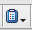

|When a single task is selected, the **Edit Task** icon provides several modification options for the task. These are the same options as right clicking on a &nbsp;task. &nbsp; |
|  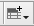

|The **Column Preferences** icon provides the option to include or exclude columns from the grid section of the Gantt chart.&nbsp; |
|  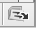

|The **Export to MS Project** icon exports the project to an MS Project XML file. &nbsp; |
|  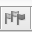,&nbsp; 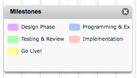

|The **Milestones** icon is available when a Milestone Path has been assigned to the project. You can drag the milestone indicators and drop them on the tasks on your project that you want to associate with a milestone. When the project is not associated with a Milestone Path, this icon is dimmed.&nbsp; |
|  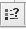,&nbsp; 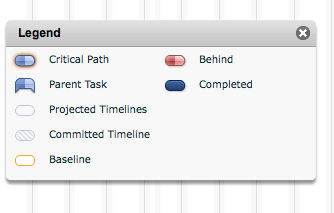

|The **Legend** icon describes the color references for the conditions and Progress Status of tasks displayed on the Gantt Chart. &nbsp; |
|  

|The **Synch Indicator**&nbsp;is enabled when the Gantt Chart transfers data back to the database when the Gantt chart is saved manually or automatically.&nbsp; |
|  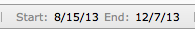

|The planned&nbsp;**Start**&nbsp;and&nbsp;**End**&nbsp;Dates are interactive. When the project is Scheduled from the Start Date, you may modify the **Start Date**; &nbsp;when the project is Scheduled from the Completion Date, you can modify the End Date.&nbsp; |

## Overview of other Legacy Gantt Chart indicators

The following indicators show&nbsp;additional information about the tasks on the project:

<table cellspacing="15"> 
 <col> 
 <col> 
 <thead> 
  <tr> 
   <th><strong>Indicator</strong> </th> 
   <th><strong>Description</strong> </th> 
  </tr> 
 </thead> 
 <tbody> 
  <tr> 
   <td> 
 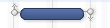,
 
  
 </td> 
   <td>The round indicators at the end of a task timeline are the <strong>End Nodes</strong> of the task. Predecessor relationships can be created by clicking the&nbsp;predecessor&nbsp;End Node&nbsp;and dragging a line to the Start or End node of another task. The predecessor&nbsp;Start Node&nbsp;functions the same way as the End Node. This option appears when hovering over the timeline of the task.&nbsp;</td> 
  </tr> 
  <tr> 
   <td>  </td> 
   <td>The <strong>Cross-Project Predecessor</strong> icon indicates the task is dependent on the completion of a task in another project.&nbsp;</td> 
  </tr> 
  <tr> 
   <td> 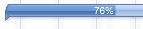 </td> 
   <td>The&nbsp;<strong>Percent Complete</strong>&nbsp;indicators provide the ability to update the percent complete of each task by clicking on either the triangle above or below the task bar, and then dragging the indicator until the percent complete is set appropriately.&nbsp;</td> 
  </tr> 
  <tr> 
   <td> 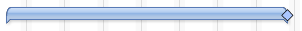 </td> 
   <td> 
The <strong>Milestone Diamond</strong>&nbsp;icon displays if selected in the chart options and it indicates&nbsp;which tasks have been identified to be milestone tasks.&nbsp;
 </td> 
  </tr> 
  <tr> 
   <td> 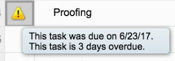 </td> 
   <td> 
The <strong>Task Past Due</strong> indicator shows that&nbsp;the Planned Completion Date of a task is now past due.&nbsp;
 </td> 
  </tr> 
 </tbody> 
</table>

&nbsp;
