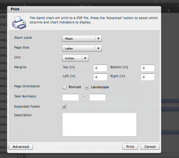
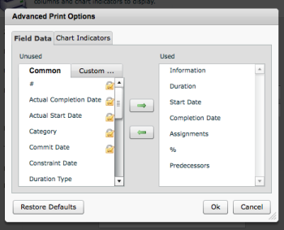

# Print from the Legacy Gantt Chart

<!--

(NOTE:&nbsp;classic only, drafted)

-->

>[!NOTE]
>
>The information in this article refers to functionality that is currently deprecated and will be removed in the future.

You may want to have a hard copy or a .pdf file of the Gantt Chart for your project.&nbsp;

Printing the Gantt Chart generates a .pdf file.&nbsp;

To print the Legacy Gantt Chart:

1. Navigate to a project whose Gantt Chart you want to print.
1. Click **More**, then **Legacy Gantt**.

1. Click the printer icon.  
   &nbsp;   
   The printer dialog box is displayed.

   

1. (Optional) Select from the following printing options:

   * **Zoom Level**: Select the time frame you want to display on the printed file
   * **Page Size**
   * **Unit**
   * **Margins**
   * **Page Orientation**
   * **Task Numbers**: Select only the tasks you want in the .pdf
   * **Expanded Footer**: Select this field if you want a legend included in the footer&nbsp;
   * **Description**: Specify a description for your file.&nbsp;

1. (Optional) Click **Advanced** to select advanced settings for printing.
1. (Optional) Select the **Field Data** tab to select the fields that you want to print in the grid portion of the chart, such as the Name of the task or the Status. Select the fields you want to include in the printed file.

   >[!NOTE]
   >
   >Use the Control/Command key to select multiple fields or the Shift key to select a series of consecutive fields.

1. (Optional) Select the **Custom Data** sub-tab to include custom data fields in the grid portion of the printed file.&nbsp;

   

1. (Optional) Select the **Chart Indicators** tab to select what fields you want to display in the printed Gantt.  
   Select from the following fields:

   * Assignments
   * Critical Paths
   * Percent Complete
   * Predecessor Lines
   * Projected Timelines
   * Show Milestones as Date Markers (vertical lines)
   * Show Milestones as Diamonds
   * Completion Dates
   * Progress Bars
   * Show Task Numbers

1. Click **OK**.
1. (Optional) Click **Restore Defaults** to revert back to the default settings.
1. ClicK **Print**.  
   The Gantt Chart is saved on your computer as a .pdf file.

1. (Optional) Print the .pdf file from your computer for a hard copy of the Gantt Chart.&nbsp;

