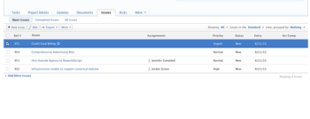
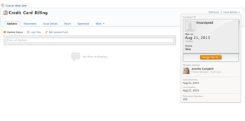
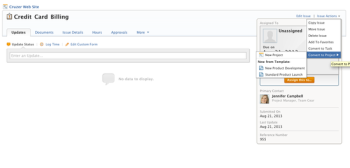
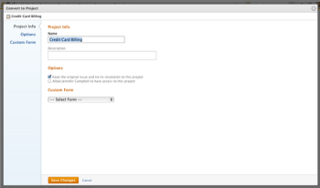
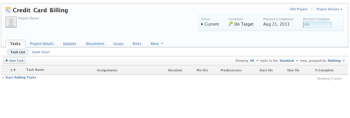

# Convert an issue to a project in Adobe Workfront

>[!NOTE]
>
>The ability to convert an issue to a project using a template from a list, report, or a dashboard was temporarily removed from the Production environment. In addition, the updated experience when converting an issue to a project using a template at the issue level was also reverted to the former experience. These changes were made on March 4, 2022. They will be re-added by mid-March.

If more work needs to be done to complete an issue after the issue is submitted, you can convert the issue to a project.

You can convert an issue to a new project or you can convert it to a project using a template.&nbsp;This article describes both ways for converting issues to projects.

For general information about converting issues, see [Overview of converting issues in Adobe Workfront](../../../manage-work/issues/convert-issues/convert-issues.md).

## Access requirements

You must have the following access to perform the steps in this article:

<table cellspacing="0"> 
 <col> 
 <col> 
 <tbody> 
  <tr> 
   <td role="rowheader">Adobe Workfront plan*</td> 
   <td> <p>Any</p> </td> 
  </tr> 
  <tr> 
   <td role="rowheader">Adobe Workfront license*</td> 
   <td> <p>Plan </p> </td> 
  </tr> 
  <tr> 
   <td role="rowheader">Access level configurations*</td> 
   <td> <p>Edit access to Issues, Tasks, and Projects</p> <p>Edit access to Financial Data to update financial information for a projected converted from the issue</p> <p>Note: If you still don't have access, ask your Workfront administrator if they set additional restrictions in your access level. For information on how a Workfront administrator can change your access level, see <a href="../../../administration-and-setup/add-users/configure-and-grant-access/create-modify-access-levels.md" class="MCXref xref">Create or modify custom access levels</a>.</p> </td> 
  </tr> 
  <tr> 
   <td role="rowheader">Object permissions</td> 
   <td> <p>View permissions to the issue</p> <p>You obtain&nbsp;Manage permissions to the project after the issue is converted</p> <p>For information on requesting additional access, see <a href="../../../workfront-basics/grant-and-request-access-to-objects/request-access.md" class="MCXref xref">Request access to objects in Adobe Workfront</a>.</p> </td> 
  </tr> 
 </tbody> 
</table>

&#42;To find out what plan, license type, or access you have, contact your Workfront administrator.

## Convert an issue to a project

You can convert an issue to a blank project or convert an issue to a project using a template.

1. Go to the **Issues** tab on a project.  

1. Click the issue to be converted to access the issue.

   

1. Click **Issue Actions**, then mouse over **Convert to Project.**

   

   ``` ```**Tip: **`````` If the issue is associated with an approval process or it is already associated with a resolving object, Workfront displays a warning at the top of the Convert to Project box to notify you that the approval will be removed or the resolving object will be overwritten during the conversion. For more information, see [Overview of converting issues in Adobe Workfront](../../../manage-work/issues/convert-issues/convert-issues.md).

1. In the submenu that displays, do one of the following:

   * Click **New Project** to covert the issue to a blank project.

     >[!NOTE]
     >
     >
     >   
     >   
     >   * If the issue was created using a request queue, the new project inherits the request queue's Group. 
     >   * If the issue was created by adding it to the Issues section of the project, the new project inherits the Group if the issue's project. 
     >   
     >

   * Click the name of a template listed in the **New from Template** section to convert the issue to a project using the template.

   The Convert to Project box displays if you clicked the name of a template. 

1. (Recommended) Update the name of the project in the **Name** field.

   By default, the name of the issue becomes the name of the project. 

1. (Optional) Update the available project fields in the Convert to Project box.  
   For more information about editing fields on projects, see [Edit projects](../../../manage-work/projects/manage-projects/edit-projects.md).

1. (Optional and conditional) Click **Options**, then select from the options that are available:

   * **Keep the original issue and tie its resolution to the this project**When deselected, the original issue is deleted.

     >[!NOTE]
     >
     >Users without access or permissions to delete issues will not be able to delete the issue as they are converting it, regardless of the status of this setting. For information about access and permissions to issues, see:
     >
     >   
     >   
     >   * [Grant access to issues](../../../administration-and-setup/add-users/configure-and-grant-access/grant-access-issues.md) 
     >   * [Share an issue in Adobe Workfront](../../../workfront-basics/grant-and-request-access-to-objects/share-an-issue.md) 
     >   
     >

   * **Allow <User Name> to have access to this project**If unselected, the issue's Primary Contact has no access to the new task.

   >[!NOTE]
   >
   >
   >The options that are available here depend on how the Workfront administrator has configured them for everyone in the system or for your group. For more information, see [Configure system-wide task and issue preferences](../../../administration-and-setup/set-up-workfront/configure-system-defaults/set-task-issue-preferences.md).
   >
   >
   >Or, if the top-level groups in your organization configured them separately, the options available here depend on which group you selected for the new project in step 6. For more information, see [Configure task and issue preferences for a group](../../../administration-and-setup/manage-groups/create-and-manage-groups/configure-task-issue-preferences-group.md) ```.```

1. (Optional) In the **Custom Forms** section, do one of the following:

   * If you convert the issue to a blank project, expand the **Add Forms** drop-down menu to attach custom forms  
     For more information about transferring information from the custom form of the issue to that of the new project, see [Transfer custom form data to a larger work item](../../../administration-and-setup/customize-workfront/create-manage-custom-forms/transfer-custom-form-data-larger-item.md).
   * If you convert the issue to a project using a template, do any of the following:

      * Review the custom forms attached to the template.&nbsp;They will transfer to the new project.
      * Update information on the custom forms, and ensure that all required fields have valid values. 
      * Rearrange the custom forms by clicking **Manage Forms**, then the **grab** handle , and drag and drop them in the correct place. Click **I'm done managing** when you finish rearranging the forms. 
      * Click the **x icon** to the right of any form that you do not want to transfer to the project to remove it. 
      * Expand the **Add Custom Forms** menu to add more forms to the project.

   * (Optional and conditional) If you want to transfer custom form information from the issue you are converting to the project, add the project custom form that contains the same fields whose information you want to transfer from the issue. For information, see [Transfer custom form data to a larger work item](../../../administration-and-setup/customize-workfront/create-manage-custom-forms/transfer-custom-form-data-larger-item.md).

1. Click **Save Changes.**

   

   The issue is now a project, if you decided to delete the original issue.  
   Or  
   The issue is now linked to the new project and it will complete when the project completes, if you decided to keep the original issue.

   Some issue fields transfer to the project. Most fields defined in the template automatically transfer to the newly created project if you didn't change them in previous steps. For information, see [Overview of converting issues in Adobe Workfront](../../../manage-work/issues/convert-issues/convert-issues.md)

1. (Optional) Set any further project details ​(project owner, project dates) and tasks as necessary.

   

   &nbsp;

