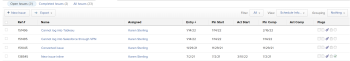
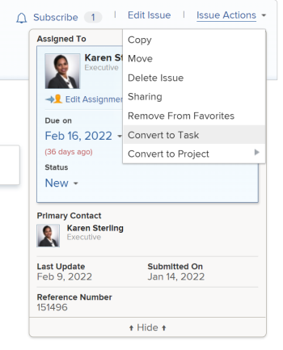
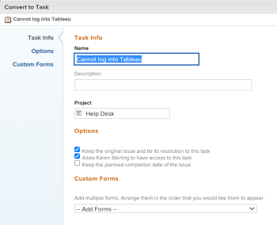
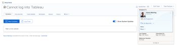

# Convert an issue to a task in&nbsp;Adobe Workfront

>[!IMPORTANT]
>
>You're currently viewing the Adobe Workfront Classic version of this document. Adobe Workfront Classic is no longer supported. All Adobe Workfront Classic functionality, along with this documentation, will be removed in July 2022. Please transition to the the new Adobe Workfront experienceas soon as possible, and switch to the new Adobe Workfront experience version of this document.

If more work needs to be done to complete an issue after the issue is submitted, you can convert the issue to a task.

For general information about converting issues, see [Overview of converting issues in Adobe Workfront](../../../manage-work/issues/convert-issues/convert-issues.md).

## Access requirements

You must have the following access to perform the steps in this article:

<table cellspacing="0"> 
 <col> 
 <col> 
 <tbody> 
  <tr> 
   <td role="rowheader">Adobe Workfront plan*</td> 
   <td> <p>Any</p> </td> 
  </tr> 
  <tr> 
   <td role="rowheader">Adobe Workfront license*</td> 
   <td> <p>Work or higher</p> </td> 
  </tr> 
  <tr> 
   <td role="rowheader">Access level configurations*</td> 
   <td> <p>Edit access to Issues, Tasks, and Projects</p> <p>Note: If you still don't have access, ask your Workfront administrator if they set additional restrictions in your access level. For information on how a Workfront administrator can change your access level, see <a href="../../../administration-and-setup/add-users/configure-and-grant-access/create-modify-access-levels.md" class="MCXref xref">Create or modify custom access levels</a>.</p> </td> 
  </tr> 
  <tr> 
   <td role="rowheader">Object permissions</td> 
   <td> <p>View permissions to the issue</p> <p>Contribute permissions to the project</p> <p>You obtain&nbsp;Manage permissions to the task after the issue is converted</p> <p>For information on requesting additional access, see <a href="../../../workfront-basics/grant-and-request-access-to-objects/request-access.md" class="MCXref xref">Request access to objects </a>.</p> </td> 
  </tr> 
 </tbody> 
</table>

&#42;To find out what plan, license type, or access you have, contact your Workfront administrator.

## Convert an issue to a task

1. Go to the **Issues** tab on a project.  
1. Click the issue you want to convert to go to the issue's landing page.

   

1. From the **Issue Actions** menu, select **Convert to Task.**

   

   >[!TIP]
   >
   >If the issue is associated with an approval process or it is already associated with a resolving object, Workfront displays a warning at the top of the Convert to Project box to notify you that the approval will be removed or the resolving object will be overwritten during the conversion. For more information, see [Overview of converting issues in Adobe Workfront](../../../manage-work/issues/convert-issues/convert-issues.md).

1. Name the task.
1. Identify the project where the task will reside.

   You can select a different project from the project that the issue is on.

1. In the **Project** box, start typing the name of the project where you want to put the new task, then press **Enter** when it appears.

   By default, this box the name of the project containing the issue that you are converting.

1. (Optional and conditional) Under **Options**, select any of the following options.

   The Workfront administrator or group administrator must enable these preferences before they are visible during the conversion of issues:

   * **Keep the original issue and tie its resolution to the this task**

     If unselected, the original issue is deleted.

     >[!NOTE]
     >
     >Users without access or permissions to delete issues will not be able to delete the issue as they are converting it, regardless of the status of this setting. For information about access and permissions to issues, see:
     >
     >   
     >   
     >   * [Grant access to issues](../../../administration-and-setup/add-users/configure-and-grant-access/grant-access-issues.md) 
     >   * [Share an issue](../../../workfront-basics/grant-and-request-access-to-objects/share-an-issue.md) 
     >   
     >

   * **Allow `<User Name>` to have access to this task**

     If unselected, the issue's Primary Contact has no access to the new task.
   
   * **Keep the planned completion date of the issue**

     If unselected, the Planned Completion Date of the new task is calculated from the Planned Start Date of the task. The Planned Start Date of the new task is set according to the system preferences for new tasks.

   >[!NOTE]
   >
   >
   >The options that display here depend on how the Workfront administrator configured them for everyone in the system. For more information, see [Configure system-wide task and issue preferences](../../../administration-and-setup/set-up-workfront/configure-system-defaults/set-task-issue-preferences.md).
   >
   >
   >Or, if the top-level groups in your organization configured them separately, the options that display here depend on which group is associated with the project you selected in step 6. For more information, see [Configure task and issue preferences for a group](../../../administration-and-setup/manage-groups/create-and-manage-groups/configure-task-issue-preferences-group.md).

1. (Optional) Attach custom forms.

   If you want to transfer custom form information from the issue you are converting to the project, add the project custom form that contains the same fields whose information you want to transfer from the issue.

   For more information about transferring information from the custom form of the issue to that of the new task, see [Transfer custom form data when converting an object](../../../administration-and-setup/customize-workfront/create-manage-custom-forms/transfer-custom-form-data-larger-item.md).

   

   >[!TIP]
   >
   >You can transfer custom form information from the issue to the task by adding a duplicate project-type custom form (with the same fields that are on the issue-type custom form) to the new project. For more information, see [Transfer custom form data when converting an object](../../../administration-and-setup/customize-workfront/create-manage-custom-forms/transfer-custom-form-data-larger-item.md).

1. Click **Save Changes** when all task settings are set.

   The issue is now a task on the designated project, if you decided to delete the original issue.

   Or

   The issue is now linked to the new task on the project you chose, and it will complete once the task completes, if you decided to keep the original issue.

   Some issue fields transfer to the task. For information, see the [View original issue information on projects and tasks](#view-original-issue-information-on-projects-and-tasks) section in this article.

1. (Optional) Continue editing the task (assignments, dates) as necessary.

   

## View original issue information on projects and tasks {#view-original-issue-information-on-projects-and-tasks}

You can view the original issue information in project and task lists and reports ```or in the Project Details area```. For information about building reports, see [Create a custom report](../../../reports-and-dashboards/reports/creating-and-managing-reports/create-custom-report.md).

The following table illustrates which&nbsp;issue fields are visible from the converted projects and tasks. 

| Issue fields |Project or task field |Project list or report |Project Details area |Task list or report |Task Details area |
|---|---|---|---|---|---|
| Issue Name |Converted Issue Name |✔ |✔ |✔ |✔ |
| Primary Contact | ```Converted Issue``` Originator Name |✔ | ```✔```  |✔ |&nbsp; |
| Entry Date |Converted Issue Entry&nbsp;Date |✔ |&nbsp; |✔ |&nbsp; |

>[!CAUTION]
>
>If the Primary&nbsp;Contact of an issue changes or if the issue becomes unlinked from the project or task after the issue has been converted, the Converted Issue Originator Name does not update and it displays the original&nbsp;Primary&nbsp;Contact of the issue at the time the issue was converted.

