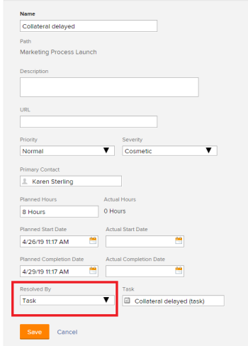

# Unlink issues from their Resolving Objects

>[!IMPORTANT]
>
>You're currently viewing the Adobe Workfront Classic version of this document. Adobe Workfront Classic is no longer supported. All Adobe Workfront Classic functionality, along with this documentation, will be removed in July 2022. Please transition to the the new Adobe Workfront experienceas soon as possible, and switch to the new Adobe Workfront experience version of this document.

When you create a project or a task by converting an issue to the project or task, you have the option to keep the original issue. Your Adobe Workfront administrator must enable this preference for you to have this option during the conversion of the issue.  
For more information about converting issues to projects and tasks, see [Overview of converting issues in Adobe Workfront](../../../manage-work/issues/convert-issues/convert-issues.md).

When you decide to keep the issue which was converted to the project or the task, the resolution of the issue is tied to the project or the task. The issue becomes the Resolvable Object of the project or the task. The project or task are the Resolving Objects of the issue.

You can also manually link an issue to another issue. The second issue becomes the Resolving Object for the first issue, in this case.  
For more information about Resolving Objects, see [Overview of Resolving and Resolvable Objects](../../../manage-work/issues/convert-issues/resolving-and-resolvable-objects.md).

>[!TIP]
>
>The issue status cannot be changed, as it changes automatically with the status of the Resolving Object.

You can unlink the resolution of an issue from that of a project, task, or issue by removing the project, task, or issue from the issue.

## Access requirements

You must have the following access to perform the steps in this article:

<table> 
 <col> 
 <col> 
 <tbody> 
  <tr> 
   <td role="rowheader">Adobe Workfront plan*</td> 
   <td> 
Any
 </td> 
  </tr> 
  <tr> 
   <td role="rowheader">Adobe Workfront license*</td> 
   <td> 
Request or higher
 </td> 
  </tr> 
  <tr> 
   <td role="rowheader">Access level*</td> 
   <td> 
Edit access to Issues
 
View access to Tasks and&nbsp;Projects
 
Note: If you still don't have access, ask your Workfront administrator if they set additional restrictions in your access level. For information on how a Workfront administrator can change your access level, see <a href="../../../administration-and-setup/add-users/configure-and-grant-access/create-modify-access-levels.md" class="MCXref xref">Create or modify custom access levels</a>.
 </td> 
  </tr> 
  <tr> 
   <td role="rowheader">Object permissions</td> 
   <td> 
Manage permissions on the issue
 
View permissions on the task or project
 
For information on requesting additional access, see <a href="../../../workfront-basics/grant-and-request-access-to-objects/request-access.md" class="MCXref xref">Request access to objects </a>.
 </td> 
  </tr> 
 </tbody> 
</table>

&#42;To find out what plan, license type, or access you have, contact your Workfront administrator.

## Unlink an issue from a project, task, or issue

1. Go to the issue that is linked to a project, task, or issue.
1. Select the **Issue Details** tab, then the **Overview** sub-tab. 

1. Click **Edit Overview**.
1. In the **Resolved By** field, remove the resolvable object type.   
   An issue can be resolved by a project, task or issue.  
   

   This removes the resolving object from the issue. 

1. Click **Save** .  
   The issue is no longer linked to a project, task, or issue, and you can now resolve the issue independently.

