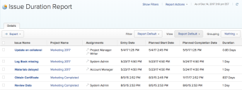

# Issue Duration overview

>[!IMPORTANT]
>
>You're currently viewing the Adobe Workfront Classic version of this document. Adobe Workfront Classic is no longer supported. All Adobe Workfront Classic functionality, along with this documentation, will be removed in July 2022. Please transition to the the new Adobe Workfront experienceas soon as possible, and switch to the new Adobe Workfront experience version of this document.

The Duration of an issue is the number of days between the Planned Start Date and the Planned Completion Date of the issue.&nbsp;

The duration of an issue is automatically calculated by Adobe Workfront and it cannot be manually modified.&nbsp;

You can display the Duration of an issue in an issue report or the view of a list of issues.&nbsp;

For more information about building a report, see [Create a custom report](../../../reports-and-dashboards/reports/creating-and-managing-reports/create-custom-report.md).

