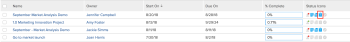

# View issues

You can view issues that are associated with&nbsp;a project, task, or iteration.

## Access requirements

You must have the following access to perform the steps in this article:

<table cellspacing="0"> 
 <col> 
 <col> 
 <tbody> 
  <tr> 
   <td role="rowheader">Adobe Workfront plan*</td> 
   <td> <p>Any</p> </td> 
  </tr> 
  <tr> 
   <td role="rowheader">Adobe Workfront license*</td> 
   <td> <p>Request or higher</p> <p>Review or higher license to view issues in the Issues tab of a project.</p> </td> 
  </tr> 
  <tr> 
   <td role="rowheader">Access level configurations*</td> 
   <td> <p>View access to Issues</p> <p>View or higher access to Projects and Tasks</p> <p>Note: If you still don't have access, ask your Workfront administrator if they set additional restrictions in your access level. For information about access to issues in your Access Level, see <a href="../../../administration-and-setup/add-users/configure-and-grant-access/grant-access-issues.md" class="MCXref xref">Grant access to issues</a>. For information on how a Workfront administrator can change your access level, see <a href="../../../administration-and-setup/add-users/configure-and-grant-access/create-modify-access-levels.md" class="MCXref xref">Create or modify custom access levels</a>. </p> </td> 
  </tr> 
  <tr> 
   <td role="rowheader">Object permissions</td> 
   <td> <p>View permissions to the issue</p> <p> For information about granting permissions to issues, see <a href="../../../workfront-basics/grant-and-request-access-to-objects/share-an-issue.md" class="MCXref xref">Share an issue in Adobe Workfront</a></p> <p>For information on requesting additional permissions, see <a href="../../../workfront-basics/grant-and-request-access-to-objects/request-access.md" class="MCXref xref">Request access to objects in Adobe Workfront</a>.</p> </td> 
  </tr> 
 </tbody> 
</table>

&#42;To find out what plan, license type, or access you have, contact your Workfront administrator.

## View issues based on&nbsp;Status

Issues are grouped in subtabs by their status on the projects, tasks, and iterations in which they appear.&nbsp; To view issues on a project, task, or iteration:&nbsp;

1. Open&nbsp;a project, task, or iteration that contains issues, then click&nbsp;the **Issues**&nbsp;tab.```<MadCap:conditionalText data-mc-conditions=""> The number of open issues that you have access to view is displayed in parenthesis on the  <strong>Issues</strong>tab</MadCap:conditionalText>```.   

1. Click one of the subtabs listed below:&nbsp;
   The number of issues in&nbsp;each category that you have access to view&nbsp;is displayed in parenthesis next to each heading.

   * **Open Issues:** Displays issues that are open. This includes those associated with a Resolving Object and those in a Closed -&nbsp;Pending Approval status.  
   
   * For information about Resolving Objects, see [Overview of Resolving and Resolvable Objects](../../../manage-work/issues/convert-issues/resolving-and-resolvable-objects.md).
   * **Completed** **Issues****:**&nbsp;Displays&nbsp;all issues that have an Actual&nbsp;Completion Date.&nbsp;

   * **All** **Issues** **:**&nbsp;Displays&nbsp;all issues.

## Understand information about issues

You can view information about an issue when you access it.&nbsp;

To access an issue and view information about it:&nbsp;

1. Go to a project, task, or iteration that contains issues.  
1. Select the **Issues** tab. 
1. Select the subtab that contains the issue you are trying to view.

   Select from the following:

   * Open Issues 
   * Completed Issues 
   * All Issues

1. Click the name of an issue.

   When you have manage permissions to the issue you can edit any editable field in the issue and add&nbsp;approvals, hours, or documents to the issue.

1. Consider viewing&nbsp;the following tabs:&nbsp;

   * **Updates**:&nbsp;You can perform the following actions in this tab:

      * Comment on the issue, or reply to an existing comment.&nbsp;
      * Log time.
      * Change the status of the issue.  
        For more information about updating work in Workfront, see [Update work](../../../workfront-basics/updating-work-items-and-viewing-updates/update-work.md).

   * **Documents**: Attach documents to the issue. For more information about adding documents to Workfront, see [Add documents to Adobe Workfront from your file system](../../../documents/adding-documents-to-workfront/add-documents-from-file-system.md).
   
   * **Issue Details**: This tab displays the **Overview**&nbsp;and the **Custom Forms** subtabs.  
     If you have manage permissions to the issue and edit rights on the custom form, you can edit some of the information on these subtabs .  
     View or edit the following fields on the **Overview** subtab :

      * **Name**
      * **Path**: the path through which the issue was logged to the project.

        &nbsp;If an issue was submitted as a request in&nbsp;a request queue, the names of the project, the Topic Group, and the Queue Topic are listed here. This field cannot be edited.

        For more information about submitting requests, see [Create and submit Adobe Workfront requests](../../../manage-work/requests/create-requests/create-submit-requests.md).
      
      * **Description**
      * **URL**: any web address related to the issue.
      * **Priority**: a visual flag which allows you to prioritize issues.&nbsp;
      * **Severity**:&nbsp;a visual flag which indicates&nbsp;how severe the problem described in the issue is.
      * **Primary Contact**: the default Primary Contact is the user who created the issue. This field can be edited.
      * **Planned Hours**: displays the amount of time that will take someone to complete the issue. The default is 8 hours. This field can be edited.
      * **Actual Hours**: displays the amount of time that&nbsp;it took to complete the issue. This is the actual time that someone logs for the issue.&nbsp;
      * **Planned Start Date**: the date when the issue is planned to start. The default is the date and the time when the issue was created.&nbsp;
      * **Actual Start Date**: the date and the time when the issue status was changed to In Progress.
      * **Planned Completion Date**: the date when the issue is planned to be completed.&nbsp;
      * **Actual Completion Date**: the date when the issue is actually completed. This field is filled in automatically when the issue status changes to Closed or Resolved, or can be manually edited.&nbsp;
      * **Actual Cost**: the cost based on the Actual Hours logged on the issue. This field is not editable. The Actual Cost of an issue is calculated based on the following formula:&nbsp;

        ```      
        Issue Actual Cost = Hours Logged * User Cost Rate
        ```      
      
        , where the User&nbsp;Cost Rate is the cost rate associated with the user logging the time to the issue.&nbsp;
      
      * **Entered By**: this is the user who created the issue. This field is not editable.
      * **Last Updated By**: this is the user who updated any field on the issue last. This field is not editable.&nbsp;

     In the **Custom Forms** subtab, view of select one or several custom forms to associate with the issue. 
   
   * **Hours**: Shows a list of hour entries on the issue.
   * **Approvals:** Shows the approval paths associated with the issue.  
     For more information about associating approvals with an issue, see the [Associating an approval process with a work item](../../../administration-and-setup/customize-workfront/configure-approval-milestone-processes/create-approval-processes.md#associating-the-approval-process-with-an-object) section in [Create an approval process for work items](../../../administration-and-setup/customize-workfront/configure-approval-milestone-processes/create-approval-processes.md).

## View which projects and&nbsp;tasks have issues

You can add icons in the view of a project or task report or list to show whether they have issues attached. Adding icons to the view of a report or list is similar for projects and tasks.&nbsp;

To add icons that display whether a project has issues :

1. Go to the **Reporting**area in your Global Navigation Bar, then click **New Report**, and select **Project Report** to build a project report. Or Go to the **Projects** area in your Global Navigation Bar, and select **New View** from the **View** drop-down menu to build a project view.  

1. On the **Columns (View)** tab of the report, if you are creating a project report. Or In the **New View** dialog box if you are creating a project view, click **Add Column.** 

1. In the **Show in this column** field, start typing **Status Icons**, then select it when it appears in the list.

1. Click **Save View** if you are building a project view. Or Click **Save + Close** if you are building a project report.

   The issue icons display on the projects that have issues in the **Status Icons** column.

   

