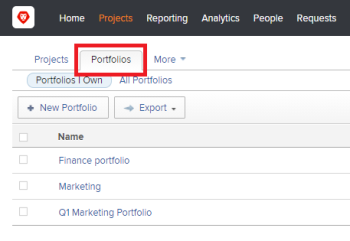

# Create a portfolio

A Portfolio is a collection of projects competing for the same resources, budget, and schedule. The projects in a Portfolio are similar enough that they would use the same Resource Pool and be measured against the same scorecard.

You can use Portfolios to group projects that belong to the same product lines, divisions, departments, companies, or other business units.

## Access requirements

You must have the following access to perform the steps in this article:

<table cellspacing="0"> 
 <col> 
 <col> 
 <tbody> 
  <tr> 
   <td role="rowheader">Adobe Workfront plan*</td> 
   <td> 
Business or higher
 </td> 
  </tr> 
  <tr> 
   <td role="rowheader">Adobe Workfront license*</td> 
   <td> 
Plan 
 </td> 
  </tr> 
  <tr> 
   <td role="rowheader">Access level configurations*</td> 
   <td> 
Edit access to Portfolios
 
Note: If you still don't have access, ask your Workfront administrator if they set additional restrictions in your access level. For information on how a Workfront administrator can change your access level, see <a href="../../../administration-and-setup/add-users/configure-and-grant-access/create-modify-access-levels.md" class="MCXref xref">Create or modify custom access levels</a>.
 </td> 
  </tr> 
  <tr> 
   <td role="rowheader">Object permissions</td> 
   <td> 
After you create a portfolio, you have Manage permissions to it, by default
 
For information on requesting additional access, see <a href="../../../workfront-basics/grant-and-request-access-to-objects/request-access.md" class="MCXref xref">Request access to objects in Adobe Workfront</a>.
 </td> 
  </tr> 
 </tbody> 
</table>

&#42;To find out what plan, license type, or access you have, contact your Workfront administrator.

## Create a portfolio

1. Go to the **Projects** area in the Global Navigation Bar. 
1. Select the **Portfolios** tab. 

   

1. Click **New Portfolio**.
1. Replace **Untitled Portfolio** with the name you want for the portfolio.

   The name can contain up to 255 characters.

1. Click the **Portfolio Details** tab.
1. Ensure that the **Overview** subtab is selected, then change any of the following information:

   <table cellspacing="0"> 
    <col> 
    <col> 
    <tbody>  
     <td class="TableStyle-TableStyle-List-options-in-steps-BodyE-Column1-LightGray" role="rowheader">Name</td> 
     <td class="TableStyle-TableStyle-List-options-in-steps-BodyD-Column2-LightGray">Specify a name for the Portfolio if you have not already done so.</td>  
     <tr> 
      <td role="rowheader">Description</td> 
      <td> 
Type a description for the Portfolio to indicate what is unique about it. 
 </td> 
     </tr> 
     <tr> 
      <td role="rowheader">Portfolio Manager</td> 
      <td> 
Start typing the name of a user that you want to indicate as the portfolio manager, then select it when it appears in the list. This is the same as the Portfolio Owner. This is the person who can oversee the work defined in the projects of the portfolio and can approve the Business Case.
 
Important: When you designate someone as the Portfolio Manager, they automatically gain&nbsp;Manage permissions to the portfolio, the programs and the projects in the portfolio. 
 </td> 
     </tr> 
     <tr data-mc-conditions=""> 
      <td role="rowheader">Group </td> 
      <td> 
Add the name of a single group if the group owns the portfolio or has responsibility for completing it. 
 </td> 
     </tr>  
     <td class="TableStyle-TableStyle-List-options-in-steps-BodyE-Column1-LightGray" role="rowheader">Alignment Scorecard</td> 
     <td class="TableStyle-TableStyle-List-options-in-steps-BodyD-Column2-LightGray"> 
Select the alignment scorecard that you want to use from the drop-down list. A scorecard is used to measure how well a project aligns with the established criteria of a Portfolio often reflecting an organization’s mission, values, and strategic goals. For more information, see <a href="../../../manage-work/projects/define-a-business-case/apply-scorecard-to-project-to-generate-alignment-score.md" class="MCXref xref">Apply a scorecard to a project and generate an Alignment Score</a> and <a href="../../../administration-and-setup/set-up-workfront/configure-system-defaults/create-scorecard.md" class="MCXref xref">Create a scorecard</a>.
 </td>   
     <td class="TableStyle-TableStyle-List-options-in-steps-BodyB-Column1-MediumGray" role="rowheader">Is Active</td> 
     <td class="TableStyle-TableStyle-List-options-in-steps-BodyA-Column2-MediumGray"> 
 Select this checkbox if you want the portfolio to be active. Other users can find active portfolios and attach them to projects when creating or editing projects. Inactive portfolios cannot be attached to projects. This is enabled by default.
 </td>  
    </tbody> 
   </table>

1. (Optional) Click the **Custom Forms** subtab and select a custom form to attach to the portfolio and update the custom fields.

   >[!TIP]
   >
   >You must have portfolio custom forms already created before you can attach them to portfolios.

1. Edit Custom Form
1. Save
1. (Optional) Select the **Programs** tab and add Programs to the Portfolio.

   For more information about creating Programs, see [Create a program](../../../manage-work/portfolios/create-and-manage-programs/create-program.md).

1. (Optional) Select the **Projects** tab and add projects to the Portfolio.

   For more information about adding projects to a Portfolio, see [Add projects to a portfolio](../../../manage-work/portfolios/create-and-manage-portfolios/add-projects-to-portfolios.md).

<!--

<h2>Deactivate a portfolio</h2>

When you deactivate a portfolio, you can still access it from the Portfolios area, but it no longer displays in the list of portfolios when users try to add it to a project.

<ol>
<li value="1"> Go to the <strong>Projects</strong> area in the Global Navigation Bar. </li>
<li value="2">Click the<strong>Portfolios</strong> tab.</li>
<li value="3"> 
Click the name of the portfolio.
 </li> On the page that appears, click the <strong>Portfolio Details</strong> tab, then click <strong>Edit Overview</strong>. Deselect the <strong>Is Active</strong> box, then click <strong>Save</strong>.
</ol>
<h2>Delete a portfolio</h2>
<ol>
<li value="1"> Go to the <strong>Projects</strong> area in the Global Navigation Bar. </li>
<li value="2"> 
Click the<strong>Portfolios</strong> tab.
 </li>
<li value="3"> 
Select the portfolio, then click <strong>Delete</strong>.
 </li>
<li value="4"> 
In the box that appears, click <strong>Yes, Delete It</strong> to confirm.
 </li>
</ol>

-->

