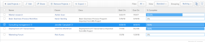

# Remove a project from a portfolio

>[!IMPORTANT]
>
>You're currently viewing the Adobe Workfront Classic version of this document. Adobe Workfront Classic is no longer supported. All Adobe Workfront Classic functionality, along with this documentation, will be removed in July 2022. Please transition to the the new Adobe Workfront experienceas soon as possible, and switch to the new Adobe Workfront experience version of this document.

You can remove a project from a portfolio and associate it with a different portfolio or you can completely remove the association between a project and a portfolio.

You can also delete projects from a portfolio which also removes them from Adobe Workfront.

## Access requirements

You must have the following access to perform the steps in this article:

<table> 
 <col> 
 <col> 
 <tbody> 
  <tr> 
   <td role="rowheader">Adobe Workfront plan*</td> 
   <td> 
Business or higher
 </td> 
  </tr> 
  <tr> 
   <td role="rowheader">Adobe Workfront license*</td> 
   <td> 
Plan 
 </td> 
  </tr> 
  <tr> 
   <td role="rowheader">Access level configurations*</td> 
   <td> 
Edit access to Projects
 
View access to Portfolios or higher
 
Note: If you still don't have access, ask your Workfront administrator if they set additional restrictions in your access level. For information on how a Workfront administrator can change your access level, see <a href="../../../administration-and-setup/add-users/configure-and-grant-access/create-modify-access-levels.md" class="MCXref xref">Create or modify custom access levels</a>.
 </td> 
  </tr> 
  <tr> 
   <td role="rowheader">Object permissions</td> 
   <td> 
Manage permissions on the Portfolio to remove projects  Manage permissions with Delete access to the projects to delete them from the portfolio
 
For information on requesting additional access, see <a href="../../../workfront-basics/grant-and-request-access-to-objects/request-access.md" class="MCXref xref">Request access to objects </a>.
 </td> 
  </tr> 
 </tbody> 
</table>

&#42;To find out what plan, license type, or access you have, contact your Workfront administrator.

## Remove a project from a portfolio

1. Go to a Portfolio and select the **Projects**&nbsp;tab. 
1. Select the project to be removed.&nbsp;

   

1. Click&nbsp;**Remove Projects**.
1. Click either **Delete** to delete the project from Workfront, or **Remove** **from Portfolio** to remove it from the selected Portfolio.  
   

1. (Optional and conditional) Find the project you removed from the portfolio and associate it with another portfolio. For information about associating projects with portfolios see [Add projects to a portfolio](../../../manage-work/portfolios/create-and-manage-portfolios/add-projects-to-portfolios.md).

