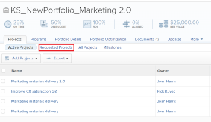
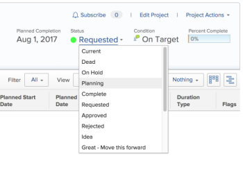

# Review Requested Projects

>[!IMPORTANT]
>
>You're currently viewing the Adobe Workfront Classic version of this document. Adobe Workfront Classic is no longer supported. All Adobe Workfront Classic functionality, along with this documentation, will be removed in July 2022. Please transition to the the new Adobe Workfront experienceas soon as possible, and switch to the new Adobe Workfront experience version of this document.

When multiple project requests are submitted for review, the project management office or portfolio committee can meet to review submitted requests and determine project request approvals. To submit a project request for review, do one of the following:

* Change the project status to **Requested**.
* Complete the Business Case of the project and submit it for approval.   
  For more information about completing a Business Case for a project, see [Create a Business Case for a project](../../../manage-work/projects/define-a-business-case/create-business-case.md).

You can review requested projects in the following areas of Adobe Workfront:

* In a project report
* Within a portfolio

## Access requirements

You must have the following access to perform the steps in this article:

<table cellspacing="0"> 
 <col> 
 <col> 
 <tbody> 
  <tr> 
   <td role="rowheader">Adobe Workfront plan*</td> 
   <td> 
Business or higher
 </td> 
  </tr> 
  <tr> 
   <td role="rowheader">Adobe Workfront license*</td> 
   <td> 
Plan 
 </td> 
  </tr> 
  <tr> 
   <td role="rowheader">Access level configurations*</td> 
   <td> 
View access or higher to Portfolios
 
Edit access to Projects
 
Note: If you still don't have access, ask your Workfront administrator if they set additional restrictions in your access level. For information on how a Workfront administrator can change your access level, see <a href="../../../administration-and-setup/add-users/configure-and-grant-access/create-modify-access-levels.md" class="MCXref xref">Create or modify custom access levels</a>.
 </td> 
  </tr> 
  <tr> 
   <td role="rowheader">Object permissions</td> 
   <td> 
View permissions or higher on the portfolio
 
Manage permissions on the projects to update their status
 
For information on requesting additional access, see <a href="../../../workfront-basics/grant-and-request-access-to-objects/request-access.md" class="MCXref xref">Request access to objects </a>.
 </td> 
  </tr> 
 </tbody> 
</table>

&#42;To find out what plan, license type, or access you have, contact your Workfront administrator.

## Review Requested Projects in a project report

You can build a report for projects to see what projects have a status of Requested.

For more information about approving project requests by building a project report, see the [Approving the Business Case by Building a Project Report](../../../manage-work/projects/define-a-business-case/approve-business-case.md#build-a-report) section in [Approve a Business Case](../../../manage-work/projects/define-a-business-case/approve-business-case.md).&nbsp;

## Review Requested Projects within a portfolio

1. Go to the portfolio whose requested projects you want to review.
1. Click the **Projects** tab. 
1. Click the **Requested Projects** sub-tab.

   >[!TIP]
   >
   >&nbsp;In addition to having a Status of **Requested**, projects must be associated with the selected Portfolio to&nbsp;display in this list.

   

1. Click the name of a project in the list to open it.
1. Select the **Project Details** tab. 
1. Do either one of the following:

   * Select the **Business Case** sub-tab, then click **Approve** or **Reject** in the Business Case Summary area to approve or reject the Business Case.

     

     The project status is changed to **Approved** if the Business Case is approved.

     The project status is changed to **Rejected** if the Business case is rejected.

     >[!NOTE]
     >
     >There are no notifications that alert the user who submitted the approval of the business case whether their project request was approved or rejected.&nbsp;

     Or
   
   * Change the status of the project to any other status in the **Status** drop-down menu.

     

   &nbsp;

&nbsp;
