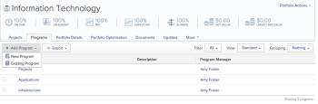
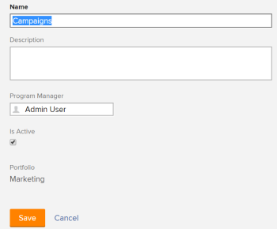
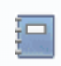
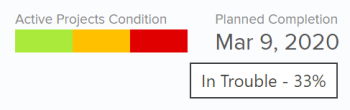

# Create a program

A program represents a collection of projects that share a common strategy, objective, or goal that transcends project boundaries. Programs cannot exist outside of a portfolio.

## Access requirements

You must have the following access to perform the steps in this article:

<table cellspacing="0"> 
 <col> 
 <col> 
 <tbody> 
  <tr> 
   <td role="rowheader">Adobe Workfront plan*</td> 
   <td> 
Business or higher
 </td> 
  </tr> 
  <tr> 
   <td role="rowheader">Adobe Workfront license*</td> 
   <td> 
Plan 
 </td> 
  </tr> 
  <tr> 
   <td role="rowheader">Access level configurations*</td> 
   <td> 
Edit access to Portfolios and Programs 
 
Note: If you still don't have access, ask your Workfront administrator if they set additional restrictions in your access level. For information on how a Workfront administrator can change your access level, see <a href="../../../administration-and-setup/add-users/configure-and-grant-access/create-modify-access-levels.md" class="MCXref xref">Create or modify custom access levels</a>.
 </td> 
  </tr> 
  <tr> 
   <td role="rowheader">Object permissions</td> 
   <td> 
Manage permissions to the portfolio
 
After you create a program, you have Manage permissions to it, by default
 
For information on requesting additional access, see <a href="../../../workfront-basics/grant-and-request-access-to-objects/request-access.md" class="MCXref xref">Request access to objects in Adobe Workfront</a>.
 </td> 
  </tr> 
 </tbody> 
</table>

&#42;To find out what plan, license type, or access you have, contact your Workfront administrator.

## Create a program

1. Go to **Projects** in the Global Navigation Bar. 
1. Click **Portfolios**, and click a portfolio. 
1. Select the **Programs**tab. 
1. Click the **Add Program** drop-down menu, then **New Program**.  
   This opens the Program page.  
   

1. Specify the name for the Program in the **Untitled Program** field.

   The name can contain up to 255 characters.

1. Select the **Program Details** tab and ensure that **Overview** is selected. 
1. Click **Edit Overview**, then specify an of the following information:

   

1. Specify the following information:

   <table cellspacing="0"> 
    <col> 
    <col> 
    <thead> 
     <tr> 
      <th>Field</th> 
      <th>Description</th> 
     </tr> 
    </thead> 
    <tbody> 
     <tr data-mc-conditions="QuicksilverOrClassic.Classic"> 
      <td role="rowheader">Name</td> 
      <td>Specify or edit the name of the program.</td> 
     </tr> 
     <tr> 
      <td role="rowheader">Description</td> 
      <td> 
Specify a description for the program.
 
The description is displayed on the landing page of the program.
 </td> 
     </tr> 
     <tr> 
      <td role="rowheader">Program Manager</td> 
      <td> 
Begin typing the name of the user who you want to act as the Program Manager, then click the user's name when it appears in the drop-down list. This is the same as the Program Owner. 
 </td> 
     </tr> 
     <tr data-mc-conditions=""> 
      <td role="rowheader">Group </td> 
      <td> 
Add the name of a single group if the group owns the program or has responsibility for completing it. 
 </td> 
     </tr> 
     <tr data-mc-conditions="QuicksilverOrClassic.Classic"> 
      <td role="rowheader">Is Active</td> 
      <td>Select this check box if you want the program to be active. Other users can find the program and attach it to projects when creating or editing projects. Inactive programs cannot be attached to projects or included in portfolios. This is enabled by default.</td> 
     </tr> 
    </tbody> 
   </table>

1. Click **Save**.
1. (Optional) Double-click any field to update information on the custom form. 
1. Select the **Projects** tab and add projects to the program.

   For information about adding projects to programs, see [Add a project to a program](../../../manage-work/portfolios/create-and-manage-programs/add-project-to-program.md).

## Program header overview

You can find limited information about the program in its header.

The following information displays in the header of a program:

<table cellspacing="0" data-mc-conditions="QuicksilverOrClassic.Classic"> 
 <col> 
 <col> 
 <tbody> 
  <tr> 
   <td role="rowheader">Header information</td> 
   <td>Notes </td> 
  </tr> 
  <tr> 
   <td role="rowheader">Breadcrumb with the name of the portfolio</td> 
   <td>You can access the Portfolio from the header of the Program. </td> 
  </tr> 
  <tr> 
   <td role="rowheader"> 
Program icon
 
  
 </td> 
   <td> 
The icon displays to the left of the name of the program. 
 </td> 
  </tr> 
  <tr> 
   <td role="rowheader">Name of the program</td> 
   <td>You can edit the program name in the header.</td> 
  </tr> 
  <tr> 
   <td role="rowheader"> 
Active Projects Condition
 
  
 </td> 
   <td>Shows the percentage of projects that are On Target, At Risk, or In Trouble. Mouse over each increment to understand the average percentage of how many projects are in each condition. The projects represented here are projects with a status of Current and Approved. </td> 
  </tr> 
  <tr> 
   <td role="rowheader">Planned Completion</td> 
   <td>The date when the last project in the program is scheduled to complete. The projects represented here are projects with a status of Current and Approved.</td> 
  </tr> 
  <tr> 
   <td role="rowheader">Percent Complete</td> 
   <td>You cannot edit the percent complete of the program in the header. The percent complete of the program is an average of the percent complete of the projects in the program. The projects represented here are projects with a status of Current, Planning, and Approved. </td> 
  </tr> 
  <tr> 
   <td role="rowheader">Program Actions menu</td> 
   <td> 
Expand the menu to do one of the following to the program:
 
    <ul> 
     <li> 
Delete it. Deleting the program does not delete the projects in the program. It removes the association of the projects with the program. 
 </li> 
     <li>Share it</li> 
     <li>Add it to your list of Favorites</li> 
    </ul> </td> 
  </tr> 
 </tbody> 
</table>

##

## Move a program

You can add existing programs to a portfolio. Because programs cannot exist in two different portfolios, adding an existing program permanently moves it from one portfolio to another.

For more information, see [Add an existing program to a portfolio](../../../manage-work/portfolios/create-and-manage-programs/move-program.md).
