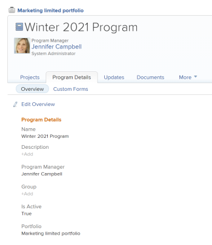
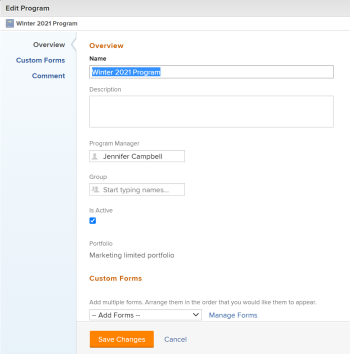
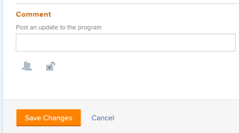

# Edit programs

>[!IMPORTANT]
>
>You're currently viewing the Adobe Workfront Classic version of this document. Adobe Workfront Classic is no longer supported. All Adobe Workfront Classic functionality, along with this documentation, will be removed in July 2022. Please transition to the the new Adobe Workfront experienceas soon as possible, and switch to the new Adobe Workfront experience version of this document.

You can edit information on programs that you have created, or that other users have created if they shared them with you.

You can edit a program in the program page or you can edit programs in a list.

## Access requirements

You must have the following access to perform the steps in this article:

<table> 
 <col> 
 <col> 
 <tbody> 
  <tr> 
   <td role="rowheader">Adobe Workfront plan*</td> 
   <td> 
Any
 </td> 
  </tr> 
  <tr> 
   <td role="rowheader">Adobe Workfront license*</td> 
   <td> 
Plan 
 </td> 
  </tr> 
  <tr> 
   <td role="rowheader">Access level*</td> 
   <td> 
Edit access to Programs
 
Note: If you still don't have access, ask your Workfront administrator if they set additional restrictions in your access level. For information about access to programs in your Access Level, see <a href="../../../administration-and-setup/add-users/configure-and-grant-access/grant-access-programs.md" class="MCXref xref">Grant access to programs</a>. For information on how a Workfront administrator can change your access level, see <a href="../../../administration-and-setup/add-users/configure-and-grant-access/create-modify-access-levels.md" class="MCXref xref">Create or modify custom access levels</a>. 
 </td> 
  </tr> 
  <tr> 
   <td role="rowheader">Object permissions</td> 
   <td> 
Manage permissions to a program
 
 For information about granting permissions to programs, see <a href="../../../workfront-basics/grant-and-request-access-to-objects/share-a-program.md" class="MCXref xref">Share a program </a>. 
 
For information on requesting additional permissions, see <a href="../../../workfront-basics/grant-and-request-access-to-objects/request-access.md" class="MCXref xref">Request access to objects </a>.
 </td> 
  </tr> 
 </tbody> 
</table>

&#42;To find out what plan, license type, or access you have, contact your Workfront administrator.

## Edit programs

1. Go to the **Projects** area in the Global Navigation Bar. 
1. Select the **Portfolios** tab, click the name of a portfolio, then  click the **Programs** tab. 

1. Do one of the following:

   * Click the name of a program to open it, then click **Program Details**.

     

   * Select one or more programs in the list, then click **Edit** to open the Edit Program box.

     

1. Consider updating the following fields in the Program Details tab or the Edit Program box: 

   <table> 
    <col> 
    <col> 
    <tbody> 
     <tr> 
      <td role="rowheader">Name</td> 
      <td> 
Update the name of the program.
 
Tip: This is not available in the Edit Program box when you select more than one program. 
 </td> 
     </tr> 
     <tr> 
      <td role="rowheader">Description</td> 
      <td> 
Type a description for the program to indicate what is unique about it. 
 </td> 
     </tr> 
     <tr> 
      <td role="rowheader">Program Manager</td> 
      <td> 
Start typing the name of a user that you want to indicate as the program manager, then select it when it appears in the list. This is the person who can oversee the work defined in the projects of the program. 
 
Important: When you designate someone as the Program Manager, they automatically gain&nbsp;Manage permissions to the program and the projects in the program. 
 
&nbsp;
 </td> 
     </tr> 
     <tr> 
      <td role="rowheader">Group</td> 
      <td> 
Add the name of a single group if the group is associated with the program or has responsibility for completing it. 
 </td> 
     </tr> 
     <tr> 
      <td role="rowheader">Is Active</td> 
      <td> 
 Select this checkbox if you want the program to be active. Other users can find active programs and attach them to projects or add them to portfolios. Inactive programs cannot be attached to projects or portfolios. This is enabled by default.
 </td> 
     </tr> 
    </tbody> 
   </table>

1. (Optional)&nbsp;Click **Custom Forms**.
1. (Optional) Select the custom form or forms that you want to associate with the program. You must build the custom forms before they are available to select in this field. Only active custom forms display in the list.

   For more information about building custom forms, see [Create or edit a custom form](../../../administration-and-setup/customize-workfront/create-manage-custom-forms/create-or-edit-a-custom-form.md). You can add up to ten custom forms to a program. 

1. (Conditional)&nbsp;If editing the program in the Program Details box, click **Edit Custom Form** to update the fields on a custom form.

   >[!NOTE]
   >
   >Depending on how your Workfront administrator set the permissions for the sections in your custom form, not everyone can view or edit the same fields on a given custom form. The permissions to edit fields within a section of a custom form depend on the permissions you have on the program itself. For information about setting permissions on sections of a custom form, see [Create or edit a custom form](../../../administration-and-setup/customize-workfront/create-manage-custom-forms/create-or-edit-a-custom-form.md).

1. (Optional) In the Edit Program box, click **Comment**.

   

   Do the following:

   1. Add a comment in the **Post an update to the program** field.
   1. (Optional) Click the **People** icon to add a user or a team to the comment. 
   1. (Optional)&nbsp;Click the **Lock** icon to lock the comment and make it private to only users in your company.

      After you save your changes, the comment you add displays in the program's Updates tab and sends an email to the users included in it.

   >[!TIP]
   >
   >You cannot add a comment in the Program Details tab.

1. (Conditional) Click&nbsp;**Save** if you edit the program in the Program Details tab

   Or

   Click **Save Changes** if you edit the program in the Edit Program box. 

1. (Optional)&nbsp;From the program page, click the **Projects** tab to add projects to the program.

   For more information, see [Add a project to a program](../../../manage-work/portfolios/create-and-manage-programs/add-project-to-program.md).

<!--

<h2>Edit programs in a list</h2>

(NOTE: this section is drafted for right now, but it might change (especially for NWE) - keeping it to easily copy it to NWE if needed.) 

<ol>
<li value="1"> 
Go to a list of programs and select one or more programs that you want to edit, then click the <strong>Edit</strong> icon  at the top of the list. 
 
The <strong>Edit Program</strong> dialog box displays.
 
All program fields are available in the Edit Program box and are grouped by the areas listed in the left panel. 
 </li>
<li value="2">Consider specifying information in any of the following sections:
<ul>
<li><a href="#overview" class="MCXref xref">Overview</a></li>
<li><a href="#Custom%C2%A0F" class="MCXref xref">Custom&nbsp;Forms</a></li>
<li><a href="#comment" class="MCXref xref">Comment</a></li>
</ul></li>
</ol>

<strong>Overview</strong>

<ol>
<li value="1">Begin editing a program as described above.</li>
<li value="2"> 
Click <strong>Overview</strong> and specify the following fields: 

<table>
<col>
<col>
<tbody>
<tr>
<td role="rowheader">Name</td>
<td> 
Update the name of the program. 
 <note type="tip">
This is not available when you selected more than one program.
</note> </td>
</tr>
<tr>
<td role="rowheader">Description</td>
<td>&nbsp;</td>
</tr>
<tr>
<td role="rowheader">Program Manager</td>
<td>&nbsp;</td>
</tr>
<tr>
<td role="rowheader">Group</td>
<td> 
Add the name of a single group if the group is associated with the program or has responsibility for completing it. 
 </td>
</tr>
<tr>
<td role="rowheader">Is Active</td>
<td>&nbsp;</td>
</tr>
</tbody>
</table> </li>
<li value="3"> 
Click <strong>Save Changes</strong> or continue editing the following sections.
 </li>
</ol>
<h3>Custom&nbsp;Forms</h3>
<ol>
<li value="1"> 
Begin editing the program as described above. 
 </li>
<li value="2"> 
Click the <strong>Add Forms</strong> drop-down menu to select a custom forms and add it to the program. 
 
You must create program custom forms before they are available to add. 
 <note type="note">
Depending on how your Workfront administrator set the permissions for the sections in your custom form, not everyone can view or edit the same fields on a given custom form. The permissions to edit fields within a section of a custom form depend on the permissions you have on the program itself. For information about setting permissions on sections of a custom form, see
<a href="../../../administration-and-setup/customize-workfront/create-manage-custom-forms/create-or-edit-a-custom-form.md" class="MCXref xref">Create or edit a custom form</a>.
</note> </li>
<li value="3"> 
Update any fields in the custom forms, then click <strong>Save Changes</strong> or continue with the following section. 
 </li>
</ol>

<strong>Comment</strong>

<ol>
<li value="1"> 
Begin editing a program as described above.
 </li>
<li value="2"> 
Click&nbsp;<strong>Comment</strong>. 
 </li>
<li value="3"> 
Add a comment in the <strong>Post an update to the program</strong> field.
 </li>
<li value="4"> 
(Optional) Click the <strong>People</strong> icon to add a user or a team to the comment. 
 </li>
<li value="5"> 
(Optional)&nbsp;Click the <strong>Lock</strong> icon to lock the comment and make it private to only users in your company. 
 </li>
</ol>

-->

