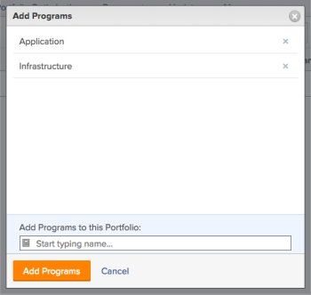

# Add an existing program to a portfolio

>[!IMPORTANT]
>
>You're currently viewing the Adobe Workfront Classic version of this document. Adobe Workfront Classic is no longer supported. All Adobe Workfront Classic functionality, along with this documentation, will be removed in July 2022. Please transition to the the new Adobe Workfront experienceas soon as possible, and switch to the new Adobe Workfront experience version of this document.

You can add existing programs to a portfolio.&nbsp;Because programs cannot exist in two different portfolios, adding an existing program permanently moves it from one portfolio to another.&nbsp;

## Access requirements

You must have the following access to perform the steps in this article:

<table cellspacing="0"> 
 <col> 
 <col> 
 <tbody> 
  <tr> 
   <td role="rowheader">Adobe Workfront plan*</td> 
   <td> 
Business or higher
 </td> 
  </tr> 
  <tr> 
   <td role="rowheader">Adobe Workfront license*</td> 
   <td> 
Plan 
 </td> 
  </tr> 
  <tr> 
   <td role="rowheader">Access level configurations*</td> 
   <td> 
Edit access to Portfolios and Programs 
 
Note: If you still don't have access, ask your Workfront administrator if they set additional restrictions in your access level. For information on how a Workfront administrator can change your access level, see <a href="../../../administration-and-setup/add-users/configure-and-grant-access/create-modify-access-levels.md" class="MCXref xref">Create or modify custom access levels</a>.
 </td> 
  </tr> 
  <tr> 
   <td role="rowheader">Object permissions</td> 
   <td> 
Manage permissions to the portfolio and the program
 
For information on requesting additional access, see <a href="../../../workfront-basics/grant-and-request-access-to-objects/request-access.md" class="MCXref xref">Request access to objects </a>.
 </td> 
  </tr> 
 </tbody> 
</table>

&#42;To find out what plan, license type, or access you have, contact your Workfront administrator.

## Add an existing program to a portfolio

1. Go to a **Projects** in the Global Navigation Bar.
1. Click **Portfolios**, and select a portfolio.
1. Select the **Programs** tab.  
1. Click **Add Program**.
1. Click **Existing Program**.

   >[!IMPORTANT]
   >
   >Adding an existing program carries all projects associated with that program to the portfolio. Be careful not to unintentionally move projects this way.

   

1. In the **Add Programs** dialog box, type and select the name of a program.
1. (Optional) To add additional programs, type and select the name of a program.
1. Click **Add Programs**.  
   The program appears in the **Programs** tab on the portfolio you selected.  
   

