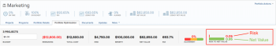

# Calculate the Risk to Net Value in a portfolio

>[!IMPORTANT]
>
>You're currently viewing the Adobe Workfront Classic version of this document. Adobe Workfront Classic is no longer supported. All Adobe Workfront Classic functionality, along with this documentation, will be removed in July 2022. Please transition to the the new Adobe Workfront experienceas soon as possible, and switch to the new Adobe Workfront experience version of this document.

In the Portfolio Optimizer, the Risk to Net Value indicator measures the Potential Risk taking into account the Net Value provided by all projects displayed in the Portfolio Optimizer.&nbsp;

For achieving the most efficiency within the portfolio, you want to see that the Risk indicator is low and the Net Value indicator is high.&nbsp;

The Risk and Net Value indicators are represented from the perspective of how they relate to each other.

Adobe Workfront calculates the Risk and Net Value indicators using the following formulas:

* The Risk indicator is calculated by the following formula:

  ```
  Risk indicator = Risk / (Risk + Net Value)
  ```

* The Net Value indicator is calculated by the following formulas:

  ```
  Net Value indicator = 1 - Risk / (Risk + Net Value)
  ```

  Or

  ```
  Net Value indicator = Net Value / (Risk + Net Value)
  ```

  <!--
  <li data-mc-conditions="QuicksilverOrClassic.Classic,QuicksilverOrClassic.Draft mode">Legacy Portfolio Optimizer <!--
  <span style="color: #ff1493;" data-mc-conditions="QuicksilverOrClassic.Draft mode">[NOTE:&nbsp;should be removed when flash is removed from prod</span>
  -->]
  <ul>
  <li>The Risk indicator is calculated by the following formula:<br><code>Risk indicator = Risk / (Risk + Legacy Net Value)</code></li>
  <li>The Net Value indicator is calculated by the following formulas:<br><code>Net Value indicator = 1 - Risk / (Risk + Legacy Net Value)</code><br>Or<br><code>Net Value indicator = Legacy Net Value / (Risk + Legacy Net Value)</code><br><note type="important">
  If you are in the Legacy Portfolio Optimizer, the Net Value is calculated using the Legacy Net Value in the Legacy Resource Estimates area of the Business case.
  <i> </i>For more information, see
  <em style="font-style: italic;"> </em>
  <a href="../../../manage-work/projects/project-finances/calculate-net-value.md">Calculating Net Value</a>
  <a href="../../../manage-work/projects/project-finances/calculate-net-value.md" style="font-style: italic;" class="MCXref xref">Calculate Net Value</a>
  </note><p><a href="../../../manage-work/projects/project-finances/calculate-net-value.md" class="MCXref xref">Calculate Net Value</a><span data-sheets-value="{&quot;1&quot;:2,&quot;2&quot;:&quot;You might not have access to this functionality because it is supported by Flash, which has been deprecated in most environments.&quot;}" data-sheets-userformat="{&quot;2&quot;:769,&quot;3&quot;:[null,0],&quot;11&quot;:4,&quot;12&quot;:0}">You might not have access to this functionality because it is supported by Flash, which has been deprecated in most environments.</span><a href="../../../manage-work/projects/project-finances/calculate-net-value.md" class="MCXref xref">Calculate Net Value</a></p></li>
  </ul></li>
  -->

>[!NOTE]
>
>The Risk to Net Value indicator calculates based on the projects that you display in the Portfolio Optimizer, and not on all the projects which are associated with the portfolio.&nbsp;



