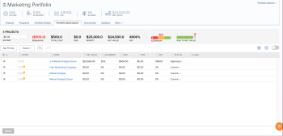
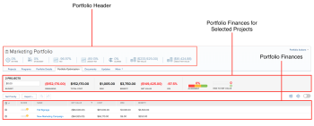
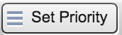
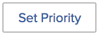
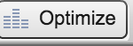
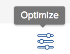
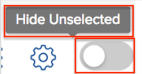
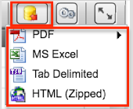
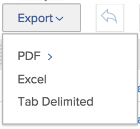
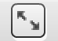

# Portfolio Optimizer overview

##  

The Portfolio Optimizer is the tool used for project evaluation and comparison. The process of reviewing and comparing Business Case values for projects assigned to a portfolio is how a portfolio manager can prioritize projects and generate the most value for an organization.

The purpose of the portfolio optimizer is to provide an interface through which a portfolio manager, steering committee, or product management office can view summary information about the business case of each project. Projects can then be prioritized according to strategic values and goals, or according to their overall score.

The Portfolio Optimizer can only assist you if you have completed the following prerequisites:

* The Business Cases have been completed on the projects
* A portfolio is defined for the projects you want to review
* You provide a budget to represent the total financial cap of the selected projects.

For information about locating the Portfolio Optimizer, see [Locate the Portfolio Optimizer](../../../manage-work/portfolios/portfolio-optimizer/locate-portfolio-optimizer.md).

<!--

<h2>Locate the Portfolio Optimizer</h2>
<ol>
<li value="1"> 
 Go to the <strong>Projects</strong> area in the Global Navigation Bar. 
 </li>
<li value="2"> Click the <strong>Portfolios</strong> tab and click the portfolio you want to view. </li>
<li value="3"> 
 Click the <strong>Portfolio Optimization</strong> tab. 
 
The Portfolio Optimizer displays.
 
  
 </li>
</ol>

-->

## Finances in the Portfolio Optimizer

* [The financial areas in the Portfolio Optimizer](#the-financial-areas-in-the-portfolio-optimizer) 
* [The financial fields in the Portfolio Optimizer](#the-financial-fields-in-the-portfolio-optimizer)

You can see the financial state of your portfolio at any time during the life of your projects when using the Portfolio Optimizer.

Consider the following when working with finances in the Portfolio Optimizer:

* Projects are each given a score when their Business Cases are completed according to what criteria they match in the Portfolio Optimizer. For example, low cost or high alignment projects receive a higher score.

  For more information about calculating the portfolio optimizer score of a project, see the article [Overview of the Portfolio Optimizer Score](../../../manage-work/portfolios/portfolio-optimizer/portfolio-optimizer-score.md).

* The financial calculations for the Portfolio Optimizer use the Budgeted Cost in the Business Case of the project.
* You can manually prioritize your projects in the Portfolio Optimizer, taking into account all the information about them. This includes financial data, alignment to their scorecards, ROI, for example.

### The financial areas in the Portfolio Optimizer {#the-financial-areas-in-the-portfolio-optimizer}

You can view financial information in the following areas of the Portfolio Optimizer:

* **Portfolio Header**: This area displays financial information gathered from all the projects in the portfolio. It displays on every tab of the Portfolio object. 
* **Portfolio Finances for Selected Projects**: This area displays financial information gathered from the projects which are selected in the Portfolio Optimizer. You can add or remove projects and understand how this will affect the finances of the portfolio by viewing the information in this area. 
* **Projects Finances**: This area displays the financial information of each project listed in the Portfolio Optimizer.  
  

### The financial fields in the Portfolio Optimizer  {#the-financial-fields-in-the-portfolio-optimizer}

The following financial fields display in the Portfolio Optimizer:

* [Portfolio header](#portfolio-header) 
* [Portfolio finances for selected projects](#portfolio-finances-for-selected-projects)<![CDATA[   ]]>
*

#### **Portfolio header** {#portfolio-header}

Adobe Workfront calculates the financial fields in the portfolio header using information from projects with statuses that equate only with Approved or Current.

<table cellspacing="15"> 
 <col> 
 <col> 
 <thead> 
  <tr> 
   <th><strong>Name of Field</strong> </th> 
   <th><strong>Description</strong> </th> 
  </tr> 
 </thead> 
 <tbody> 
  <tr> 
   <td>On Time</td> 
   <td> 
The percentage of projects in the portfolio which are considered to be On Time. This is visible from any tab inside a Portfolio.
 
A project is considered to be On Time when the Project <strong>Condition</strong> is <strong>On Target</strong>.  For more information about Project Conditions, see the article <a href="../../../manage-work/projects/manage-projects/project-condition-and-condition-type.md" class="MCXref xref">Overview of Project Condition and Condition Type</a>.
 
The <strong>On Time</strong> percentage is calculated by using the following formula:
 
<em>On Time Portfolio Percentage = Number of On Time Projects/ Total Number of Projects in a Current or Approved status</em> 
 </td> 
  </tr> 
  <tr> 
   <td>On Budget</td> 
   <td> 
The percentage of projects in the portfolio which are considered to be On Budget. This is visible from any tab inside a Portfolio.
 
Projects are <strong>On Budget</strong> when they have not exceeded their pre-defined budget.  For more information about the budget of a project, see the article <a href="../../../manage-work/projects/project-finances/manage-project-finance-area.md" class="MCXref xref">Manage information in the project Finance area</a>.
 
The On Budget percentage is calculated by using the following formula:
 
<em>On Budget Portfolio Percentage = Number of On Budget Projects/ Total Number of Projects </em><em>in a Current or Approved status</em> 
 </td> 
  </tr> 
  <tr> 
   <td>ROI (for portfolio)</td> 
   <td> 
The Return on Investment (ROI) for the portfolio is calculated by taking into account the total Benefit of the Portfolio and the total of the Budgeted Costs of the projects. This is visible from any tab inside a Portfolio.
 
The Portfolio ROI value is calculated by using the following formula:
 
<em>Portfolio ROI = (Total Benefit - Total Budgeted Cost)/ Total Cost * 100</em> 
 
For more information about how the ROI is calculated for a project, see the article <a href="../../../manage-work/projects/project-finances/calculate-roi.md" class="MCXref xref">Calculate Return On Investment (ROI)</a> .
 </td> 
  </tr> <!--
   <tr data-mc-conditions="QuicksilverOrClassic.Classic,QuicksilverOrClassic.Draft mode"> 
    <td> Legacy ROI (for portfolio)</td> 
    <td> 
The Legacy Return on Investment (ROI) for the portfolio is calculated by taking into account the Total Benefit of the portfolio and the Total of the Legacy budgeted costs of the projects. This is visible from any tab inside a portfolio. 
 
You might not have access to this functionality because it is supported by Flash, which has been deprecated in most environments.  
 
The portfolio Legacy ROI value is calculated by using the following formula:
 
<em>Portfolio Legacy ROI = [(Total Benefit - Total Legacy Budgeted Cost)/ Total Cost] * 100</em> 
 
For more information about how the ROI is calculated for a project, see the article<a href="../../../manage-work/projects/project-finances/calculate-roi.md" class="MCXref xref">Calculate Return On Investment (ROI)</a>.
 </td> 
   </tr>
  --> 
  <tr> 
   <td>Aligned or Alignment Score </td> 
   <td> 
An average of all the Project Alignment Score values which are calculated after completing the Scorecard in the Business Case of the project. The alignment score of each project is listed in the Alignment column of the Portfolio Optimizer. This is visible from any tab inside a portfolio.
 
For more information about generating an alignment score for a project, see the article <a href="../../../manage-work/projects/define-a-business-case/apply-scorecard-to-project-to-generate-alignment-score.md" class="MCXref xref">Apply a scorecard to a project and generate an Alignment Score</a>.
 </td> 
  </tr> 
  <tr> 
   <td>Net Value</td> 
   <td> 
The sum of all the Net Values of all the projects in the portfolio. This is visible from any tab inside a portfolio.
 
For more information about how Net Value is calculated for a project, see the article <a href="../../../manage-work/projects/project-finances/calculate-net-value.md" class="MCXref xref">Calculate Net Value</a>.
 </td> 
  </tr> <!--
   <tr data-mc-conditions="QuicksilverOrClassic.Classic,QuicksilverOrClassic.Draft mode"> 
    <td> Legacy Net Value</td> 
    <td> 
The sum of all the Legacy Net Values of all the projects in the portfolio. This is visible from any tab inside a portfolio. 
 
You might not have access to this functionality because it is supported by Flash, which has been deprecated in most environments.  
 
For more information about how Net Value is calculated for a project, see the article <a href="../../../manage-work/projects/project-finances/calculate-net-value.md" class="MCXref xref">Calculate Net Value</a>.
 </td> 
   </tr>
  --> 
 </tbody> 
</table>

#### Portfolio finances for selected projects {#portfolio-finances-for-selected-projects}

<table cellspacing="15"> 
 <col> 
 <col> 
 <thead> 
  <tr> 
   <th><strong>Name of Field</strong> </th> 
   <th> 
<strong>Description</strong> 
 
&nbsp;
 </th> 
  </tr> 
 </thead> 
 <tbody> 
  <tr> 
   <td>Number of projects</td> 
   <td> 
The total number of active projects in the portfolio. Projects that are considered active in a portfolio can be in any of the following statuses:
 
    <ul> 
     <li>Current</li> 
     <li>Planning</li> 
     <li>Approved</li> 
    </ul> </td> 
  </tr> 
  <tr> 
   <td>Budget</td> 
   <td>You can manually update this field to indicate what is the total budget for the entire portfolio. This budget is used for all the projects inside the portfolio. </td> 
  </tr> 
  <tr> 
   <td>Remaining</td> 
   <td> 
The remaining budget after all the Budgeted Costs on all the projects inside the portfolio have been subtracted from the Budget of the portfolio.
 
The Remaining Portfolio Budget is calculated using the following formula:
 
<em>Remaining Portfolio Budget = Total Portfolio Budget - Total Budgeted Cost of All Portfolio Projects</em> 
 <!--
     
If you are using the Legacy Portfolio Optimizer, the Remaining Portfolio Budget is calculated by using the following formula:

    --> <!--
     
<em>Remaining Portfolio Budget = Total Portfolio Budget - Total Legacy Budgeted Cost of All Portfolio Projects</em> 

    --> 
The overall Budgeted Cost of all the projects in the portfolio is represented in the indicator bar under the Budget field. <!--
      If you are using the Legacy Portfolio Optimizer, the Legacy Budgeted Cost of each project is listed in the Cost column.
     -->
 
For more information about tracking costs on a project, see the article<a href="../../../manage-work/projects/project-finances/track-costs.md" class="MCXref xref">Track costs</a>.
 </td> 
  </tr> 
  <tr> 
   <td>Total Cost</td> 
   <td> 
The sum of the costs of all the projects displayed in the Portfolio Optimizer. The cost of each project is the same as the Budgeted Cost of the Project as it is displayed in the Business Case Summary. 
 
For more information about the financial fields of projects in the Business Case, see the section "Understanding Financial Fields in the Business Case" in the article <a href="../../../manage-work/projects/define-a-business-case/create-business-case.md" class="MCXref xref">Create a Business Case for a project in Adobe Workfront</a>.
 </td> 
  </tr> 
  <tr> 
   <td>Risk </td> 
   <td> 
The sum of all the Potential Risk Costs of all the projects in the portfolio. The Potential Risk Cost of each project is listed in the Risk column of the Portfolio Optimizer. 
 
For more information about calculating risks for projects, see the article <a href="../../../manage-work/projects/project-finances/potential-risk-cost.md" class="MCXref xref">Calculate Potential Risk Cost </a>.
 </td> 
  </tr> 
  <tr> 
   <td>Benefit</td> 
   <td> 
The sum of all the Planned Benefit values of all the projects in the portfolio. The Planned Benefit value of each project is listed in the Benefit column of the Portfolio Optimizer. 
 
For more information about the Planned Benefit of a project, see the article <a href="../../../manage-work/projects/project-finances/project-planned-benefit.md" class="MCXref xref">Overview of project Planned Benefit</a>.
 </td> 
  </tr> 
  <tr> 
   <td>Risk to Net Value indicator</td> 
   <td> 
Measures the Potential Risk value taking into account the Net Value provided by all projects in the portfolio. For achieving the most efficiency within the portfolio, you want to see that the Risk indicator is low and the Net Value indicator is high. 
 
For more information about calculating Risk to Net Value, see the article <a href="../../../manage-work/portfolios/portfolio-optimizer/calculate-risk-to-net-value-in-portfolio.md" class="MCXref xref">Calculate the Risk to Net Value in a portfolio</a>.
 </td> 
  </tr> 
 </tbody> 
</table>

## Customize the Portfolio Optimizer

You can customize only the project list area of the Portfolio Optimizer by using settings to change the information in the list.

The following icons and options are available for the Portfolio Optimizer:

<table cellspacing="15"> <!--
  <col data-mc-conditions="QuicksilverOrClassic.Classic,QuicksilverOrClassic.Draft mode">
 --> 
 <col data-mc-conditions="QuicksilverOrClassic.Classic"> 
 <col> 
 <col> 
 <thead> 
  <tr> <!--
    <th data-mc-conditions="QuicksilverOrClassic.Draft mode,QuicksilverOrClassic.Classic"><strong>Icon in the Legacy Portfolio Optimizer</strong> </th>
   --> <!--
    <th data-mc-conditions="QuicksilverOrClassic.Draft mode,QuicksilverOrClassic.Classic"><strong>Icon in the</strong><strong>Portfolio Optimizer</strong> </th>
   --> <!--
    <th data-mc-conditions="QuicksilverOrClassic.Draft mode,QuicksilverOrClassic.Classic"><strong>Name</strong> </th>
   --> <!--
    <th data-mc-conditions="QuicksilverOrClassic.Draft mode,QuicksilverOrClassic.Classic"><strong>Function</strong> </th>
   --> 
  </tr> 
 </thead> 
 <tbody> 
  <tr> <!--
    <td data-mc-conditions="QuicksilverOrClassic.Draft mode,QuicksilverOrClassic.Classic">  </td>
   --> <!--
    <td data-mc-conditions="QuicksilverOrClassic.Draft mode,QuicksilverOrClassic.Classic">  </td>
   --> <!--
    <td data-mc-conditions="QuicksilverOrClassic.Draft mode,QuicksilverOrClassic.Classic">Set project priority</td>
   --> <!--
    <td data-mc-conditions="QuicksilverOrClassic.Draft mode,QuicksilverOrClassic.Classic">Use this icon when you want to save the project order, based on their priority. </td>
   --> 
  </tr> 
  <tr> <!--
    <td data-mc-conditions="QuicksilverOrClassic.Draft mode,QuicksilverOrClassic.Classic">  </td>
   --> <!--
    <td data-mc-conditions="QuicksilverOrClassic.Draft mode,QuicksilverOrClassic.Classic">  </td>
   --> <!--
    <td data-mc-conditions="QuicksilverOrClassic.Draft mode,QuicksilverOrClassic.Classic">Optimize portfolio</td>
   --> 
   <td>Use this icon to optimize the portfolio based on the following financial values of the projects:
    <ul>
     <li>Cost</li>
     <li>Alignment</li>
     <li>Value</li>
     <li>Risk to Benefit</li>
     <li>ROI</li>
    </ul>
For more information about optimizing your portfolio, see the article <a href="../../../manage-work/portfolios/portfolio-optimizer/optimize-projects-in-portfolio-optimizer.md" class="MCXref xref">Optimize projects in the Portfolio Optimizer </a> .
</td> 
  </tr> 
  <tr> <!--
    <td data-mc-conditions="QuicksilverOrClassic.Draft mode,QuicksilverOrClassic.Classic">  </td>
   --> <!--
    <td data-mc-conditions="QuicksilverOrClassic.Draft mode,QuicksilverOrClassic.Classic">  </td>
   --> <!--
    <td data-mc-conditions="QuicksilverOrClassic.Draft mode,QuicksilverOrClassic.Classic">Undo/ Redo icons</td>
   --> <!--
    <td data-mc-conditions="QuicksilverOrClassic.Draft mode,QuicksilverOrClassic.Classic">Use these icons to cancel or redo the changes you made to the Portfolio Optimizer before saving.</td>
   --> 
  </tr> 
  <tr> <!--
    <td data-mc-conditions="QuicksilverOrClassic.Draft mode,QuicksilverOrClassic.Classic">  </td>
   --> <!--
    <td data-mc-conditions="QuicksilverOrClassic.Draft mode,QuicksilverOrClassic.Classic">  </td>
   --> <!--
    <td data-mc-conditions="QuicksilverOrClassic.Draft mode,QuicksilverOrClassic.Classic">Show/ Hide unchecked projects</td>
   --> <!--
    <td data-mc-conditions="QuicksilverOrClassic.Draft mode,QuicksilverOrClassic.Classic">Use these icons to display or hide the projects in the portfolio that you have unchecked. </td>
   --> 
  </tr> 
  <tr> <!--
    <td data-mc-conditions="QuicksilverOrClassic.Draft mode,QuicksilverOrClassic.Classic">  </td>
   --> <!--
    <td data-mc-conditions="QuicksilverOrClassic.Draft mode,QuicksilverOrClassic.Classic">    <!--
      
 

     --> </td>
   --> <!--
    <td data-mc-conditions="QuicksilverOrClassic.Draft mode,QuicksilverOrClassic.Classic">Export</td>
   --> 
   <td> 
Use this icon to export the data in the Project Prioritization area of the Portfolio Optimizer. You can export it to the following formats:
 
    <ul> 
     <li>PDF</li> 
     <li>Excel</li> 
     <li>Tab Delimited</li> 
    </ul> </td> 
  </tr> 
  <tr> <!--
    <td data-mc-conditions="QuicksilverOrClassic.Draft mode,QuicksilverOrClassic.Classic">  </td>
   --> <!--
    <td data-mc-conditions="QuicksilverOrClassic.Draft mode,QuicksilverOrClassic.Classic">  </td>
   --> <!--
    <td data-mc-conditions="QuicksilverOrClassic.Draft mode,QuicksilverOrClassic.Classic">Preferences</td>
   --> <!--
    <td data-mc-conditions="QuicksilverOrClassic.Draft mode,QuicksilverOrClassic.Classic"> 
Use this icon to modify the project fields displayed in the columns of the Portfolio Optimizer, or to modify what projects you display in the Optimizer, based on their statuses. 
 
Tips:  
      <ul> 
       <li> 
Not all&nbsp;Workfront standard fields are available to add in the columns. 
 </li> 
      </ul> 
      <ul> 
       <li> 
You can add only the custom fields that have a value other than zero in any of the projects in the portfolio.
 </li> 
      </ul> 
 </td>
   --> 
  </tr> <!--
   <tr data-mc-conditions="QuicksilverOrClassic.Draft mode"> <!--
     <td data-mc-conditions="QuicksilverOrClassic.Draft mode,QuicksilverOrClassic.Classic">  </td>
    --> <!--
     <td data-mc-conditions="QuicksilverOrClassic.Draft mode,QuicksilverOrClassic.Classic">  </td>
    --> <!--
     <td data-mc-conditions="QuicksilverOrClassic.Draft mode,QuicksilverOrClassic.Classic">Full screen</td>
    --> <!--
     <td data-mc-conditions="QuicksilverOrClassic.Draft mode,QuicksilverOrClassic.Classic">Use this icon to display the Portfolio Optimizer in full-screen mode, or to end the full-screen mode and return to the default view. 
Note:  This view is not supported in the new Portfolio Optimizer.
</td>
    --> 
   </tr>
  --> 
 </tbody> 
</table>

