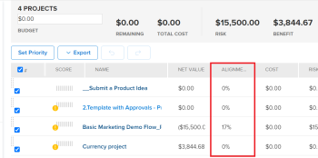
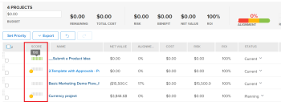
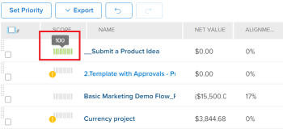
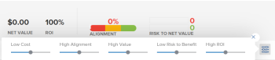

# Overview of the Portfolio Optimizer Score

You can find the Portfolio Optimizer score in the ```Portfolio Optimizer. It displays in the **Score** column for every project```. This represents a score for every project in the portfolio.

For information about locating the Portfolio Optimizer, see the article [Portfolio Optimizer overview](../../../manage-work/portfolios/portfolio-optimizer/portfolio-optimizer-overview.md).

For information about how&nbsp;Adobe Workfront uses the project&nbsp;Score and other project information to optimize projects in the Portfolio Optimizer, see [Optimize projects in the Portfolio Optimizer](../../../manage-work/portfolios/portfolio-optimizer/optimize-projects-in-portfolio-optimizer.md).

## Difference between the Alignment Score and the Portfolio Optimizer Score

There is a difference between the alignment score and the portfolio optimizer score of a project.

The alignment score of a project is calculated based on the points obtained after completing the scorecard. This score is then used to determine the portfolio alignment score. The alignment score is displayed as a percentage.  
The alignment score of a project displays in the **Alignment** column of the Portfolio Optimizer or in the Alignment field of the Business Case Summary.




For more information about generating the alignment score of a project, see the article [Apply a scorecard to a project and generate an Alignment Score](../../../manage-work/projects/define-a-business-case/apply-scorecard-to-project-to-generate-alignment-score.md).

The portfolio optimizer score is a ranking automatically calculated in the Portfolio Optimizer by which projects can be prioritized. The portfolio optimizer score is displayed as an indicator icon accompanied by a number and it displays in the **Score** column of the Portfolio Optimizer.

>[!NOTE]
>
>A project can be scored in the Portfolio Optimizer only if its Business Case has been completed. For more information about completing a Business Case, see the article [Create a Business Case for a project in Adobe Workfront](../../../manage-work/projects/define-a-business-case/create-business-case.md).



The score for each project is calculated based on the importance of the following categories:

* Cost
* Alignment
* Net Value
* Risk to Benefit
* ROI

## Calculate the Portfolio Optimizer Score

Workfront produces a score using the Portfolio Optimizer which is a ranking to assist in the prioritization of projects. The values in the portfolio are based on values entered into the business cases of the projects and are used to calculate a score for the project. Projects with a higher score could be considered of greater importance and they could be prioritized to be completed first.

To find out the ranking of a project, do the following:

1. Go to the Portfolio Optimizer.
1. Hover over the ranking icon to see the portfolio optimizer score for a project.



The algorithm for calculating the scores takes in to consideration the values outlined in the Business Cases of the projects and the weights they carry. It gives every project in the optimizer a score and normalizes that score so there is always a project with a score of 100. This gives a high score to the best project.

``` ```**Example: **``````For example, if you make higher alignment the only factor to consider, the project with the highest alignment gets the score of 100. 

The following are criteria that you can score a project by:

* Cost
* Alignment
* Value
* Risk to Benefit
* ROI



For information about how to optimize projects in the portfolio, see [Optimize projects in the Portfolio Optimizer](../../../manage-work/portfolios/portfolio-optimizer/optimize-projects-in-portfolio-optimizer.md).

Each criteria on the configuration panel (Cost, Alignment, ROI, Net Value, Risk to Benefit) are given their weights in the range 0-100 based on what you selected.

For each project with a complete business case a score per criteria is generated using the folowing formula:&nbsp;

```
Score Per Criteria = (Project Value For The Criteria - AVG(all the project values for this criteria)) / Standard Deviation of that value for that project
```

``` ```**Example: **``````For the Alignment Score for the Project A, you will have the following:

```
Alignment Score = (Project A Alignment Score - AVG (of all the project Alignments)) / Standard Deviation of alignment score for that project
```

Once you have all the Score Per Criteria calculated, you can add them taking into account their weights to get the full score per project. The score of the project is calculated using the following formula:

```
Score = Cost Score * Cost Weight + Alignment Score * Alignment Weight + ROI Score * ROI Weight + Net Value Score * Net Value Weight + Risk Score * Risk Weight
```

For the project cost and risk the logic works in reverse from the way the other criteria work: if you want the Low Cost to be important to you, it's not going to increase but decrease the overall score of the project by 

```
Cost Score * Cost Weight
```

.

After you have scores calculated for each project, the Optimization Score is defined for the projects the following way:

1. Minimum and Maximum scores are defined.
1. The range between those values is calculated.
1. For each project the Optimization&nbsp;Score is calculated using the following formula:

   ```
   Optimization Score = Rounded ((Score - Minimum / Range)*100)
   ```

