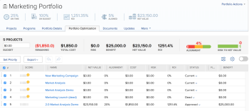

# Prioritize projects in the Portfolio Optimizer

>[!IMPORTANT]
>
>You're currently viewing the Adobe Workfront Classic version of this document. Adobe Workfront Classic is no longer supported. All Adobe Workfront Classic functionality, along with this documentation, will be removed in July 2022. Please transition to the the new Adobe Workfront experienceas soon as possible, and switch to the new Adobe Workfront experience version of this document.

You can prioritize your projects in the Portfolio Optimizer, to establish the order in which they should be completed.

Consider the following when using the Portfolio Optimizer:

* The projects at the top of the Portfolio Optimizer are considered more important than the ones listed towards the bottom. You will need to complete the projects in order of their priority in the Portfolio Optimizer for the Portfolio to be optimized.&nbsp;
* The priority of projects in the Portfolio Optimizer is unrelated to the Priority field located on the Project Details tab of a project.

  The Priority field on the Project Details tab is a visual flag that you manually specify to understand how important a project should be. 

* The priority of projects in the Portfolio Optimizer is visible in the Resource Planner, if it is enabled there. In the Resource Planner, projects receive resources in the order of their Resource Planner priority, and not that of the Portfolio Priority.

  For information about prioritizing projects in the Resource Planner, see the article [Prioritize projects in the Resource Planner](../../../resource-mgmt/resource-planning/prioritize-projects-resource-planner.md). 

* The **Project Prioritization** area of the Portfolio Optimizer displays projects in the order of Planned Start Dates and Net Value, by default.

## Access requirements

You must have the following access to perform the steps in this article:

<table> 
 <col> 
 <col> 
 <tbody> 
  <tr> 
   <td role="rowheader">Adobe Workfront plan*</td> 
   <td> 
Any 
 </td> 
  </tr> 
  <tr> 
   <td role="rowheader">Adobe Workfront licenses*</td> 
   <td> 
Business or higher
 </td> 
  </tr> 
  <tr> 
   <td role="rowheader">Access level configurations*</td> 
   <td> 
Edit access to Projects and Portfolios
 
Note: If you still don't have access, ask your Workfront administrator if they set additional restrictions in your access level. For information on how a Workfront administrator can modify your access level, see <a href="../../../administration-and-setup/add-users/configure-and-grant-access/create-modify-access-levels.md" class="MCXref xref">Create or modify custom access levels</a>.
 </td> 
  </tr> 
  <tr> 
   <td role="rowheader">Object permissions</td> 
   <td> 
Manage permissions to the portfolio
 
Contribute or higher permissions to the projects
 
For information on requesting additional access, see <a href="../../../workfront-basics/grant-and-request-access-to-objects/request-access.md" class="MCXref xref">Request access to objects </a>.
 </td> 
  </tr> 
 </tbody> 
</table>

&#42;To find out what plan, license type, or access you have, contact your Workfront administrator.

## Change the priority of the projects in the Portfolio Optimizer

1. Go to the **Projects** area in your Global Navigation Bar. 
1. Select the **Portfolios** tab. 
1. Click the name of a portfolio to open it. 
1. Select the **Portfolio Optimization** tab. 
1. In the **Project Prioritization** section,&nbsp;alter the priority of your projects by clicking the gray area next to the number of the project and dragging it to the desired display position.  
   

   Click the **Set Priority** button in the Optimizer tools area when you finish re-arranging your projects. The projects will receive a new number&nbsp;based on the new order.

1. Click **Save** to save the new project priority in the Portfolio Optimizer.

   >[!NOTE]
   >
   >This does not necessarily change the order of the projects in the Portfolio Optimizer. The priority is listed as a number in the number (**#**) column.&nbsp;

   You can see the priority of the project as it appears in the Portfolio Optimizer in the Resource Planner, by enabling the **Display Portfolio Priorities** setting in the Resource Planner.

   For information about prioritizing projects in the Resource Planner, see the article [Prioritize projects in the Resource Planner](../../../resource-mgmt/resource-planning/prioritize-projects-resource-planner.md).

