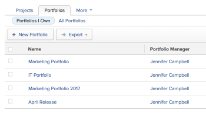

# Navigate within a portfolio

In Adobe Workfront, a portfolio represents a collection of projects that compete for the same resources, budget, schedule, and priority. The primary purpose of the portfolio is to assist executives and project&nbsp;managers in selecting to work on projects that provide the most benefit to an organization.

For more information about portfolios, see [Portfolio overview in Adobe Workfront](../../../manage-work/portfolios/portfolios-overview/portfolio-overview.md).

## Access requirements

You must have the following access to perform the steps in this article:

<table cellspacing="0"> 
 <col> 
 <col> 
 <tbody> 
  <tr> 
   <td role="rowheader">Adobe Workfront plan*</td> 
   <td> <p>Any </p> </td> 
  </tr> 
  <tr> 
   <td role="rowheader">Adobe Workfront license*</td> 
   <td> <p>Plan </p> </td> 
  </tr> 
  <tr> 
   <td role="rowheader">Access level configurations*</td> 
   <td> <p>Edit access to Projects and Portfolios</p> <p>Note: If you still don't have access, ask your Workfront administrator if they set additional restrictions in your access level. For information on how a Workfront administrator can modify your access level, see <a href="../../../administration-and-setup/add-users/configure-and-grant-access/create-modify-access-levels.md" class="MCXref xref">Create or modify custom access levels</a>.</p> </td> 
  </tr> 
  <tr> 
   <td role="rowheader">Object permissions</td> 
   <td> <p>Manage permissions to the portfolio</p> <p>View or higher permissions to the projects</p> <p>For information on requesting additional access, see <a href="../../../workfront-basics/grant-and-request-access-to-objects/request-access.md" class="MCXref xref">Request access to objects in Adobe Workfront</a>.</p> </td> 
  </tr> 
 </tbody> 
</table>

&#42;To find out what plan, license type, or access you have, contact your Workfront administrator.

## Navigate within a portfolio

1. Go to the **Projects** area in your Global Navigation Bar. 
1. ```Select the``` **Portfolios** ```tab.``` 

1. Select any of the following sub-tabs:

   * **Portfolios I Own**: Includes a list of portfolios for which you are designated as the Portfolio Manager.
   * **All** **Portfolios** : Includes all portfolios for which you have at least access to View.  
     For more information about access to Portfolios, see [Access levels overview](../../../administration-and-setup/add-users/access-levels-and-object-permissions/access-levels-overview.md).  
     For more information about permissions to Portfolios, see&nbsp; [Share a portfolio in Adobe Workfront](../../../workfront-basics/grant-and-request-access-to-objects/share-a-portfolio..md).  
       
     To add new portfolios, see [Create a portfolio](../../../manage-work/portfolios/create-and-manage-portfolios/create-portfolios.md).

1. Click the name of a portfolio to access it.  
   The following portfolio performance metrics are displayed in the Portfolio Details area inside a portfolio:

   * Whether the portfolio is On Time
   * Whether the portfolio is On Budget
   * The Return on Investment (ROI)
   * The portfolio Alignment
   * The portfolio Net Value  
     

1. (Optional) Select the **Projects** tab to view projects associated with the selected portfolio, then select any of the following sub-tabs:&nbsp;

   * **Active****Projects**: Includes all projects associated with the selected portfolio which are in the following statuses:  
     - Planning  
     - Approved  
     - Current
   
   * **Requested** **Projects**: Includes projects associated with the selected portfolio with a status of **Requested**.  
     For information about reviewing Requested projects, see [Review Requested Projects](../../../manage-work/portfolios/create-and-manage-portfolios/review-requested-projects.md).
   
   * **All****Projects**: Includes all projects associated with the selected portfolio.

     >[!NOTE]
     >
     >To see only specific projects, consider creating a project filter in the **Filter** drop-down menu at the top of the list of projects to decrease the number of projects displayed.

     For more information about creating filters, see [Filters overview in Adobe Workfront](../../../reports-and-dashboards/reports/reporting-elements/filters-overview.md).

1. (Optional) Select the **Programs**tab to create Programs within the portfolio or manage existing ones.   
   For information about programs, see the [Create and manage programs](../../../manage-work/portfolios/create-and-manage-programs/create-and-manage-programs.md) section.

1. (Optional) Select the **Portfolio Details**&nbsp;tab to specify new portfolio details or to attach custom forms to the portfolio. 
1. (Optional) Select the **Portfolio Optimization**&nbsp;tab to optimize the performance of the portfolio.

   >[!IMPORTANT]
   >
   >Your company must have a Business or higher Workfront plan to have access to the Portfolio Optimizer.

   For information about using the Portfolio Optimizer, see the [Manage projects in the Portfolio Optimizer](../../../manage-work/portfolios/portfolio-optimizer/manage-projects-in-portfolio-optimizer.md) section.&nbsp;

1. (Optional) Select the **Documents**&nbsp;tab to attach documents to the portfolio. 
1. (Optional) Select the **Updates** sub-tab to add comments to the update stream of the portfolio.&nbsp;
1. (Optional) Click **Portfolio Actions** to do one of the following:<![CDATA[]]>

   * Delete the portfolio.

     >[!IMPORTANT]
     >
     >This does not delete the projects associated with the portfolio. This removes the name of the portfolio from the projects currently associated with it.&nbsp;

   * Share the portfolio with other users.
   * Add the portfolio to your **Favorites** list.

