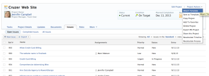
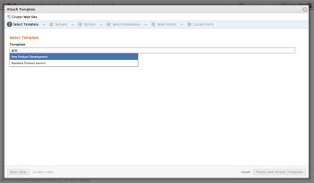
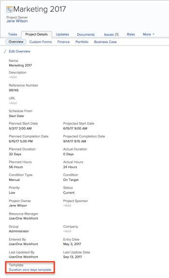

# Attach a template to a project

You can attach a template to a project either during the initial creation phase of the project or after it has been created.

For more information about creating a project using a template, see [Create a project using a template](../../../manage-work/projects/create-projects/create-project-from-template.md).

## Access requirements

You must have the following to perform the steps described in this article:

<table cellspacing="0"> 
 <col> 
 <col> 
 <tbody> 
  <tr> 
   <td role="rowheader">Adobe Workfront plan*</td> 
   <td> 
Any 
 </td> 
  </tr> 
  <tr> 
   <td role="rowheader">Adobe Workfront license*</td> 
   <td> 
Plan 
 </td> 
  </tr> 
  <tr> 
   <td role="rowheader">Access level configurations*</td> 
   <td> 
Edit access to Projects 
 
For information about project access, see <a href="../../../administration-and-setup/add-users/configure-and-grant-access/grant-access-projects.md" class="MCXref xref">Grant access to projects</a>.
 
View access to&nbsp;Templates
 
For information about template permissions, see <a href="../../../workfront-basics/grant-and-request-access-to-objects/share-a-template.md" class="MCXref xref">Sharing a template</a>. 
 
For information about template access, see <a href="../../../administration-and-setup/add-users/configure-and-grant-access/grant-access-templates.md" class="MCXref xref">Grant access to templates</a>.
 
Note: If you still don't have access, ask your Workfront administrator if they set additional restrictions in your access level. For information on how a Workfront administrator can modify your access level, see <a href="../../../administration-and-setup/add-users/configure-and-grant-access/create-modify-access-levels.md" class="MCXref xref">Create or modify custom access levels</a>.
 </td> 
  </tr> 
  <tr> 
   <td role="rowheader">Object permissions</td> 
   <td> 
Manage permissions to the project
 
For information about project permissions, see <a href="../../../workfront-basics/grant-and-request-access-to-objects/share-a-project.md" class="MCXref xref">Share a project in Adobe Workfront</a>. 
 
View permissions or higher to the template
 
For information on requesting additional access, see <a href="../../../workfront-basics/grant-and-request-access-to-objects/request-access.md" class="MCXref xref">Request access to objects in Adobe Workfront</a>.
 </td> 
  </tr> 
 </tbody> 
</table>

&#42;To find out what plan, license type, or access you have, contact your Workfront administrator.

<!--

<h2>Considerations when adding templates to projects</h2>

Consider the following when adding templates to projects:

<ul>
<li> 
You can attach only active templates to projects. 
 </li>
<li> 
You can attach a template to a project when the project is in a status of Complete, Dead, or in Pending Approval, only when your Adobe Workfront administrator or a group administrator has enabled this functionality in the Project&nbsp;Preferences area. For information about setting project preferences, see <a href="../../../administration-and-setup/set-up-workfront/configure-system-defaults/set-project-preferences.md" class="MCXref xref">Configure system-wide project preferences</a>. 
 </li>
<li> 
Unless you exclude specific template tasks from being added in the attachment process, all template tasks are added to the existing project. 
 </li>
<li> 
Most template settings are added to the project. 
 </li>
<li> 
Some settings from the template automatically transfer to the project, unless you specifically mark them to be excluded. 

Example: </b>">
<b>Example: </b>

For example, these settings are added to the project:

<ul>
<li>Start&nbsp;From field</li>
<li>Custom forms and the information on them</li>
<li>Queue Details </li>
<li>Financial settings </li>
</ul>

 </li>
</ul>

-->

## Attach a template to an existing project {#attach-a-template-to-an-existing-project}

1. Go to the project where you want to attach a template. 
1. Click **Project Actions,** then click**Attach Template.**

   The Attach Template box displays.   
   

1. Begin typing the name of the template that you want to attach, then select it from the drop-down list when it displays.

   

1. Click **Next Step** to navigate through the numbered options, as follows (or, select **Finish and Attach Template** at any time):

   <table cellspacing="0"> 
    <col> 
    <col> 
    <tbody> 
     <tr> 
      <td role="rowheader">Exclude</td> 
      <td>Select any tasks that you want to exclude from the template before attaching it to the project.</td> 
     </tr> 
     <tr> 
      <td role="rowheader">Options</td> 
      <td> 
Select the checkbox beside any information you want to clear from the template before attaching it to the project.
 
Important: If you do not check the <strong>Clear Queue Properties and Issues Setup</strong> box, the Queue Details of the template overwrite those of the project. In this case, the Routing Rules, Queue Topics, and Topic Groups of the template are added to those of the project.  If the project is set up as a request queue and the template you attach to the project is not set up as a request queue, the queue information of the project is removed if you leave the <strong>Clear Queue Properties and Issues Setup</strong> box unchecked.  If you select the <strong>Clear Queue Properties and Issue Setup</strong> box, all the Queue Setup settings of the project are preserved and no Queue Setup settings from the template are attached. 
 </td> 
     </tr> 
     <tr> 
      <td role="rowheader">Select Predecessor</td> 
      <td> 
Select which project task you want finished before the template tasks are started. Alternatively, you can skip this step and set up relationships within the project after the template is attached. Select the <strong>Dependency Type</strong>, <strong>Lag</strong> information, and whether you want the predecessor to be <strong>Enforced</strong> or not. 
 </td> 
     </tr> 
     <tr> 
      <td role="rowheader">Select Parent</td> 
      <td>Select which project task you want to designate as the parent task for all of the template tasks. If you do not make a selection, all of the template tasks appear at the end of your current project tasks. You can skip this step and move tasks around in the project after the template is attached.</td> 
     </tr> 
     <tr> 
      <td role="rowheader">Custom&nbsp;Form</td> 
      <td> 
(Optional)&nbsp;Update information in the custom fields of the attached custom forms. 
 
Tip:  
        <ul> 
         <li> 
This step is mandatory when the custom forms on the template contain required fields that are empty. 
 </li> 
         <li> 
If the fields from the template custom forms already exist on the project and contain information, they preserve the information already on the project. You cannot edit them during attaching the template. 
 </li> 
        </ul> 
 </td> 
     </tr> 
    </tbody> 
   </table>

1. Click **Finish and Attach Template.**

   Your template is now attached to your project. You can edit the project and adjust any tasks, information, or settings as needed.

## Attach multiple templates to an existing project and view template information

You can attach multiple templates (one at a time) to the same project, following the steps described in the section [Attach a template to an existing project](#attach-a-template-to-an-existing-project) in this article. This adds the tasks and other information from each template to the project.

>[!TIP]
>
>When you attach several templates to a project, only the one you attached first displays in the Project Details tab .

To understand what template is applied to a project:

1. Navigate to a project which has a template attached.
1. Select the **Project Details** tab, then the **Overview** sub-tab. .

1. Find the name of the template attached to the project in the **Template** field .

   

&nbsp;

&nbsp;

##  

