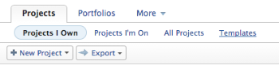
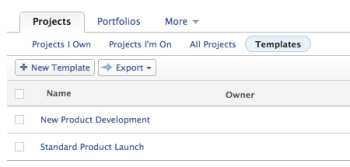
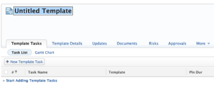

# Create a project template

>[!IMPORTANT]
>
>You're currently viewing the Adobe Workfront Classic version of this document. Adobe Workfront Classic is no longer supported. All Adobe Workfront Classic functionality, along with this documentation, will be removed in July 2022. Please transition to the the new Adobe Workfront experienceas soon as possible, and switch to the new Adobe Workfront experience version of this document.

You can create and delete templates from the Projects area. When building a new template, you can enter the information for all of the tasks and all information for your future project settings. This information will then transfer to the project, when you create it from the template.

You can create a new template in the following ways:

* From scratch, as described in this article.
* From existing projects, by saving a project as a template.

  For more information about creating templates from existing projects, see [Save a project as a template](../../../manage-work/projects/manage-projects/save-project-as-template.md).

* By copying it from another template.

  For more information about copying an existing template, see [Copy a project template](../../../manage-work/projects/create-and-manage-templates/copy-template.md).

## Access requirements

You must have the following:

<table> 
 <col> 
 <col> 
 <tbody> 
  <tr> 
   <td role="rowheader">Adobe Workfront plan*</td> 
   <td> 
Any
 </td> 
  </tr> 
  <tr> 
   <td role="rowheader">Adobe Workfront license*</td> 
   <td> 
Plan 
 </td> 
  </tr> 
  <tr> 
   <td role="rowheader">Access level configurations*</td> 
   <td> 
Edit access to Templates
 
Note: If you still don't have access, ask your Workfront administrator if they set additional restrictions in your access level. For information on how a Workfront administrator can modify your access level, see <a href="../../../administration-and-setup/add-users/configure-and-grant-access/create-modify-access-levels.md" class="MCXref xref">Create or modify custom access levels</a>.
 </td> 
  </tr> 
  <tr> 
   <td role="rowheader">Object permissions</td> 
   <td> 
You have Manage permissions to the templates you create, by default
 
For information on requesting additional access, see <a href="../../../workfront-basics/grant-and-request-access-to-objects/request-access.md" class="MCXref xref">Request access to objects </a>.
 </td> 
  </tr> 
 </tbody> 
</table>

&#42;To find out what plan, license type, or access you have, contact your Workfront administrator.

## Create a template

1. Go to the **Projects** area in the Global Navigation Bar. 
1. Select the **Projects** tab.  
   

1. Select the **Templates** sub-tab.  
   

1. Click **New Template**.

   The template is untitled.

   

1. Specify a name for the new template in the template header, then press **Enter.**
1. Click the **Template Tasks** tab. 
1. Click**Start Adding Template Tasks**.

   Or

   Click **New Template Task** to start adding tasks to your template.

   Adding template tasks to a template is identical to adding tasks to a project.

   For more information about adding tasks to a project, see [Create tasks in a project](../../../manage-work/tasks/create-tasks/create-tasks-in-project.md).

   >[!NOTE]
   >
   >You cannot add recurring tasks to a template.

1. (Optional) Click the **Gantt chart** icon in the upper-right corner of the Task List to see a visual representation of the template's task list.

   >[!TIP]
   >
   >You cannot edit tasks directly from this Gantt chart.

1. To add information to your new template, click **Edit Template** .

   For information about editing a template, see [Edit project templates](../../../manage-work/projects/create-and-manage-templates/edit-templates.md).

1. Click **Save Changes**.
1. (Optional) If you want to add additional items to the template, see the section [Add additional items to a template](../../../manage-work/projects/create-and-manage-templates/edit-templates.md#adding-items-to-template) in the article [Edit project templates](../../../manage-work/projects/create-and-manage-templates/edit-templates.md).

## Template settings determined by group association

A project template's association with a group (or lack thereof) affects how project, task, and issue preferences determine certain settings in the template. For more information, see the section Create and modify a group’s project templates in the article Create and modify a group’s project templates.
