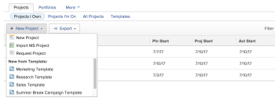
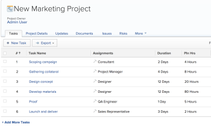
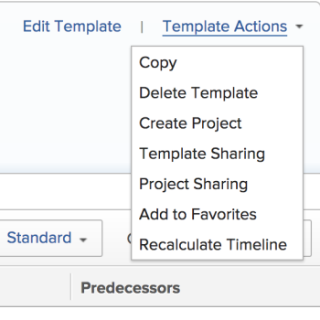

# Create a project using a template

>[!IMPORTANT]
>
>You're currently viewing the Adobe Workfront Classic version of this document. Adobe Workfront Classic is no longer supported. All Adobe Workfront Classic functionality, along with this documentation, will be removed in July 2022. Please transition to the the new Adobe Workfront experienceas soon as possible, and switch to the new Adobe Workfront experience version of this document.

You can use templates as a framework to create new projects. If you have projects that repeat often, using templates for the general timeline of the new project saves you from having to build the same projects repeatedly.

Templates provide you with a way to capture all of the repeatable processes, information, and settings associated with your projects. All of the information associated with a template is transferred to the project. This includes tasks, assignments, durations, documents, financial details, risks, and custom forms.

>[!TIP]
>
>The status of a new project created from a template corresponds with the status defined by your Workfront administrator in the main Project Preferences area or by a group administrator ```(or Workfront administrator) in the Project Preferences area for a group.``` For information about configuring project preferences, see [Configure system-wide project preferences](../../../administration-and-setup/set-up-workfront/configure-system-defaults/set-project-preferences.md) or [Configure project preferences for a group](../../../administration-and-setup/manage-groups/create-and-manage-groups/configure-project-preferences-group.md).

You have the following options for creating a project from a template:

* Create a project from a template in the Projects area
* Create a project from a template at the template level
* Attach a template to an existing project

  For information, see [Attach a template to a project](../../../manage-work/projects/create-and-manage-templates/attach-template-to-project.md).

## Access requirements

You must have the following access to perform the steps in this article:

<table cellspacing="0"> 
 <col> 
 <col> 
 <tbody> 
  <tr> 
   <td role="rowheader">Adobe Workfront plan*</td> 
   <td> <p>Any </p> </td> 
  </tr> 
  <tr> 
   <td role="rowheader">Workfront licenses overview*</td> 
   <td> <p>Plan </p> </td> 
  </tr> 
  <tr> 
   <td role="rowheader">Access level*</td> 
   <td> <p>Edit access to Projects and to Templates</p> <p>Note: If you still don't have access, ask your Workfront administrator if they set additional restrictions in your access level. For information about access to projects, see <a href="../../../administration-and-setup/add-users/configure-and-grant-access/grant-access-projects.md" class="MCXref xref">Grant access to projects</a>. For information on how a Workfront administrator can change your access level, see <a href="../../../administration-and-setup/add-users/configure-and-grant-access/create-modify-access-levels.md" class="MCXref xref">Create or modify custom access levels</a>. </p> </td> 
  </tr> 
  <tr> 
   <td role="rowheader">Object permissions</td> 
   <td> <p>View permissions to a template</p> <p>When you create a project you automatically receive Manage permissions to the project </p> <p> For information about project permissions, see <a href="../../../workfront-basics/grant-and-request-access-to-objects/share-a-project.md" class="MCXref xref">Share a project in Adobe Workfront</a>.</p> <p>For information on requesting additional access, see <a href="../../../workfront-basics/grant-and-request-access-to-objects/request-access.md" class="MCXref xref">Request access to objects </a>.</p> </td> 
  </tr> 
 </tbody> 
</table>

&#42;To find out what plan, license type, or access you have, contact your Workfront administrator.

## Create a project from a template in the Projects area

You can create a project from the Projects area in the Global Navigation Bar, or from the Projects area of a portfolio or a program.

1. Do one of the following:

   * Go to the **Projects** area in the Global Navigation Bar and select the **Projects** tab, then expand **New Project**. 
   * Go to a portfolio, then expand **Add Projects**.

     >[!TIP]
     >
     >When you create a project using a template from a portfolio, the Portfolio field of the new project updates to display the portfolio you chose to create the project from. This overwrites the Portfolio field on the template, if it is specified.

   * Go to a program, then expand **Add Projects**.

     >[!TIP]
     >
     >When you create a project using a template from a program, the Program field of the new projects updates to display the Program you chose to create the project from. The Portfolio field of the template updates to display the portfolio of the program you chose to create the project from. This overwrites the Program and Portfolio fields on the template, if they are specified.

   

1. Select a template from the choices under **New from Template** area in the drop-down list.

   The **Create Project From Template** box that displays contains all of the pre-populated details from the settings configured in the template.

   

1. Specify a **Name** for the project, then review each section and make any necessary changes needed for the project.

   For more information, see [Edit projects](../../../manage-work/projects/manage-projects/edit-projects.md).

1. Click **Save Changes.**

   All details defined in the template associate automatically with the newly created project if you didn't change them in the previous step.

   

## Create a project from a template in the Templates area

Instead of starting in the Projects subtab of the Projects area, you can create a project from a template by starting with the template.

1. Go to the **Projects** area in the Global Navigation Bar and select the **Projects** subtab. 
1. Click **Templates.** 
1. Click the name of a template you want to use.
1. Click **Template Actions**, then **Create Project**.

   

1. In the **Create a Project from Template** box that opens, specify a name for the project, then review each section and make any necessary changes.

   If a field is already populated in the template, the field is pre-populated in the **Create Project from Template** dialog box. You can edit the pre-populated values to better match your project. For more information, see [Edit projects](../../../manage-work/projects/manage-projects/edit-projects.md).

1. Click **Save Changes.**

   All details defined in the template associate automatically with the newly created project if you didn't change them in the previous step.

&nbsp;
