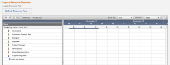
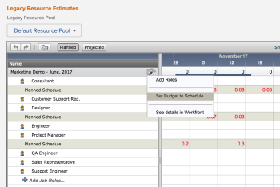

# Estimate project resources by applying Legacy Resource Pools to the Business Case

<!--

(NOTE:IMPORTANT: When they redesign this and you are able to attach new Res Pools to the business case - MAKE A NEW ARTICLE with NEW information (instead of Legacy)!!! Do not overwrite this one

This links to this article:&nbsp;https://workfront.zendesk.com/knowledge/articles/115004967388/en-us?brand_id=662728&amp;return_to=%2Fhc%2Fen-us%2Farticles%2F115004967388 &nbsp;- if you delete this one, edit the link to the other article.)

-->

>[!IMPORTANT]
>
>The information in this article refers to functionality that is currently deprecated and will be removed from Adobe Workfront. For information about the current functionality for managing resources in Workfront, see [Resource Planning in Adobe Workfront](../../../resource-mgmt/resource-planning/resource-planning-overview.md).

You can&nbsp;associate a Legacy Resource Pool with a project as part of completing the Legacy Resource Estimates section of the Business Case of the project.

For more information about creating a Business Case, see [Create a Business Case for a project](../../../manage-work/projects/define-a-business-case/create-business-case.md).

## Apply a Legacy Resource Pool to the Business Case

The **Legacy Resource Pool** field on the Business Case is&nbsp;used to help estimate potential resource needs during project evaluation.&nbsp;

You must have Edit access to projects in your access level, as well as Manage permissions on the project to be able to edit the Business Case of the project.&nbsp;

To apply a Legacy Resource Pool to the Business Case of a project:

1. Go to the project which you want to associate with the Legacy Resource Pool.&nbsp;
1. Select the **Project Details** tab.
1. Select the **Business Case** sub-tab.
1. In the **Legacy Resource Estimates** section, click **Add**.&nbsp;

1. Specify a **Legacy Resource Pool** in the **Legacy Resource Pool** drop-down menu.

   This adds the **Legacy**&nbsp;**Resource Estimates** grid to the Business Case.&nbsp;

1. Click **Save**.

## Add Legacy Resource Estimates to the&nbsp;Legacy Resource Pool on the Business Case

The job roles displayed in a Legacy Resource Pool are preset by the Workfront administrator; however, project or resource managers can add additional job roles&nbsp;to the Legacy Resource Pool. When&nbsp;you add additional job roles to a Legacy Resource Pool through the Legacy Resource Estimates of the Business Case on the project, the job roles are also added to the Legacy Resource Pool in the Resource Budget Manager.

For more information about budgeting resources in the Resource Budget Manager, see [Budget Legacy Resource Pools in the Resource Budget Manager](../../../resource-mgmt/legacy-res-planning/budget-legacy-pools-in-budget-manager.md).

At the top of the Legacy Resource Estimates grid, you see the timeline of the project. You can enter an estimate of time for each date in the timeline of the project. You can only view your resource estimates by week or month. You cannot view them&nbsp;by day.

>[!NOTE]
>
>&nbsp;Allocation data displays for 1095 days (or 3 years) in the Legacy Resource Estimates area of the Business Case.

To add resource estimates to the Legacy Resource Estimates grid within the Business Case of a project:

1. Start entering the value (in Hours, FTE or Cost) of time or cost needed for each job role in the Legacy Resource Pool. To be able to use the Cost value, your job roles must be associated with rates. For more information about setting up job roles, see [Create and manage job roles](../../../administration-and-setup/set-up-workfront/organizational-setup/create-manage-job-roles.md).

   Click inside the cell where you enter the first estimate, and drag the green outline across the rows and the columns of the grid, to apply the same estimate to multiple roles or dates.

1. (Optional) Click the **Planned** button at the top of the Legacy Resource Estimates grid to show the Planned Hours required for each job role.&nbsp;The Planned&nbsp;allocation shows the Planned Hours of the tasks associated&nbsp;with the job roles.

   Try to estimate&nbsp;the same amount of hours for your resources as the number of Planned Hours on the project. The estimated hours are your Budgeted Hours. Ideally, these numbers will match.

1. (Optional) To make all the resource estimates (Budgeted Hours) match the Planned Hours from the tasks across all job roles in the Resource Estimates grid, mouse&nbsp;over the name of the Legacy Resource Pool, and&nbsp;click the hammer icon, then click **Set Budget to Schedule**.  

1. (Optional) You can also match the Planned Hours from the tasks for one job role at a time by&nbsp;mousing over each job role and clicking **Set Budget to Schedule** for that role.

   

1. (Optional) Click the **Projected** button&nbsp;at the top of the Resource Estimates grid to show the Projected Hours required for each job role, according to their assignments to the tasks in the project. The Projected allocation shows what resources have already been scheduled to meet those needs.&nbsp;
1. Click **Save** when you finish estimating your resources for the project.

   This calculates the Budgeted&nbsp;Cost of your project.

   The information you enter in the Legacy Resource Estimates grid at the project level transfers to the Capacity Planner of the Legacy Resource Pool and allows you to further allocate your resources across all the projects associated with this Legacy Resource Pool. For more information about using the Capacity Planner, see [Plan resources in the Capacity Planner](../../../resource-mgmt/legacy-res-planning/plan-resources-in-capacity-planner.md)

   A&nbsp;dark blue line displays the anticipated timeline for the project, but only if a template is used on the project.

