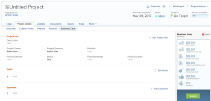

# Create a Business Case for a project

>[!IMPORTANT]
>
>You're currently viewing the Adobe Workfront Classic version of this document. Adobe Workfront Classic is no longer supported. All Adobe Workfront Classic functionality, along with this documentation, will be removed in July 2022. Please transition to the the new Adobe Workfront experienceas soon as possible, and switch to the new Adobe Workfront experience version of this document.

You can use the Business Case to request a project and define the purpose, the budget, and the potential benefit for the project. The Portfolio Manager or Project Sponsor uses the information from the Business Case to analyze and prioritize the project before they approve it.

## Access requirements

You must have the following:

<table> 
 <col> 
 <col> 
 <tbody> 
  <tr> 
   <td role="rowheader">Adobe Workfront plan*</td> 
   <td> <p>Any </p> </td> 
  </tr> 
  <tr> 
   <td role="rowheader">Adobe Workfront license*</td> 
   <td> <p>Plan or higher</p> </td> 
  </tr> 
  <tr> 
   <td role="rowheader">Access level configurations*</td> 
   <td> <p>Edit access to Projects, Financial Data, and Resource Management</p> <p>Note: If you still don't have access, ask your Workfront administrator if they set additional restrictions in your access level. For information on how a Workfront administrator can modify your access level, see <a href="../../../administration-and-setup/add-users/configure-and-grant-access/create-modify-access-levels.md" class="MCXref xref">Create or modify custom access levels</a>.</p> </td> 
  </tr> 
  <tr> 
   <td role="rowheader">Object permissions</td> 
   <td> <p>Manage or higher permissions on the project</p> <p>For information on requesting additional access, see <a href="../../../workfront-basics/grant-and-request-access-to-objects/request-access.md" class="MCXref xref">Request access to objects </a>.</p> </td> 
  </tr> 
 </tbody> 
</table>

&#42;To find out what plan, license type, or access you have, contact your Workfront administrator.

## Prerequisites

Consider the following when requesting a project through a Business Case:

* Your Adobe Workfront administrator ```or group administrator``` must enable the sections of the Business Case before they appear on your project.  
  For information about enabling the sections in the Business Case at the system level, see the article [Configure system-wide project preferences](../../../administration-and-setup/set-up-workfront/configure-system-defaults/set-project-preferences.md).

  For information about the areas of the Business Case, see the article [Overview of the Areas of the Business Case](../../../manage-work/projects/define-a-business-case/areas-of-business-case.md).

* You must complete all areas of the Business Case except for the Goals area if you want your project to receive a Score in the Portfolio Optimizer. Completing the Goals area is optional. The project receives a Score in the Portfolio Optimizer, even if this area is not completed.

  For information about working with Scorecards and with the Portfolio Optimizer, see the article [Apply a scorecard to a project and generate an Alignment Score](../../../manage-work/projects/define-a-business-case/apply-scorecard-to-project-to-generate-alignment-score.md).

## Create a Business Case

1. Click **Projects** in the Global Navigation Bar.
1. Click&nbsp;**New Project** and select&nbsp;**Request Project**.  
   By default, the project is placed in the **Idea** status.

   >[!CAUTION]
   >
   >If the Idea status has been deleted in your Workfront instance, the project is placed in the default status for new projects as defined in the Project Preferences area. For information about setting up project preferences, see [Configure system-wide project preferences](../../../administration-and-setup/set-up-workfront/configure-system-defaults/set-project-preferences.md).

   

1. Specify a name for your project, then press Enter. 
1. (Optional) Click **Project Actions**, then **Attach Template**, to create the Work Breakdown Structure of your project.

   Or

   Start adding tasks to the project manually. 

1. (Conditional) If you selected to attach a template, continue attaching the template to the project
1. Select the **Project Details** tab, then select the **Business Case** subtab.

1. (Optional) Click **Edit Project Info**.&nbsp;

   For more information about editing the fields in the Project Info section of the Business Case, see the section [Project Info](../../../manage-work/projects/define-a-business-case/areas-of-business-case.md#project-info) in the article [Overview of the Areas of the Business Case](../../../manage-work/projects/define-a-business-case/areas-of-business-case.md).

1. (Optional) Click **Edit Goals**.

   For more information about editing the Goals section of the Business Case, see the section [Goals](../../../manage-work/projects/define-a-business-case/areas-of-business-case.md#goals) in the article [Overview of the Areas of the Business Case](../../../manage-work/projects/define-a-business-case/areas-of-business-case.md).

1. (Optional) Click**Edit Expenses**.

   For more information about editing the Expenses section of the Business Case, see the section [Expenses](../../../manage-work/projects/define-a-business-case/areas-of-business-case.md#expenses) in the article [Overview of the Areas of the Business Case](../../../manage-work/projects/define-a-business-case/areas-of-business-case.md).

   <!--
   <li value="10" data-mc-conditions="QuicksilverOrClassic.Draft mode,QuicksilverOrClassic.Classic"> <p data-mc-conditions="QuicksilverOrClassic.Classic">(Optional) Click <strong>Edit Legacy Resource Estimates</strong>.</p> <p data-mc-conditions="QuicksilverOrClassic.Classic">For more information about editing the Legacy Resource Estimates section of the Business Case, see the section <a href="../../../manage-work/projects/define-a-business-case/areas-of-business-case.md#resource-estimates" class="MCXref xref">Legacy Resource Estimates</a> in the article <a href="../../../manage-work/projects/define-a-business-case/areas-of-business-case.md" class="MCXref xref">Overview of the Areas of the Business Case</a>. </p> <p data-mc-conditions="QuicksilverOrClassic.Classic">The ability to edit information in this area might have been removed in your environment.</p> </li>
   -->

1. (Optional) Use the Resource Budgeting area to budget your resources and obtain the Budgeted Labor Cost associated with the job roles on the project. For more information, see [Budget resources in the Business Case](../../../manage-work/projects/define-a-business-case/budget-resources-in-business-case.md).

   >[!TIP]
   >
   >The information displayed here is the same as the information displayed in the system-level resource budgeting tools.

1. (Optional)&nbsp;Click **Edit Risks** to add potential risks to this project. For information about adding risks to the Business Case, see the [Risks](../../../manage-work/projects/define-a-business-case/areas-of-business-case.md#risks) section in the article [Overview of the Areas of the Business Case](../../../manage-work/projects/define-a-business-case/areas-of-business-case.md). 
1. (Optional) Select a**Scorecard**&nbsp;in the **Add a Scorecard****to this Project** drop-down menu.

   Scorecards must be created before they can be attached to projects.

   For more information about scorecards, see the article [Apply a scorecard to a project and generate an Alignment Score](../../../manage-work/projects/define-a-business-case/apply-scorecard-to-project-to-generate-alignment-score.md).

1. (Optional) Select a **Custom Form** in the **Custom Forms** drop-down menu.

   Custom Forms must be created before they can be attached to projects.

   For more information about Custom Forms, see the article [Create or edit a custom form](../../../administration-and-setup/customize-workfront/create-manage-custom-forms/create-or-edit-a-custom-form.md).

1. Click&nbsp;**Submit**.

   The project status is changed to **Requested** and it is submitted to have the Business Case approved.

   For more information about approving a Business Case, see the article [Approve a Business Case](../../../manage-work/projects/define-a-business-case/approve-business-case.md).

1. (Optional) After completing the Business Case, you can export a copy of it to a .pdf file.&nbsp;For more information about exporting the Business Case to a .pdf file, see the section "Export the Business Case" in the article [Overview of the Areas of the Business Case](../../../manage-work/projects/define-a-business-case/areas-of-business-case.md).
