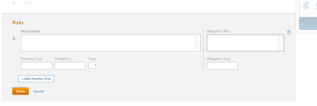
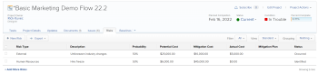
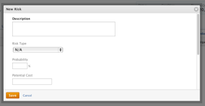

# Create and edit risks on projects

>[!IMPORTANT]
>
>You're currently viewing the Adobe Workfront Classic version of this document. Adobe Workfront Classic is no longer supported. All Adobe Workfront Classic functionality, along with this documentation, will be removed in July 2022. Please transition to the the new Adobe Workfront experienceas soon as possible, and switch to the new Adobe Workfront experience version of this document.

Risks are possible events or factors that prevent a project from finishing on time or within budget. Risks can be recorded as part of creating the Business Case of a project or by using the Risks tab. Risks are created only on a project. You cannot associate risks with tasks or issues.

Risks can be associated with cost, but Actual Risk Cost does not impact the Actual Cost of the Project.

>[!NOTE]
>
>This article defines the risks associated with the project as you define them in the Business Case of the project or as you add them in the Risks tab of the project. For information about the Risk field that is available when editing a project, see [Edit projects](../../../manage-work/projects/manage-projects/edit-projects.md).

## Access requirements

You must have the following access to perform the steps in this article:

<table cellspacing="0"> 
 <col> 
 <col> 
 <tbody> 
  <tr> 
   <td role="rowheader">Adobe Workfront plan*</td> 
   <td> <p>Any</p> </td> 
  </tr> 
  <tr> 
   <td role="rowheader">Adobe Workfront license*</td> 
   <td> <p>Plan </p> </td> 
  </tr> 
  <tr> 
   <td role="rowheader">Access level configurations*</td> 
   <td> <p>Edit access to Projects and Financial&nbsp;Data</p> <p>Note: If you still don't have access, ask your Workfront administrator if they set additional restrictions in your access level. For information on how a Workfront administrator can change your access level, see <a href="../../../administration-and-setup/add-users/configure-and-grant-access/create-modify-access-levels.md" class="MCXref xref">Create or modify custom access levels</a>.</p> </td> 
  </tr> 
  <tr> 
   <td role="rowheader">Object permissions</td> 
   <td> <p> Manage permissions that include Manage Finance on the project for which you want to create or edit risks </p> <p>For more information about project permissions, see the article <a href="../../../workfront-basics/grant-and-request-access-to-objects/share-a-project.md" class="MCXref xref">Share a project in Adobe Workfront</a>.</p> </td> 
  </tr> 
 </tbody> 
</table>

&#42;To find out what plan, license type, or access you have, contact your Workfront administrator.

## Create and edit risks in the Business Case

You can create risks as part of planning the Business Case of a project. You can later edit them in the Business Case, when changes occur to their probability, mitigation plan, or cost, for example. For information about creating a Business Case, see [Create a Business Case for a project](../../../manage-work/projects/define-a-business-case/create-business-case.md).

Your Workfront administrator ```or group administrator``` must enable the **Risks** section in your Business Case in the Project Preferences area before you can view it at the project level in the Business Case section. For information about setting project preferences, see [Configure system-wide project preferences](../../../administration-and-setup/set-up-workfront/configure-system-defaults/set-project-preferences.md).

Creating and editing risks in the Business Case is identical.

To create or edit a risk in the Business Case:

1. Click **Projects** in the Global Navigation Bar. 
1. Click the project you want to create or edit risks for. 
1. Click the **Project Details** tab, then click the **Business Case** subtab. 

1. In the **Risks** section, click **Edit Risks**.
1. Enter or edit the following information:

   * **Description:** describe the risk.  
   
   * **Potential Cost**: indicate the estimated cost if the risk should occur.  
   
   * **Probability**: indicate the probability of the risk occurring as a percentage value.   
   
   * **Type:** indicate what category the risk falls under.
   * **Mitigation Plan**: update the description of the plan to mitigate the risk.  
   
   * **Mitigation Cost**: indicate the cost of the mitigation plan that you must put in place to prevent the risk from occurring.

   

1. (Optional) Click **Add Another Risk** to add additional risks.
1. Click **Save**.

## Create and edit risks in the Risks area

In addition to creating and editing risks in the Business Case, you can do so using the **Risks** tab of a project.

* [Create risks in the Risks area](#create-risks-in-the-risks-area) 
* [Edit risks in the Risks area](#edit-risks-in-the-risks-area)

### Create risks in the Risks area {#create-risks-in-the-risks-area}

1. Go to the project you want to create risks for.
1. Select the **Risks** tab.

   

1. Click **Start Adding Risks** and create risks by in-line editing their information.

   Or

   Click **New Risk**. The **New Risk** dialogue box opens.

   

1. Enter the following information:

   * **Description**: describe the risk.
   * **Risk Type**: indicate what category the risk falls under.  
     Your Workfront administrator defines the Risk Types available in your environment. For information about defining Risk Types, see the article [Edit and create risk types](../../../administration-and-setup/set-up-workfront/configure-system-defaults/edit-create-risk-types.md).  
   
   * **Probability**: indicate the probability of the risk occurring as a percentage value.
   * **Potential Cost**: indicate the estimated cost if the risk should occur.
   * **Mitigation Cost**: indicate the cost of the mitigation plan that you must put in place to prevent the risk from occurring.
   * **Actual Cost**: indicate the actual cost of the risk if the risk occurred.
   * **Mitigation Plan**: update the description of the plan to mitigate the risk.

1. (Conditional) Click **Enter** if you are creating the risk in-line.

   Or

   Click **Save** if you are editing the information in the **New Risk** dialog box.

1. (Optional) Select a different **Status** for the risk, in the **Status** drop-down menu, when applying the **Standard** view for the list of risks.

   By default, the Status of a risk is **Identified**.

### Edit risks in the Risks area {#edit-risks-in-the-risks-area}

You can edit risks during the life of a project, when changes occur in their probability, potential cost, or their status, for example.

You can edit one risk at a time, or you can edit multiple risks in bulk.

To edit risks:

1. Navigate to a project for which you want to edit existing risks.
1. Select the **Risks** tab on the project. 
1. Start in-line editing the fields for the risks you see in the list to edit one risk at a time.

   Or

   Select one or several risks, then click **Edit** to edit multiple risks at the same time.

   >[!NOTE]
   >
   >You are applying the same information to all the risks selected, when you edit multiple risks at the same time. The information associated with each risk prior to your changes is overwritten in a bulk edit.

1. If you have clicked **Edit**, the **Edit Risk** dialog box opens.

   

   Consider editing the following fields:

   * **Description**: edit the description of the risk.
   * **Risk Type**: indicate what category the risk falls under. 
   * **Probability**: indicate the probability of the risk occurring as a percentage value.
   * **Potential Cost**: indicate the estimated cost if the risk should occur.
   * **Mitigation Cost**: indicate the cost of the mitigation plan that you must put in place to prevent the risk from occurring.
   * **Actual Cost**: indicate the actual cost of the risk if the risk occurred.
   * **Mitigation Plan**: update the description of the plan to mitigate the risk.

1. Click **Save Changes**.
1. (Optional) Edit the **Status** for a risk, in the **Status** drop-down menu, when applying the **Standard** view for the list of risks.

   >[!NOTE]
   >
   >You cannot edit the **Status** of risks in the **Edit Risk** dialog box. You can do so only in an in-line edit.

