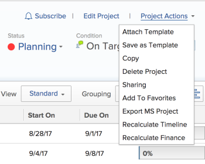
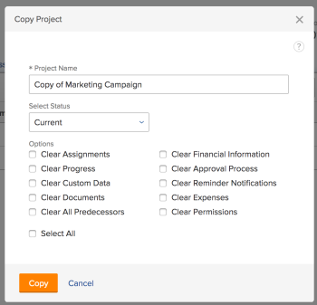

# Copy a project

You can copy a project rather than create a new one from scratch.

## Access requirements

You must have the following:

<table cellspacing="15"> 
 <col> 
 <col> 
 <tbody> 
  <tr> 
   <td> 
Adobe Workfront plan*
 </td> 
   <td>Any</td> 
  </tr> 
  <tr> 
   <td> 
Adobe Workfront license*
 </td> 
   <td> 
Plan 
 </td> 
  </tr> 
  <tr data-mc-conditions=""> 
   <td><strong>Access level configurations*</strong> </td> 
   <td> 
Edit access to Projects with ability to Create and Copy projects
 
Note: If you still don't have access, ask your Workfront administrator if they set additional restrictions in your access level. For information on how a Workfront administrator can change your access level, see <a href="../../../administration-and-setup/add-users/configure-and-grant-access/create-modify-access-levels.md" class="MCXref xref">Create or modify custom access levels</a>.
 </td> 
  </tr> 
  <tr data-mc-conditions=""> 
   <td> 
<strong>Object permissions</strong> 
 </td> 
   <td> 
View permissions or higher to the project
 
For information on requesting additional access, see <a href="../../../workfront-basics/grant-and-request-access-to-objects/request-access.md" class="MCXref xref">Request access to objects in Adobe Workfront</a>.
 </td> 
  </tr> 
 </tbody> 
</table>

&#42;To find out what plan, license type, or access you have, contact your Workfront administrator.

## Copy a 

<!--
<MadCap:conditionalText data-mc-conditions="QuicksilverOrClassic.Draft mode">
single
</MadCap:conditionalText>
-->

project

1. Go to the project that you want to copy.
1. Click **Project Actions**, then click **Copy**.

   

1. Specify a name for the project.

   By default, the new name is **Copy of <Original project name>.**

   

1. Select the **Status** of your new project.

   By default, the **Status** matches that of the original project.

1. (Optional) Select any of the following options to remove the items from the new project.

   >[!IMPORTANT]
   >
   >The following items are never copied from an existing project to a new one:   

   >
   >   
   >   
   >   * Issues  
   >   * Billing Rates
   >   * Billing Records  
   >   * Notes  
   >   * Hours
   >   * Cross-project predecessors
   >   
   >   
   >The following items are always copied from an existing project to a new one:
   >
   >   
   >   
   >   * Tasks
   >   * Template
   >   * Risks
   >   * Queue Setup information
   >   * Portfolio and Program
   >   * Scorecard
   >   * Task Default information (Task Default Approval Process, Task Default Custom Forms)
   >   
   >

   If you leave any of the following items unselected, they transfer to the copied project by default:

   * **Clear Assignments**: Removes all the project and task assignments
   * **Clear Progress**: Removes the progress on all the tasks.
   * **Clear Custom Data**: Removes the information from the custom form on the project, as well as the information on the custom forms associated with the following items:

      * Tasks
      * Expenses
      * Documents

     The custom forms will remain attached to the tasks, expenses, documents, and the project, but the information in the custom fields of the forms is not copied to the new project. 
   
   * **Clear Documents**: Removes everything in the documents tab, including document versions, linked documents, and folders.

     By default, document proofs and approvals cannot be copied to another project. 
   
   * **Clear All Predecessors**: Removes all predecessor relationships between the tasks on the project.

     >[!TIP]
     >
     >Cross-project predecessors never transfer to the new project, regardless of whether this is selected or not.

   * **Clear Financial Information**: Removes the information in the following areas:

      * Finance sub-tab of the project
      * Planned Benefit in the Business Case
      * Financial information from all tasks

     For more information about the project Finance sub-tab, see [Manage information in the project Finance area](../../../manage-work/projects/project-finances/manage-project-finance-area.md).

   * **Clear Approval Process**: Removes all approvals associated with the tasks or the project. 
   * **Clear Reminder Notifications**: Removes the Reminder Notifications associated with the tasks or the project. 
   * **Clear Expenses**: Removes expenses associated with the tasks or the project. 
   * **Clear Permissions**: Removes permissions to all the users on the tasks or the project.

     >[!NOTE]
     >
     >Permissions are removed from users who are assigned to the copied tasks, even if **Clear Assignments** is not selected.

   * **Select all**: Select this option to select all the options above and clear all the fields and objects listed from the new project.

1. Click **Copy** to create a copy of the project.

   This creates a new project which is similar to the project you copied.

   You can start making changes to your new copied project, like review task assignments or adjust timelines.

