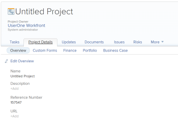
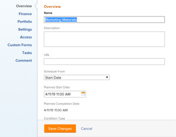
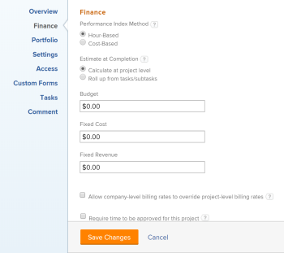
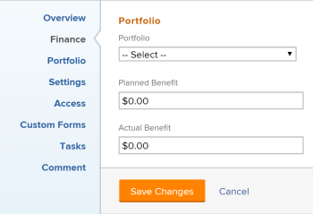
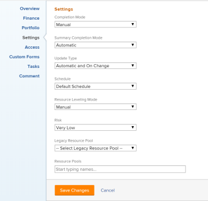
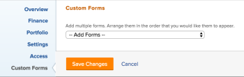
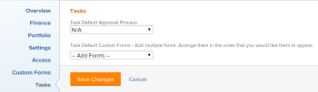
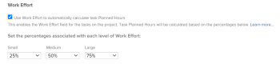
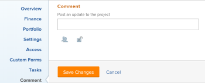
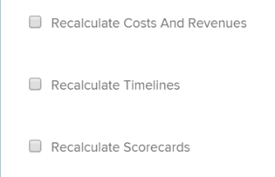

# Edit projects

>[!IMPORTANT]
>
>You're currently viewing the Adobe Workfront Classic version of this document. Adobe Workfront Classic is no longer supported. All Adobe Workfront Classic functionality, along with this documentation, will be removed in July 2022. Please transition to the the new Adobe Workfront experienceas soon as possible, and switch to the new Adobe Workfront experience version of this document.

<!--
<div data-mc-conditions="QuicksilverOrClassic.Draft mode">
<p>(NOTE: ***Linked to many articles,</p>
<p>The Resource Pools part also duplicates in the "Working with Resource Pools" article -</p>
<p>The Update Type section is also documented in Selecting the Project Update Type article</p>
<p>Keep the reference link to the other article that also documents the Update Type) </p>
<p>(NOTE 2: information described here also exists in these articles:</p>
<p>** Project Overview area</p>
<p>**Manage project Finance area</p>
<p>If you need to update just one field, check to see if that field is also listed there and update in both places.)</p>
</div>
-->

You can edit a project in Adobe Workfront as often as needed. We recommend that you edit projects minimally after they become Current, to avoid confusion by sending out notifications about the changes to the entire project team. You should ideally edit a project when the project is in Planning status. For information about the Project Team, see [Project Team overview](../../../manage-work/projects/planning-a-project/project-team-overview.md).

## Access requirements

You must have the following access to perform the steps in this article:

<table cellspacing="0"> 
 <col> 
 <col> 
 <tbody> 
  <tr> 
   <td role="rowheader">Adobe Workfront plan*</td> 
   <td> <p>Any</p> </td> 
  </tr> 
  <tr> 
   <td role="rowheader">Adobe Workfront license*</td> 
   <td> <p>Plan </p> </td> 
  </tr> 
  <tr> 
   <td role="rowheader">Access level configurations*</td> 
   <td> <p>Edit access to Projects</p> <p>Note: If you still don't have access, ask your Workfront administrator if they set additional restrictions in your access level. For information about access to projects, see <a href="../../../administration-and-setup/add-users/configure-and-grant-access/grant-access-projects.md" class="MCXref xref">Grant access to projects</a>. For information on how a Workfront administrator can change your access level, see <a href="../../../administration-and-setup/add-users/configure-and-grant-access/create-modify-access-levels.md" class="MCXref xref">Create or modify custom access levels</a>. </p> </td> 
  </tr> 
  <tr> 
   <td role="rowheader">Object permissions</td> 
   <td> 
    <ul> 
     <li> <p>Contribute permissions to a project to edit it in the Project Details area </p> </li> 
     <li> <p>Manage permissions to a project to edit it in the Edit Project box</p> </li> 
    </ul> <p> For information about project permissions, see <a href="../../../workfront-basics/grant-and-request-access-to-objects/share-a-project.md" class="MCXref xref">Share a project in Adobe Workfront</a>.</p> <p>For information on requesting additional access, see <a href="../../../workfront-basics/grant-and-request-access-to-objects/request-access.md" class="MCXref xref">Request access to objects </a>.</p> </td> 
  </tr> 
 </tbody> 
</table>

&#42;To find out what plan, license type, or access you have, contact your Workfront administrator.

## Limitations for editing projects

There are some limitations that might prevent you from editing projects.

Consider the following when editing projects:

* You cannot edit projects that are in an Approval Process, except for logging time. 
* You can attach documents or templates to a project that has a status of Complete, Dead, or is in Pending Approval only if your Workfront administrator or a group administrator enabled this functionality in the Project Preferences area. For information about setting project preferences, see [Configure system-wide project preferences](../../../administration-and-setup/set-up-workfront/configure-system-defaults/set-project-preferences.md). 
* You can only edit the following information on a project in a Dead or Complete status:

   * Modify existing expenses.
   * Add, remove, or edit custom forms.

## Edit a project

Editing a project allows you to modify information and settings for the project, as well as tasks and issues on the project.

Some settings mentioned in this article might be modified from their default status for the template from which the project was created. For information about editing templates, see [Edit project templates](../../../manage-work/projects/create-and-manage-templates/edit-templates.md).

1. Go to the project you want to edit.
1. Do either of the following:

   * To edit limited information about the project, select the **Project Details** tab, then go to the subtabs listed to edit the information under each subtab.   
     For information about the Project Details tab, see the following articles:

      * [Manage information in the project Overview area](../../../manage-work/projects/manage-projects/understand-project-overview-area.md)
      * [Manage information in the project Finance area](../../../manage-work/projects/project-finances/manage-project-finance-area.md)  
        &nbsp;Select from the following subtabs:

         * Overview
         * Custom Forms
         * Finance
         * Portfolio
         * Business Case

           

     >[!TIP]
     >
     >For information about all fields that display in the Details area, continue with editing all fields using the Edit Project box below.

   * Or
   * To edit all information about the project, click **Edit Project** .

     The **Edit Project** box opens.  The fields available in the subtabs of the Project Details are included in the Edit Project box.

     >[!IMPORTANT]
     >
     >You must have Manage permissions to the project in order to see the Edit  Project option.

1. (Conditional) If you clicked **Edit Project**, consider specifying information in any of the following areas:

   * [Overview](#overview) 
   * [Finance](#finance) 
   * [Portfolio](#portfolio) 
   * [Settings](#settings) 
   * [Access](#access) 
   * [Custom Forms](#custom-forms) 
   * [Tasks](#tasks) 
   * [Comment](#comment)

### Overview {#overview}

1. Begin editing your project as described above.
1. In the **Edit Project** box, click **Overview**.

   

1. Consider the following:

   <table cellspacing="0"> 
    <col> 
    <col> 
    <tbody> 
     <tr> 
      <td role="rowheader"><strong>Name</strong> </td> 
      <td>Specify a name for the project.</td> 
     </tr> 
     <tr> 
      <td role="rowheader"><strong>Description</strong> </td> 
      <td> <p>Add additional information about the project.</p> </td> 
     </tr> 
     <tr> 
      <td role="rowheader"><strong>URL</strong> </td> 
      <td> <p>Specify a web link that relates to information about this project.</p> </td> 
     </tr> 
     <tr> 
      <td role="rowheader"><strong>Schedule From</strong> </td> 
      <td> <p>Specify whether the project is scheduled from the Start Date, or from the Completion Date. This selection determines the planned dates of the tasks on the project. 
        <ul> 
         <li><strong>Schedule From Start Date</strong>: The first task of the project has the same Planned Start Date and time as the project by default. The first task of the project has the same Planned Start Date and time as the project by default. For information about the task Planned Start Date and time, see <a href="../../../manage-work/tasks/task-information/task-planned-start-date.md" class="MCXref xref">Overview of the task Planned Start Date</a>. The project timeline calculates from the Start Date and the Completion Date of the project is calculated by the system, based on the duration of all the tasks.</li> 
         <li><strong>Schedule from Completion Date</strong>: The last task of the project has the same Planned Completion Date and time as the project. The project timeline calculates from the Completion Date and the Start Date of the project is calculated by the system, by subtracting the duration of all the tasks from the Completion Date of the project. </li> 
        </ul><p>Your Workfront administrator<span> or a group administrator</span> selects the default Schedule From setting for your system <span>or your group</span>. For information about setting project defaults, see <a href="../../../administration-and-setup/set-up-workfront/configure-system-defaults/set-project-preferences.md" class="MCXref xref">Configure system-wide project preferences</a>. </p></p> </td> 
     </tr> 
     <tr> 
      <td role="rowheader"><strong>Planned Start Date and time</strong> </td> 
      <td> <p> <p>Specify the date when you select <strong>Schedule From Start Date</strong>. <br></p> <p>This is a read-only field when you select <strong>Schedule from Completion Date</strong>.<br></p> </p> </td> 
     </tr> 
     <tr> 
      <td role="rowheader"><strong>Planned Completion Date and time</strong> </td> 
      <td> <p>Specify the date when you select <strong>Schedule from Completion Date</strong>. </p> <p>This is a read-only field when you select <strong>Schedule from Start Date</strong>.<br></p> </td> 
     </tr> 
     <tr> 
      <td role="rowheader"><strong>Condition Type</strong> </td> 
      <td> <p>Select between the following Condition Types: 
        <ul> 
         <li><strong>Manual:</strong> The project owner sets the condition on the project manually.</li> 
         <li><strong>Progress Status:</strong> Workfront automatically sets the condition based on the Progress Status of tasks on the Critical Path. For more information about understanding Progress Status, see <a href="../../../manage-work/tasks/task-information/task-progress-status.md" class="MCXref xref">Task Progress Status overview</a>.</li> 
        </ul><p>Your Workfront administrator<span> or a group administrator</span> selects the default for how the projects' condition is calculated for your system <span>or your group</span>. For information about setting project defaults, see <a href="../../../administration-and-setup/set-up-workfront/configure-system-defaults/set-project-preferences.md" class="MCXref xref">Configure system-wide project preferences</a>. </p></p> </td> 
     </tr> 
     <tr> 
      <td role="rowheader"><strong>Condition</strong> </td> 
      <td> <p> <p>(Appears only after you select <strong>Manual</strong> for the <strong>Condition Type</strong>): Select a Condition to indicate how the project is going. </p> <p>For information how project Conditions can be set automatically or manually, see <a href="../../../manage-work/projects/manage-projects/project-condition-and-condition-type.md" class="MCXref xref">Overview of Project Condition and Condition Type</a></p> </p> </td> 
     </tr> 
     <tr> 
      <td role="rowheader"><strong>Priority</strong> </td> 
      <td> <p> <p>This is just a visual flag for you which allows you to prioritize your projects.</p> <p>Depending on the Project Preferences selected by your Workfront administrator, the names of priorities might be different for you. For more information about editing priorities, see <a href="../../../administration-and-setup/customize-workfront/creating-custom-status-and-priority-labels/create-customize-priorities-.md" class="MCXref xref">Create and customize priorities</a></p> </p> </td> 
     </tr> 
     <tr> 
      <td role="rowheader"><strong>Status</strong> </td> 
      <td> <p>Select the status of the project. You cannot mark a project Complete before all tasks and issues complete. For information about project statuses, see <a href="../../../administration-and-setup/customize-workfront/creating-custom-status-and-priority-labels/project-statuses.md" class="MCXref xref">Access the list of system project statuses</a></p> </td> 
     </tr> 
     <tr> 
      <td role="rowheader"><strong>Project Owner</strong> </td> 
      <td> <p>The user specified in this field is added to the project team and is automatically given manage permissions to the project. The user who is designated as the Project Owner must be a Workfront active user.</p> </td> 
     </tr> 
     <tr> 
      <td role="rowheader"><strong>Project Sponsor</strong> </td> 
      <td> <p>The specified user is added to the project team and is automatically given view permissions to the project. The user who is designated as the Project Sponsor must be a Workfront active user.<br></p> </td> 
     </tr> 
     <tr> 
      <td role="rowheader"><strong>Resource Manager</strong> </td> 
      <td> <p>The specified user is automatically given Manage permissions to the project and can assign resources to the tasks and issues on the project. The user maintains Manage permissions on the project even when they are removed from the Resource Manager field. You can specify more than one Resource Manager.<br></p> </td> 
     </tr> 
     <tr> 
      <td role="rowheader"><strong>Group</strong> </td> 
      <td> <p> <p>Specify a Group associated with the project. </p>This is a required field. You cannot have a project which is not associated with a group. </p> <p>By default, the Home Group of the creator of the project is the group associated with the project. If a group administrator creates a project from the Projects area of a group, the group becomes the group of the project by default. </p> <p>Tip: If the project, or its tasks or issues are already associated with a group-level approval process using group-level custom statuses, changing the group might create a conflict between the approval statuses of the previous group and those existing at the system level. Consider removing the group-level approval processes on the project, or its tasks or issues before updating the group. For information about creating group-level approval processes, see Group-level approval processes. For information about creating a group-level custom status, see <a href="../../../administration-and-setup/manage-groups/manage-group-statuses/create-or-edit-a-group-status.md" class="MCXref xref">Create or edit a group status</a></p> </td> 
     </tr> 
     <tr> 
      <td role="rowheader"><strong>Company</strong> </td> 
      <td> <p>Specify a Company associated with the project. You must create a company before you can associate it with a project. Only active companies can be associated with a project. For information about creating companies, see <a href="../../../administration-and-setup/set-up-workfront/organizational-setup/create-and-edit-companies.md" class="MCXref xref">Create and edit companies</a>.</p> </td> 
     </tr> 
    </tbody> 
   </table>

1. (Optional) Continue editing the following sections, depending on the information you want to modify.

   Or

   Click **Save Changes**.

### Finance {#finance}

1. Begin editing your project as described above.
1. In the **Edit Project** box, click **Finance**.

   

1. Consider the following:

   <table cellspacing="0"> 
    <col> 
    <col> 
    <thead> 
     <tr> 
      <th> </th> 
      <th> </th> 
     </tr> 
    </thead> 
    <tbody> 
     <tr> 
      <td role="rowheader"><strong>Performance Index Method</strong> </td> 
      <td> <p>Specify whether the Earned Value metrics of the project are calculated using hours or costs. </p> <p>For more information about the Performance Index Method, see <a href="../../../manage-work/projects/project-finances/set-pim.md" class="MCXref xref">Set the Performance Index Method (PIM)</a>. </p> <p>Your Workfront administrator<span> or a group administrator</span> selects the default Performance Index Method setting for your system <span>or your group</span>. For information about setting project defaults, see <a href="../../../administration-and-setup/set-up-workfront/configure-system-defaults/set-project-preferences.md" class="MCXref xref">Configure system-wide project preferences</a>. </p> </td> 
     </tr> 
     <tr> 
      <td role="rowheader"><strong>Estimate at Completion</strong> </td> 
      <td> <p> <p>Specify how Estimate at Completion (EAC) calculates. </p> <p>For more information about how the Estimate at Completion calculates, see <a href="../../../manage-work/projects/project-finances/calculate-eac.md" class="MCXref xref">Calculate Estimate At Completion (EAC)</a>.</p> <p>Your Workfront administrator<span> or a group administrator</span> selects the default Estimate at Completion setting for your system <span>or your group</span>. For information about setting project defaults, see <a href="../../../administration-and-setup/set-up-workfront/configure-system-defaults/set-project-preferences.md" class="MCXref xref">Configure system-wide project preferences</a>. </p> </p> </td> 
     </tr> 
     <tr> 
      <td role="rowheader"><strong>Budget</strong> </td> 
      <td> <p>Specify a Budget for the project.<br></p> </td> 
     </tr> 
     <tr> 
      <td role="rowheader"><strong>Fixed Cost</strong> </td> 
      <td> <p>Specify the Fixed Cost for the project. This is different than the Labor Cost which comes from the hours on the project and the Expense Cost which comes from the amount of expenses on the project. The Fixed Cost of a project is taken into account when calculating the Net Value of a project and it is part of the Budgeted Cost.<br></p> </td> 
     </tr> 
     <tr> 
      <td role="rowheader"><strong>Fixed Revenue</strong> </td> 
      <td> <p>Specify the Fixed Revenue for the project.<br></p> </td> 
     </tr> 
     <tr> 
      <td role="rowheader"><strong>Allow company-level billing rates to override project-level billing rates</strong> </td> 
      <td> <p>Select this option to allow company-level billing rates to override historical job role rates unless those rates are marked as billed. Enabling this option overrides historical job role rates unless they are marked as billed. <br></p> <p>For more information, see <a href="../../../manage-work/projects/project-finances/override-project-level-with-company-level-billing-rates.md" class="MCXref xref">Override Project-Level Billing Rates with Company-Level Billing Rates</a>.<br></p> </td> 
     </tr> 
     <tr> 
      <td role="rowheader"><strong>Project Currency</strong> </td> 
      <td> <p> <p>Specify the currency for the project, if it is different than the default currency of your system. You cannot change the currency of a project if there is already financial information on the project. This field is not visible if you have only the default currency in the system. </p> <p>For more information about currency, see <a href="../../../administration-and-setup/manage-workfront/exchange-rates/set-up-exchange-rates.md" class="MCXref xref">Set up exchange rates</a>.<br></p> </p> </td> 
     </tr> 
     <tr> 
      <td role="rowheader"><strong>Require time to be approved for this project</strong> </td> 
      <td> <p>: Select this option to require the Project Owner to approve time logged on the project. If you are using Billing Records and you select this option, only the approved hours on the project appear as available billable hours for the Billing Records. Approving time on the project is independent of approving timesheets. </p> <p>For more information about requiring time to be approved on a project, see <a href="../../../manage-work/projects/manage-projects/require-time-approval-for-projects.md" class="MCXref xref">Require time to be approved for a project</a>.<br></p> </td> 
     </tr> 
    </tbody> 
   </table>

1. (Optional) Continue editing the following sections, depending on the information you want to modify.

   Or

   Click **Save Changes**.

### Portfolio {#portfolio}

1. Begin editing your project as described above.
1. In the **Edit Project** box, click **Portfolio**.

   

1. Specify the following information:

   <table cellspacing="0"> 
    <col> 
    <col> 
    <tbody> 
     <tr> 
      <td role="rowheader"><strong>Portfolio</strong> </td> 
      <td> <p>Indicate a Portfolio that the project belongs to. You must create a Portfolio first, before it appears in the drop-down list. Only active portfolios can be associated with a project. For more information about creating portfolios, see <a href="../../../manage-work/portfolios/create-and-manage-portfolios/create-portfolios.md" class="MCXref xref">Create a portfolio </a>.</p> </td> 
     </tr> 
     <tr> 
      <td role="rowheader"><strong>Program</strong> </td> 
      <td> <p>If you selected a Portfolio for the project, specify a Program for the project. Some Portfolios might not have Programs. You must create a Program first, before it appears in this drop-down list. Only active programs can be associated with a project. </p> <p>For more information about creating programs, see <a href="../../../manage-work/portfolios/create-and-manage-programs/create-program.md" class="MCXref xref">Create a program</a>.<br></p> </td> 
     </tr> 
     <tr> 
      <td role="rowheader"><strong>Planned Benefit</strong> </td> 
      <td> <p>Estimate what the Planned Benefit of the project is. This is used in the Business Case of the project and the Portfolio Optimizer. For more information about the Planned Benefit of a project, see <a href="../../../manage-work/projects/project-finances/project-planned-benefit.md" class="MCXref xref">Overview of project Planned Benefit</a>. The Planned Benefit of a project is taken into account when the Net Value of a project is calculated. </p> <p>For more information, see <a href="../../../manage-work/portfolios/portfolio-optimizer/manage-projects-in-portfolio-optimizer.md" class="MCXref xref">Manage projects in the Portfolio Optimizer</a> <br></p> </td> 
     </tr> 
     <tr> 
      <td role="rowheader"><strong>Actual Benefit</strong> </td> 
      <td> <p>Estimate the Actual Benefit of the project. This is a currency amount that represents the benefit that your company or department would gain after this project is complete. </p> </td> 
     </tr> 
    </tbody> 
   </table>

1. (Optional) Continue editing the following sections, depending on the information you want to modify.

   Or

   Click **Save Changes**.

### Settings {#settings}

1. Begin editing your project as described above.
1. In the **Edit Project** box, click **Settings**.

   

1. Consider the following:

   <table cellspacing="0"> 
    <col> 
    <col> 
    <thead> 
     <tr> 
      <th> </th> 
      <th> </th> 
     </tr> 
    </thead> 
    <tbody> 
     <tr> 
      <td role="rowheader"><strong>Milestone Path</strong> </td> 
      <td> <p>Select a Milestone Path for the project. Only active milestone paths display in the list.</p> <p>For more information about Milestone Paths, see <a href="../../../administration-and-setup/customize-workfront/configure-approval-milestone-processes/create-milestone-path.md" class="MCXref xref">Create a milestone path</a>.</p> </td> 
     </tr> 
     <tr> 
      <td role="rowheader"><strong>Completion Mode</strong> </td> 
      <td> <p>Controls how the project is marked as Complete. Select from the following options: 
        <ul> 
         <li><p><strong>Automatic</strong>: The project is marked Complete when all the tasks and issues are completed.</p><p>Note: The project Status is automatically changed to Complete only when the project status is Current when the tasks are completed. </p></li> 
         <li><strong>Manual</strong>: You have to manually select the Complete status for the project, when all the tasks and issues are completed.<br></li> 
        </ul></p> </td> 
     </tr> 
     <tr> 
      <td role="rowheader"><strong>Summary Completion Mode</strong> </td> 
      <td> <p>Controls how the parent tasks are marked as Complete. Select from the following options: 
        <ul> 
         <li><strong>Automatic</strong>: The parent tasks are marked Complete and they update their percent complete automatically, as the children tasks are completed and the percent complete of the children is updated. </li> 
         <li><strong>Manual</strong>: You have to manually update the percent complete and the status of the parent tasks, independently of what changes are made to the children tasks.<br></li> 
        </ul></p> </td> 
     </tr> 
     <tr> 
      <td role="rowheader"><strong>Update Type</strong> </td> 
      <td> <p>Controls when the changes you make to the project timeline are saved on the project or the parent tasks. For example, the following changes to the project trigger an update to the timeline of the project: 
        <ul> 
         <li>Update the dates of tasks</li> 
         <li>Change predecessor relationships of tasks</li> 
         <li><p>Change parent-child relationships, adding or removing assignments in addition to changing the task constraint or duration type.</p><p>When the tasks update, their parent objects (parent tasks or the project) update at the time indicated by the Update Type. </p><p>Note: If the parent objects do not update immediately after the change when selecting "Automatic and On Change" or "Change Only" Update Type, refresh the page</p><p>Select from the following options: </p><p>- <strong>Automatic and On Change</strong> (Default setting): The project timeline is updated each time a change occurs in the project or in another project that the project is dependent on (On Change). The project timeline is also updated each night (Automatic).</p><p>This is the recommended setting for this field because it ensures that the project is always up to date.</p><p>When you perform an action on a task or project that triggers a timeline recalculation, all available dates are immediately displayed, allowing you to continue working. On projects with more than 100 tasks, dates that require longer recalculations display briefly as a question mark (between 1 and 5 seconds, or up to a minute for large projects). This indicates that the recalculation is not yet finished, and the dates are subject to change.</p><p>- <strong>Change Only</strong>: The project timeline is updated each time a change occurs in the project or in another project that the project is dependent on. You might want to select this option if changes rarely occur in the project or in other projects that the timeline is dependent on.</p><p>- <strong>Automatic Only</strong>: The project timeline is updated each night; the timeline is not updated immediately after changes are made.</p><p>You might want to select this option if many changes occur each day in the project or in other projects that the timeline is dependent on. However, be aware that you chose this setting, as the project will not update at the same time that the changes are made.</p><p>- <strong>Manual Only</strong>: The project timeline is updated only when you select the option to Recalculate Timeline. For more information about manually recalculating the project timeline, see the <a href="../../../manage-work/projects/manage-projects/recalculate-project-timeline.md#manual-recalculation" class="MCXref xref">Manual recalculation</a> section in <a href="../../../manage-work/projects/manage-projects/recalculate-project-timeline.md" class="MCXref xref">Recalculate project timelines</a>. </p><p>You might want to select this option if you are making many changes to the project at one time, and you want the timeline recalculation to occur after all of the changes have been made (rather than after each individual change).</p></li> 
        </ul></p> </td> 
     </tr> 
     <tr> 
      <td role="rowheader"><strong>Schedule</strong> </td> 
      <td> <p>Select a schedule for your project. This should be the same schedule assigned to most people that are working on the project. You must create a schedule before you can assign it to a project or a user. If you have not created custom schedules in your system, the Default Schedule is selected.</p> <p>For more information about creating schedules, see <a href="../../../administration-and-setup/set-up-workfront/configure-timesheets-schedules/create-schedules.md" class="MCXref xref">Create a schedule</a>. </p> </td> 
     </tr> 
     <tr> 
      <td role="rowheader"><strong>User Time Off</strong> </td> 
      <td> <p>Determines whether the time off of the Primary Assignee of a task adjusts the task planned dates on the project. </p> <p>Your Workfront administrator<span> or a group administrator</span> selects the default for this setting for your system <span>or your group</span>. For information about setting project defaults, see <a href="../../../administration-and-setup/set-up-workfront/configure-system-defaults/set-project-preferences.md" class="MCXref xref">Configure system-wide project preferences</a>. </p> <p>Select from the following options:<br>- <strong>Consider user time off in task durations</strong>: When selecting this option, the planned dates of the tasks adjust according to the time off of the Primary Assignee of the task, if the time off occurs during the duration of the task. </p> <p>For example, if a task with a constraint of As Soon As Possible is scheduled to start on June 1 and complete on June 3, and the Primary Assignee has June 2 marked for Time-off, when this selection is enabled the task planned dates are June 1 to June 4. Depending on the Task&nbsp;Constraint, the following scenarios exist: </p> 
       <ul> 
        <li>For task constraints that relate to planning from a start date (As Soon As Possible, Earliest Available Time, Start No Earlier Than, Start No Later Than, Must Start On) the Planned Start Date does not change but the Planned Completion Date changes.</li> 
        <li>For task constraints that relate to planning from a completion date (As Late As Possible, Latest Available Time,&nbsp;Finish No Earlier Than, Finish No Later Than, Must&nbsp;Finish On), the Planned Completion Date does not change, but the Planned Start&nbsp;Date changes.</li> 
        <li>For tasks with a constraint of Fixed&nbsp;Dates, neither the Planned Start nor Completion Date changes. </li> 
       </ul> <p>Important: The Duration of the task does not change when you select this setting. Only the planned dates change, depending on the Task Constraint. For information about task constraint, see <a href="../../../manage-work/tasks/task-constraints/task-constraint-overview.md" class="MCXref xref">Task Constraint overview</a>. </p> <p>- <strong>Ignore user time off in task durations</strong>: When selecting this option, the planned dates of the tasks on the project remain as originally planned, even if the Primary Assignee of the task has time off during the duration of the task. </p> <p>Consider the following when selecting options for this setting:</p> 
       <ul> 
        <li> <p>The default option for this setting for a new project is the same as the system-level project preference. </p> <p>For information about the project preferences at the System level, see <a href="../../../administration-and-setup/set-up-workfront/configure-system-defaults/set-project-preferences.md" class="MCXref xref">Configure system-wide project preferences</a>. </p> </li> 
        <li>When you attach a template to an existing project, the setting on the project is updated to match the one of the template. </li> 
        <li> <p>Workfront decides which planned task dates to adjust according to the Task Constraint value of the task. Depending on what that is, either the Planned Start or the Planned Completion Date, or both could be affected, or might even remain the same. For example, if a task has a Constraint of Fixed Dates, the dates do not adjust when the Primary Assignee has time off, even when <strong>Consider user time off in task durations</strong> is selected. </p> </li> 
       </ul> </td> 
     </tr> 
     <tr> 
      <td role="rowheader"><strong>Resource Leveling Mode</strong> </td> 
      <td> <p> <p>Select from the following options:</p> <p>- <strong>Manual</strong>: you must manually level your resources (this is the default setting)</p> <p>- <strong>Automatic</strong>: Workfront levels your resources.</p> <p>For more information about Resource Leveling, see <a href="../../../manage-work/gantt-chart/use-the-gantt-chart/level-resources-in-gantt.md" class="MCXref xref">Level Resources in the Gantt Chart </a>. </p> </p> </td> 
     </tr> 
     <tr> 
      <td role="rowheader"><strong>Risk</strong> </td> 
      <td> <p> <p>Define the level of risk of your project. The risk is just an indicator of how risky a project can be. You can prioritize the execution of your projects based on the level of risk.</p> <p> <p>Consider selecting from the following levels of risk:</p> <p>- Very Low</p> <p>- Low</p> <p>- Medium</p> <p>- High</p> <p>- Very High</p> <p>The levels of risks you indicate here cannot be customized.</p> <p>Note: These are not related to the potential Risks that could occur during the life of a project and which you should record in the Risks tab of the project, or in the Business Case. For information about potential project Risks, see <a href="../../../administration-and-setup/set-up-workfront/configure-system-defaults/edit-create-risk-types.md" class="MCXref xref">Edit and create risk types</a>. </p> </p> </p> </td> 
     </tr> <!--
      <tr data-mc-conditions="QuicksilverOrClassic.Classic,QuicksilverOrClassic.Draft mode"> 
       <td role="rowheader"><strong>Legacy Resource Pool</strong> </td> 
       <td> <p> <p>Specify the Legacy Resource Pool associated with the project. Legacy Resource Pools allow you to manage your job role allocations for the tasks in the project, according to the timeline of the project. You can also select a Legacy Resource Pool in the Resource Estimates section of the Business Case, as you are planning the project. For more information about Legacy Resource Pools on the Business case, see <a href="../../../manage-work/projects/define-a-business-case/apply-legacy-pools-to-business-case.md">Applying Legacy Resource Pools to the Business Case.</a></p> <!--
          <p data-mc-conditions="QuicksilverOrClassic.Draft mode">(NOTE:&nbsp;removed feature)</p>
         --> </p> </td> 
      </tr>
     --> 
     <tr> 
      <td role="rowheader"><strong>Resource Pools</strong> </td> 
      <td> <p> <p>Specify the Resource Pools associated with the project. Resource Pools are collections of users that are needed at the same time for the completion of a project and allow for project budgeting in the Resource Planner. For more information about Resource Pools, see <a href="../../../resource-mgmt/resource-planning/resource-pools/work-with-resource-pools.md" class="MCXref xref"> Resource pools overview </a>. </p> <p>Note: When you edit projects in bulk, only the Resource Pools that are common to all the projects selected appear in this field. If the projects selected have no shared Resource Pools, this field will be empty. The Resource Pools you specify here will overwrite the projects' individual Resource Pools.</p> </p> </td> 
     </tr> 
     <tr> 
      <td role="rowheader"><strong>Approval Process</strong> </td> 
      <td> <p>Select the approval process you want to associate with the project. Your Workfront administrator must define system-level Approval Processes before you can associate them with projects. <span>A user with administrative access to Approval processes can also create group-specific approval processes.</span> For more information about creating approval processes, see <a href="../../../administration-and-setup/customize-workfront/configure-approval-milestone-processes/create-approval-processes.md" class="MCXref xref">Create an approval process for work items</a>.</p> <p>Consider the following when adding approval processes: </p> 
       <ul> 
        <li>Only active approval processes display in the list. </li> 
        <li> <p>System-wide and group-specific approval processes display in the list. An approval process associated with a group other than that of the project does not display in the list.</p> <p>Important: If the group associated with the project changes, the group-specific approval process becomes a single-use approval process. For more information about how changes to the group of the project or changes in the approval process affect approval settings, see <a href="../../../administration-and-setup/customize-workfront/configure-approval-milestone-processes/how-changes-affect-group-approvals.md" class="MCXref xref">How group and approval process changes affect assigned approval processes</a>. </p> </li> 
        <li> <p data-mc-conditions="QuicksilverOrClassic.Classic">If you added a single-use approval process, it displays as "&lt;Custom&gt;" in this field. </p> <!--
          <p data-mc-conditions="QuicksilverOrClassic.Draft mode">(NOTE: this bullet stays here although the sections it might appear in are QS only, so we can use the snippet for both Qs and classic)</p>
         --> </li> 
        <li> <p>When bulk-editing projects, the following scenarios exist:</p> 
         <ul> 
          <li> <p>When you select projects from the same group, both system-level and group-level approval processes display in this field.</p> </li> 
          <li> <p>When you select projects from different groups, only system-level approval processes display in this field.</p> </li> 
          <li> <p>When any of the projects have a single-use approval process attached, it is replaced by the system-level or group-level approval process you select. </p> </li> 
         </ul> </li> 
       </ul> </td> 
     </tr> 
     <tr> 
      <td role="rowheader"><strong>Filter Hour Types</strong> </td> 
      <td> <p> <p>Consider the following:</p> <p>Select <strong>No</strong> to make all project-specific hour types available on the project. (This is the default selection)</p> <p>Or</p> <p>Select <strong>Yes</strong> to make only a subset of the project-specific hour types available on the project, then select the hour types you want to make available. (Hold the Shift key to select multiple hour types.)</p> <p>If you select this option, only the hour types you select are made available to select when logging hours on the project (or on tasks and issues within the project). You must select at least one hour type; if you select this option and you do not select any hour types, all hour types are made available on the project.</p> <p>The same hour type selections must be made at the individual user level in order for the user to see these hour type options on the project. For more information about defining hour types at the user level, see <a href="../../../administration-and-setup/set-up-workfront/configure-timesheets-schedules/timesheet-and-hour-preferences.md" class="MCXref xref">Configure timesheet and hour preferences</a>. </p> </p> </td> 
     </tr> 
     <tr> 
      <td role="rowheader"><strong>Reminder Notification</strong> </td> 
      <td> <p> <p>Select the Reminder Notification that should be associated with the project. You must configure Reminder Notifications for projects for this field to appear during editing a project. For more information about configuring Reminder Notifications, see <a href="../../../administration-and-setup/manage-workfront/emails/set-up-reminder-notifications.md" class="MCXref xref">Set up reminder notifications</a>. </p> </p> </td> 
     </tr> 
    </tbody> 
   </table>

1. (Optional) Continue editing the following sections, depending on the information you want to modify.

   Or

   Click **Save Changes**.

### Access {#access}

1. Begin editing your project as described above.
1. In the **Edit Project** box, click **Access**.

   

1. Specify the following **Access** information for the project:  

   <table cellspacing="0"> 
    <col> 
    <col> 
    <thead> 
     <tr> 
      <th> </th> 
      <th> </th> 
     </tr> 
    </thead> 
    <tbody> 
     <tr> 
      <td role="rowheader"><strong>When someone is assigned to a task</strong></td> 
      <td><p>Select from <strong>View</strong>, <strong>Contribute,</strong> or <strong>Manage</strong> access to a task. The user assigned to a task is automatically granted this access to the task.</p></td> 
     </tr> 
     <tr> 
      <td role="rowheader">Also grant access to the project</td> 
      <td><p>Select from <strong>View</strong>, <strong>Contribute</strong>, or <strong>Manage</strong> access to the project. The user assigned to a task is automatically granted this access to the project, as well.<br></p></td> 
     </tr> 
     <tr> 
      <td role="rowheader"><strong>When someone is assigned to an issue</strong></td> 
      <td><p>Select from <strong>View</strong>, <strong>Contribute,</strong> or <strong>Manage</strong> access to an issue. The user assigned to an issue is automatically granted this access to the issue. For more information, see <a href="../../../workfront-basics/grant-and-request-access-to-objects/share-an-issue.md" class="MCXref xref">Share an issue </a>.<br></p></td> 
     </tr> 
     <tr> 
      <td role="rowheader">Also grant access to the project</td> 
      <td><p>Select from <strong>View</strong>, <strong>Contribute</strong>, or <strong>Manage</strong> access to the project. The user assigned to an issue is automatically granted this access to the project, as well.<br></p></td> 
     </tr> 
     <tr> 
      <td role="rowheader">When someone submits a request: Give them access</td> 
      <td><p>Select from <strong>View</strong>, <strong>Contribute</strong>, or <strong>Manage</strong> access to the request. When the project is also a request queue and a user submits a request to the project, they are granted this access to the request they submitted. For information about setting up a project as a request queue, see <a href="../../../manage-work/requests/create-and-manage-request-queues/create-request-queue.md" class="MCXref xref">Create a Request Queue</a>.<br></p></td> 
     </tr> 
     <tr> 
      <td role="rowheader"><strong>People from the same company will inherit the same permissions for all requests</strong></td> 
      <td><p>Select this field if you want people from the same company to have the same access to all the requests on the project, whether they submitted them or not.<br></p></td> 
     </tr> 
     <tr> 
      <td role="rowheader"><strong>When someone is given access to this project: Give them access to ...</strong></td> 
      <td><p>Select the access options that you want users to have on the project, if the project is shared with them. Select the specific options for their access, if they are designated as <strong>Viewers</strong>, <strong>Contributors</strong>, or <strong>Managers</strong> when sharing the project with them. </p><p>Note:  The <strong>Delete</strong> access in the <strong>Manage</strong> permission level determines whether users can&nbsp;delete the project itself. Users with <strong>Manage</strong> access to the project can delete tasks and issues within the project regardless of whether this option is selected, if they have <strong>Manage</strong> permissions to the tasks and issues.&nbsp;</p></td> 
     </tr> 
    </tbody> 
   </table>

1. (Optional) Continue editing the following sections, depending on the information you want to modify.

   Or

   Click **Save Changes**.

### Custom Forms {#custom-forms}

1. Begin editing your project as described above.
1. In the **Edit Project** box, click **Custom Forms**.

   

1. Select the custom form or forms that you want to associate with the project.

   You must build the custom forms before they are available to select in this field. Only active custom forms appear in the list. For more information about building custom forms, see [Create or edit a custom form](../../../administration-and-setup/customize-workfront/create-manage-custom-forms/create-or-edit-a-custom-form.md). You can add up to ten custom forms to a project. 

1. (Conditional) If you attached a custom form to the project, edit any fields on the form. You must specify all required fields before you can save the project.

   >[!NOTE]
   >
   >Depending on how your Workfront Administrator set the permissions for the sections in your custom form, not everyone can view or edit the same fields on a given custom form. The permissions to edit fields within a section of a custom form depend on the permissions you have on the project itself. For information about setting permissions on sections of a custom form, see [Create or edit a custom form](../../../administration-and-setup/customize-workfront/create-manage-custom-forms/create-or-edit-a-custom-form.md). For information about setting permissions on projects, see [Share a project in Adobe Workfront](../../../workfront-basics/grant-and-request-access-to-objects/share-a-project.md).

1. (Optional) Continue editing the following section, depending on the information you want to modify.

   Or

   Click **Save Changes**.

### Tasks {#tasks}

You can define the defaults that will be associated with all the new tasks when you add them to the project.

For information about how these settings affect creating new tasks, see [Create tasks overview](../../../manage-work/tasks/create-tasks/create-tasks-overview.md).

1. Begin editing your project as described above.
1. In the **Edit Project** box, click **Tasks**.

   

1. In the **Task Default Approval Process** box, select the task Approval Process you want to associate with all new tasks when you add them to the project. Your Workfront administrator must create a system-level approval process for tasks before you can associate it with a project. ```A user with administrative access to Approval processes can also create group-specific approval processes```. Only active approval processes display in the list. For more information about creating Approval Processes, see [Create an approval process for work items](../../../administration-and-setup/customize-workfront/configure-approval-milestone-processes/create-approval-processes.md). For more information about how changes to the group of the project or changes in the approval process affect approval settings, see [How group and approval process changes affect assigned approval processes](../../../administration-and-setup/customize-workfront/configure-approval-milestone-processes/how-changes-affect-group-approvals.md). 

   When bulk-editing projects, the following scenarios exist:

   * When you select multiple projects from the same group, both system-level and group-specific task approval processes display in this field.
   * When you select multiple projects from different groups, only system-level task approval processes display in this field.

1. In the **Task Default Custom Forms** box, select the custom form or forms that you want to associate with all new tasks when you add them to the project. You must build the custom forms before they are available to select in this field. Only active custom forms display in the list. For more information about building custom forms, see [Create or edit a custom form](../../../administration-and-setup/customize-workfront/create-manage-custom-forms/create-or-edit-a-custom-form.md). You can associate up to ten custom forms with a task.
1. (Optional) Select **Use Work Effort to automatically calculate task Planned Hours** if you want to enable managing task effort by using Work Effort instead of Planned Hours.

   

1. (Conditional and optional) If you selected Use Work Effort to automatically calculate task Planned Hours, click the drop-down menu for each level of effort and select a percentage for each level.

   The following percentage values are defaults:

   | Small |25% |
   |---|---|
   | Medium |50% |
   | Large |75%  |

   >[!TIP]
   >
   >When the project Update Type is set to Automatic and you select this setting, the Planned Hours of the tasks update according to the task Duration and the Work Effort percentage, if they are set to zero. For more information about using Work Effort to plan effort for a task, see ``` [Work Effort overview](../../../manage-work/tasks/task-information/work-effort.md)```.

### Comment {#comment}

1. Begin editing your project as described above.
1. In the **Edit Project** box, click **Comment**.

   

1. Specify a comment that you want to display in the updates stream of the project in the available field and do one of the following:

   * Click the **People** icon  to tag a user who will be notified about your comment.
   * Click the **Lock** icon  to restrict your comment only to people within your company.

   This comment is visible for everyone with View access to the project and with access to view Notes.

1. Click **Save Changes**.

   Your changes will be submitted for this project. Any notifications that are triggered by making edits to the project and meet the conditions to be sent at this time, will now be sent to the users who subscribe to them.

##

## Edit projects in bulk

<!--
<p data-mc-conditions="QuicksilverOrClassic.Draft mode">(NOTE: *******THIS WHOLE SECTION WILL NEED TO BE RE-WRITTEN FOR NWE BULK WHEN EDITING PROJECTS IN BULK IN NWE WILL BE UPDATED***** THE SECTION AS IS NOW WILL STAY FOR CLASSIC, BUT REMOVE ALL THE NWE CONDITIONING AND CROSS-REFERENCES*****)</p>
-->

You can edit projects in bulk and update all their information at the same time.

To edit projects in bulk:

1. Go to the **Projects** area in the Global Navigation Bar.  
1. Select the **Projects** tab.  
1. Select several projects in the list.
1. Click **Edit**.

   The **Edit Projects** dialog box opens.

1. Specify the information on all selected projects in the following sections:

   * Overview

     For information, see the [Overview](#overview) section in this article.
   
   * Finance

     For information, see the [Finance](#finance) section in this article.
   
   * Portfolio

     For information, see the [Portfolio](#portfolio) section in this article.
   
   * Settings

     For information, see the [Settings](#settings) section in this article.
   
   * Access

     For information, see the [Access](#access) section in this article.
   
   * Custom Forms

     For information, continue with step 7 below.

     <!--   
     <p data-mc-conditions="QuicksilverOrClassic.Draft mode">(NOTE:&nbsp;make sure this stays accurate)</p>   
     -->

   * Tasks

     For information, see the [Tasks](#tasks) section in this article.
   
   * Comment

     For information, continue with step 9 below.

     <!--   
     <p data-mc-conditions="QuicksilverOrClassic.Draft mode">(NOTE: ensure this step stays accurate)</p>   
     -->

   >[!NOTE]
   >
   >The information you are changing on all the projects selected will override the existing information on individual projects, except for the **Resource Manager** field. Adding a new resource manager in bulk edit will add that manager to all the selected projects. If other resource managers are associated with the selected projects, they will remain on the projects in addition to the one added through bulk edit.

1. (Optional) In the Settings area, select any of the following options:

   * **Recalculate Costs and Revenues**: Select this option to recalculate Costs and Revenues on all projects selected.
   * **Recalculate Timelines**: Select this option to recalculate the Timelines of all projects selected.
   * **Recalculate Scorecards**: Select this option to recalculate the Scorecard values for all projects selected.

   

1. Click **Custom Forms** to edit the custom forms attached to all the projects selected.

   If the projects selected do not have any common custom forms, no forms are listed in this section.

   You can edit only the fields on the forms that are attached to all projects selected and which you have permissions to edit. 

1. (Optional) In the Custom Forms section, select the **Recalculate Custom Expressions** option to ensure that all Calculated Custom Fields that are on the Custom Forms attached to the projects selected are up to date.

   >[!IMPORTANT]
   >
   >We recommend not to select more than 500 projects at a time when you recalculate custom expressions.

1. (Optional) Click **Comment**, then select the Post an update to each project box and specify a comment that you want to display in the updates stream of the project in the available field and do one of the following:

   * Click the **People** icon  to tag a user who will be notified about your comment.
   * Click the **Lock** icon  to restrict your comment only to people within your company.

   This comment is visible for everyone with View access to the project and with access to view Notes.

1. Click **Save Changes**.

   All changes you made are now visible on all the selected projects.

